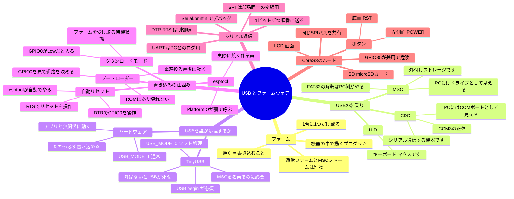
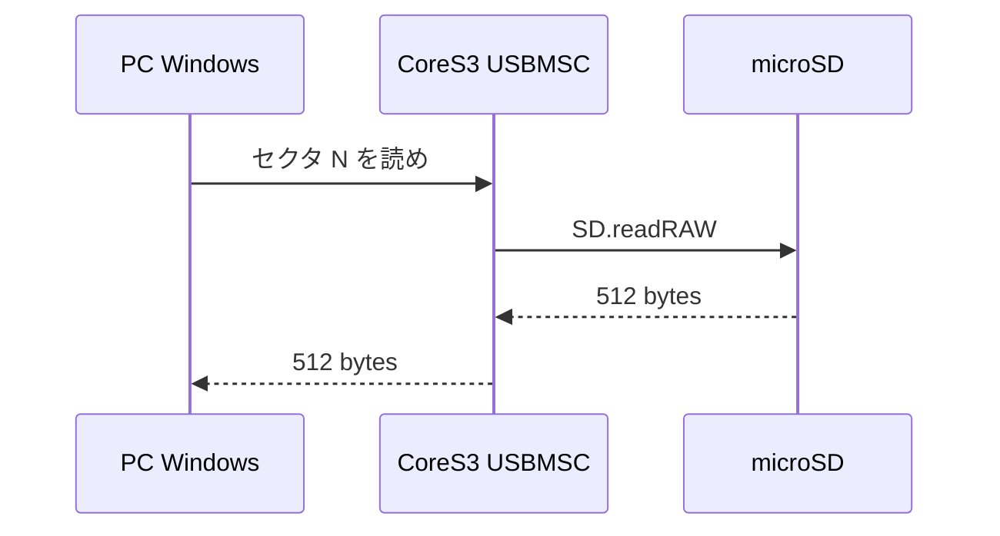

# USB・ファームウェア周辺の用語（#160）

2026-07-18。#157（USB MSC 転送ファーム）の作業中に出てきた用語をまとめる。
実機が書き込めなくなり復旧するまでの過程で、USB とファームウェアの層が一気に登場したため。

## 全体マップ



---

## Q. ファームとは何か

**機器に組み込まれて動くソフトウェア**。firmware。PC のアプリのように起動・終了するものではなく、
**電源を入れたらそれが動く、その機器の中身そのもの**。

ハードウェア（固い）とソフトウェア（柔らかい）の中間で、書き換えられるが普段は固定されているから
firm（しっかりした）。

```
src/main.cpp, src/menu.cpp, ...
      │ platformio run      ビルド＝コンパイル
      ↓
 firmware.bin  約2MBの1ファイル
      │ platformio run -t upload   書き込み＝「焼く」
      ↓
 CoreS3 のフラッシュメモリ
      │ 電源オン
      ↓
 メニュー画面が出る
```

**重要な性質: 実行されるのは 1 つだけ。** 新しく焼くと前のものは消える。
だから「通常ファーム」と「MSC 転送ファーム」を行き来するには焼き直しが要る。

> 補足: 置ける場所自体は 2 つある（`app0` / `app1` という OTA 用スロット）が、
> このプロジェクトでは片方しか使っていない。「1 つだけ」と考えて差し支えない。

---

## Q. LCD、SD とは何か

- **LCD** = Liquid Crystal Display = **画面そのもの**。コード上では `M5.Display`
- **SD** = **microSD カード**。コード上では `SD.begin()` `SD.open()` など

### なぜ「同じバス」が問題になったか

**バス**＝部品同士をつなぐ配線の束。CoreS3 では **SPI** という方式の配線を使う。

```
                ┌─ GPIO36 クロック  ─┐
ESP32-S3 ───────┼─ GPIO37 データ送信 ┼──> LCD と SD が
                └─ GPIO35 データ受信 ┘    同じ線を共有している
```

GPIO35 は「SD からデータを受け取る線」と「画面に対して**これから送るのがコマンドかデータかを
示す線**（D/C ＝ Data/Command）」の**兼用**。
同じ線なので**同時に使うと信号が混ざって化ける**。1 本の電話線で 2 人が同時に喋るようなもの。

MSC 転送ファームでは USB タスクが SD に書き、メインループが画面に描く構造だったため、
**PC から書いたファイルが化けて保存される**危険があった（reviewer 指摘の 🔴）。
対策として MSC 転送中は画面を一切描かないことにした。

> 💡 覚えておくこと: **CoreS3 では SD と画面を同時に触ってはいけない**
> 既存の `main.cpp` は全部 `loop` の中で順番に実行しているので問題ない。
> 気をつけるのは「裏で並行して動く処理」を足すときだけ。

---

## Q. MSC とは何か

**USB Mass Storage Class**。USB 機器が「自分は外付けストレージだ」と名乗るための規格。
PC 側は対応ドライバを標準で持っているので、名乗れば専用ソフト無しでドライブとして見える。

実装で書くのは実質これだけ:

- PC「N 番目のブロックをくれ」→ SD の同じ番号を読んで返す
- PC「N 番目のブロックにこれを書け」→ SD の同じ番号に書く

1 ブロックは SD の場合 512 バイト（MSC 規格の固定値ではなく、カードから取得した値を使う）。

**FAT32 の解釈は PC 側が行う**ため、ファイルシステムを自前で実装する必要はない。



**なぜ作ったか**: PC にカードリーダーが無く、動画アセットを microSD に置けなかったため。

---

## Q. CDC とは何か

**Communications Device Class**。MSC の兄弟。USB 機器が「自分は何者か」を名乗る種類のひとつ。

| 名乗り | 意味 | PC からどう見えるか |
|---|---|---|
| **MSC** | 外付けストレージです | ドライブ D: など |
| **CDC** | 通信する機器です | **COM ポート COM3 など** |
| HID | キーボード・マウスです | 入力デバイス |

**COM3 の正体がこれ。** CoreS3 が「私は CDC です」と名乗るから Windows が COM3 として見せる。
「COM3 が開けない」＝この名乗りが機能していない状態。

（正確には CDC は通信機器全般のクラスで、COM ポートとして見えるのはその中の
ACM というサブクラス。区別が要る場面はまず無い）

---

## Q. シリアル通信とは何か

**データを 1 ビットずつ順番に送る方式**。serial ＝ 直列。

```
パラレル 並列: 8本の線で一度に      シリアル 直列: 1本の線で順番に
  ─── 1 0 1 1 0 0 1 0                ─── 1 → 0 → 1 → 1 → 0 → 0 → 1 → 0 →
  線は多いが単純                      線が1本で済む
```

> 補足: 「シリアルは遅い」わけではない。高速域ではむしろシリアルが有利で
> （線ごとの到達時間のズレが問題になるため）、USB・SATA・PCIe など現代の高速規格は
> どれもシリアル方式。

線が少なくて済むので、組み込み機器と PC をつなぐ定番の方法。

### このプロジェクトでの実体

```cpp
Serial.begin(115200);                          // 秒間115200ビットで通信開始
Serial.println("\n[boot] m5-cores3-lite up");  // PCに文字列を送る
```

`115200` は**ボーレート**＝1 秒間に何ビット送るか。送る側と受ける側で一致していないと文字化けする
（`platformio.ini` の `monitor_speed = 115200` がその設定）。

PC 側で受け取るには `platformio device monitor` を打つ。

### 紛らわしい点

**SPI も広い意味ではシリアル通信**（Serial Peripheral Interface）。ただし用途が違う。

| | 何のため | 相手 |
|---|---|---|
| **UART** | PC とログをやり取り | PC |
| **SPI** | チップ内で部品同士をつなぐ | LCD、SD カード |

単に「シリアル通信」「シリアルポート」と言った場合は**前者**を指す。

---

## Q. ブートローダーとは何か

**電源を入れた直後、アプリより先に動く小さなプログラム。**

ここは**2 段構え**になっている。混同しやすいので分けて書く。

| | 場所 | 書き換え | 役割 |
|---|---|---|---|
| **一段目** | チップ内の **ROM** | **不可能** | ダウンロードモードに入るか、二段目を起動するか決める |
| **二段目** | **フラッシュ** | **される**（`bootloader.bin`） | アプリ本体を読み込んで起動する |

`platformio run -t upload` を打つと、実は `firmware.bin` だけでなく `bootloader.bin`（約 15KB）も
一緒に焼かれている。つまり**二段目は書き換え可能で、壊れうる**。

```
電源オン
   ↓
一段目ブートローダー（ROM・壊れない）
   ↓
リセット解除の瞬間に GPIO0 の状態が読み取られる
   ├─ Low  → ダウンロードモード（ファームを受け取る待機状態）
   └─ High → 二段目ブートローダー → アプリ起動（いつものメニュー画面）
```

**復旧を保証しているのは一段目。** ここは ROM にあり絶対に壊れないので、
二段目やアプリをどれだけ壊しても必ず書き込み直せる。今日それに救われた。

> ⚠ 補足: GPIO0 の状態は「**リセット解除の瞬間にラッチされる**」（ストラップピンという）。
> 起動してから GPIO0 を Low にしても意味がない。RST 3 秒長押しの遅延回路が効くのは、
> 「リセットをまたいで GPIO0 を Low に保つ」ことをやってくれるから。
> なお ESP32-S3 のブートモード判定には GPIO0 以外のピンも関わるので、
> 「GPIO0 だけで決まる」と単純化しすぎないこと。

---

## Q. ダウンロードモードとは何か。標準機能か

**ESP32-S3 チップ自体の標準機能。** M5Stack 固有でも自作でもない。Espressif の仕様。

M5Stack 固有なのは「**RST 長押しで GPIO0 を Low にする遅延回路**」の部分だけ。

**普段この操作は不要。** esptool が自動でこの状態を作っている。

---

## Q. esptool とは何か

Espressif が作った**ファームを書き込むプログラム**。
`platformio run -t upload` を打つと、PlatformIO が裏でこれを呼ぶ。

**PlatformIO は指揮者、実際に焼く作業員が esptool。**

---

## Q. DTR、RTS とは何か

どちらもシリアル通信の**制御線**。元は電話・モデム時代の規格。

- **DTR** = Data Terminal Ready 「こちらの準備ができた」
- **RTS** = Request To Send 「送っていいか」の交通整理（フロー制御）

### ESP32 では全く違う目的に転用されている

**一般的な ESP32 開発ボード**では、USB-UART ブリッジ IC（CP2102 や CH340）が載っていて、
その DTR と RTS が基板上でそれぞれ別のピンに配線されている。

```
DTR ──> GPIO0 を操作        Low なら「ダウンロードモードに入れ」
RTS ──> EN リセット を操作   機器を再起動させる
```

正しい順番で操作すると自動でダウンロードモードに入る。**これが「自動リセット」の中身。**

```
1. DTR を操作して GPIO0 を Low にする
2. RTS を操作してリセットをかける
3. リセット解除の瞬間に GPIO0 の状態が読み取られる → Low なのでダウンロードモードへ
```

### ⚠ CoreS3 は事情が違う（ブリッジ IC が無い）

CoreS3 には **USB-UART ブリッジ IC が載っていない。** USB-C が ESP32-S3 のネイティブ USB に
直結している。根拠:

- ボード定義の `hwids` が `0x303A / 0x8119` ＝ **Espressif の VID**
  （ブリッジ IC があれば Silicon Labs 等の VID になるはず）
- ファームのビルド設定を変えると PID が `0x8119 → 0x1001` に変わる
  （物理 IC が居るなら、ファームを変えても VID/PID は変わらない）

つまり **上の配線図は CoreS3 の実態ではない。** DTR/RTS という「約束事」は同じだが、
物理配線ではなく**チップ内蔵の USB-Serial-JTAG がその組み合わせを解釈して**、
内部でリセットとダウンロードブートを起こしている。昔のブリッジ IC の慣習をチップ内で
エミュレートしている形。

CoreS3 に「RST 長押しの遅延回路」がわざわざ用意されているのも、この事情と整合する。

> ⚠ この内部動作の詳細は ESP32-S3 の技術リファレンスマニュアル参照レベルなので、
> ここでは「そういう仕組みらしい」以上に踏み込まない。

### ログに出ていた

```
Leaving...
Hard resetting via RTS pin...      ← 書き込み完了後、RTS でリセットして新ファームを起動
```

```
Connecting......................................
A fatal error occurred: Failed to connect to ESP32-S3: No serial data received.
                                   ← 制御線を操作しても誰も応答しない状態
```

---

## Q. TinyUSB とは何か

USB の通信を**ソフトウェアで**処理するオープンソースライブラリ。

ESP32-S3 は USB を扱う方法を 2 つ持っており、ここが今回の分かれ道だった。

| | `USB_MODE=1` 通常 | `USB_MODE=0` TinyUSB |
|---|---|---|
| USB の担当 | **チップ内蔵のハードウェア回路**（USB-Serial-JTAG） | **TinyUSB＝アプリ内のソフト** |
| アプリが固まったら | 影響なし。USB は生きている | 一緒に死ぬ |
| できること | シリアル通信 CDC ＋ JTAG デバッグ | **MSC も名乗れる** |
| 起動に必要な処理 | なし | **`USB.begin()` の呼び出しが必須** |

`USB_MODE=1` で **MSC を名乗れない**のは確か（`USBMSC.cpp` 全体が `CONFIG_TINYUSB_MSC_ENABLED`
配下にあり、この設定では TinyUSB スタック自体がビルドされない）。ただし CDC 専用ではなく
**JTAG デバッグも兼ねる**。デバイス名が `USB JTAG/serial debug unit` なのはそのため
（ダウンロードモードの判定にこの名前を使う）。

MSC をやりたければ TinyUSB が必要 → `USB_MODE=0` にする必要があった。

---

## Q. なぜダウンロードモードでの再焼き込みが必要だったのか

```
【通常時】
  esptool ──DTR/RTS──> ハードウェア回路 ──> ブートローダー ──> 書き込み OK
                        ↑ アプリがハングしても生きているので届く

【M1 で壊した時】
  esptool ──DTR/RTS──> TinyUSB ソフト
                        ↑ USB.begin() を呼んでいないので起動していない
                        ↑ 誰も聞いていない → 指示が届かない → 書き込み失敗
                        ↑ CDC も名乗れないので COM3 も開けない

【復旧】
  底面 RST 3秒長押し ──> 遅延回路が GPIO0 を Low に ──> ブートローダー ──> 書き込み OK
                          ↑ 完全にハードウェア。ソフトが死んでいても効く
```

**ソフトの道が断たれたので、ハードの道を使った。** これが必要だった理由。

原因は CoreS3 のボード定義に `ARDUINO_USB_ON_BOOT` が無く、Arduino のコアが `USB.begin()` を
呼んでくれないこと。`main.cpp` も呼んでいなかったため、`USB_MODE=0` にした瞬間 USB が無反応になった。

---

## Q. ダウンロードモード前後で何を変えたのか

焼いたファームの中身。アプリのコードは同じ `main.cpp` で、**ビルド設定だけ**が違う。

| タイミング | 焼いたもの | USB の担当 |
|---|---|---|
| 壊れる前 | 通常ファーム `USB_MODE=1` | ハードウェア |
| M1 検証で焼いた | `main.cpp` を `USB_MODE=0` でビルド | **ソフト TinyUSB** |
| 復旧で焼いた | 通常ファーム `USB_MODE=1` に戻した | ハードウェア |

**機器が故障したわけではない。** フラッシュに何を入れるかの問題だった。

---

## Q. ボタンはどれか

| ボタン | 位置 | 操作 | 動作 |
|---|---|---|---|
| POWER | **左側面** | シングルクリック | 電源オン |
| POWER | **左側面** | 6 秒長押し | **電源オフ** |
| RST | **底面** | シングルクリック | リセット |
| RST | **底面** | **3 秒長押し** | **ダウンロードモード** |

出典: https://docs.m5stack.com/en/core/CoreS3

左側面を長押しすると電源が落ちるだけ。**COM ポートが全部消えたらまず電源オフを疑う。**

---

## Q. 緑 LED は実装したものか、標準機能か

**ハードウェアの標準機能。** 公式ドキュメントに `self-built delay circuit`（専用の遅延回路）と
明記されており、ファームウェアとは無関係に動く。だから USB が死んだファームが載っていても機能する。

公式の記述は `Long-press the RESET button for 3 s (green LED on) to enter download mode` のみで、
LED の位置については書かれていない。ただし**実測では外から確認できなかった**
（2026-07-18、LED を視認できないまま焼き込みに成功）。筐体内部にあるものと思われる。

> 💡 **LED が見えないことを失敗と判断しない。** 判定はデバイスマネージャで:
> ```powershell
> Get-PnpDevice | Where-Object InstanceId -like '*VID_303A*' | Select-Object Status,Class,FriendlyName
> ```
> `USB JTAG/serial debug unit` が出ていればダウンロードモードに入れている。
> 迷うより `platformio run -t upload` を試す方が早い。

---

## Q. 今後も同じ操作が必要か

| 場面 | 手動操作 | 理由 |
|---|---|---|
| 通常ファームを焼く（普段の開発） | **不要** | ハードウェア USB が生きていて自動で入れる |
| 通常 → MSC ファームを焼く | **不要のはず** | 焼く時点では通常ファームが動いている |
| MSC → 通常ファームに戻す | **未検証** | 効く可能性あり。#157 M3 で確認 |
| USB が壊れたファームを焼いてしまった | **必要** | ソフト経路が断たれ、ハード経路しか残らない |

**普段の開発では今まで通りで大丈夫。**

---

## 信頼してよい境界（認知負荷を下げるために）

### 今後もう出てこない可能性が高い層

**DTR / RTS / TinyUSB / ブートローダーの詳細。**
今回たまたま USB モードをいじったから登場しただけで、通常の機能開発
（動画再生、ゲーム、図鑑など）では一切関係しない。
ビルドの仕組み（コンパイル、リンク、`.bin` 生成）も PlatformIO が全部やってくれる。

ただし **MSC 転送ファームを焼くときだけ再登場する**（#157 M3）。
そのときは本ドキュメントに戻ってくればよい。

### 今後も使う層

**シリアル通信。** 実機のデバッグで `Serial.println()` を仕込んで
`platformio device monitor` で見る場面は必ず来る（動画再生の fps 実測でも使う）。

### 覚えておくと得なこと（3 つだけ）

1. **CoreS3 では SD と画面を同時に触ってはいけない**
   既存コードは `loop` 内で直列化されているので安全。並行処理を足すときだけ注意する
2. **`upload` が "No serial data received" で失敗したら、底面 RST を 3 秒長押ししてから再実行**
   原理を思い出す必要はない。手順は PLAN.md にある
3. **実機の中で何が起きているか知りたくなったら `Serial.println()` ＋ `platformio device monitor`**

---

## 関連

- 実装の概要: `summary/260718/02-usb-msc.md`
- 再開手順とハマりどころ: `PLAN.md`
- SD の作法: `research/sd-video-playback.md`
- Issue: #157（USB MSC）、#159（実機復旧・クローズ済み）、#160（本ドキュメント）
