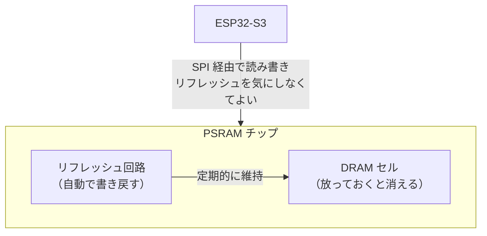

# PSRAM とは（ESP32-S3 のメモリ構成）

分からなかったこと: **「PSRAM とは何か」**。動画音声を `ps_malloc` で確保する話（#152/#166）で出てきた。

## ひとことで

**外付けの追加メモリ**。ESP32-S3 のチップ内蔵メモリ（SRAM）は約 512KB しか無く、数 MB のデータを
置く場所が無い。そこで外付けチップを足して 8MB 使えるようにしたものが PSRAM。

## 2 種類のメモリの違い

| | 内蔵 SRAM | PSRAM |
|---|---|---|
| 容量（CoreS3） | 約 512KB | **8MB** |
| 場所 | チップの中 | 外付けチップ（SPI 接続） |
| 速度 | 速い | 遅い（バス経由 + キャッシュ） |
| 確保方法 | `malloc()` | `ps_malloc()` |
| 用途 | 変数・スタック・Wi-Fi スタック | 画像・音声など大きなデータ |

`malloc()` と `ps_malloc()` は**明示的に使い分ける**。何もしなければ内蔵 SRAM から取られるので、
大きなバッファを普通に `malloc` すると内蔵 SRAM を食い潰して Wi-Fi ごと死ぬ。

## 名前の由来

**P**seudo-**S**tatic **RAM**（擬似スタティック RAM）。

メモリには大きく 2 種類ある。

- **SRAM**（Static RAM）… 電源がある限り内容を保持する。速いが 1bit あたりの回路が大きく高価
- **DRAM**（Dynamic RAM）… コンデンサに電荷を貯めて記憶する。安く大容量にできるが、**放っておくと
  電荷が抜けて内容が消える**ため、定期的に読み直して書き戻す「リフレッシュ」が要る

PSRAM は**中身は DRAM** だが、**リフレッシュ回路をチップの中に内蔵している**。だから外から見ると
「置いておくだけで消えない」＝ SRAM のように扱える。**擬似的にスタティック**、という意味。



要するに「安くて大容量な DRAM を、扱いやすい SRAM の顔をさせて使う」ための仕組み。

## このプロジェクトでの使いどころ

動画再生の音声は `audio.wav` を**丸ごと** PSRAM に載せて `playRaw` に渡している（#152）。

```cpp
uint8_t* buf = static_cast<uint8_t*>(ps_malloc(len));  // 内蔵SRAMではなくPSRAMから取る
```

内蔵 SRAM は 512KB しか無く Wi-Fi スタックとも共用なので、数 MB の音声を置く選択肢は無い。

## ハマりどころ: 「空きはあるのに確保できない」

`ps_malloc` は**連続した領域**を返す。そのため空き合計が足りていても、細切れになっていると失敗する。

```
PSRAM 8MB のうち空き合計 5MB  … でも最大の連続ブロックが 3MB
  → 4MB を要求すると失敗する（合計は足りているのに！）
```

これを**断片化（フラグメンテーション）**という。だから診断では**空き合計と最大連続ブロックの
両方**を見る必要がある（#166 でそのログを入れた）。

```cpp
heap_caps_get_free_size(MALLOC_CAP_SPIRAM)          // 空き合計
heap_caps_get_largest_free_block(MALLOC_CAP_SPIRAM) // 最大連続ブロック
```

- `free` も `largest` も足りない → 素材が大きすぎる。サンプルレートを下げるか分割再生（2c-2）へ
- `free` は足りるが `largest` が足りない → **断片化**。常駐している何か（#128 のスプライト等）が原因
- どちらも 0 → PSRAM が初期化されていない（設定の問題）

なお `largest` が要求サイズをわずかに上回っていても失敗しうる。アロケータが管理用のヘッダを
余分に消費するため。数十バイト差の境界では「足りていたはず」と読まないこと。

## 実際の数字（この動画再生で）

```
全長 236秒 × 16000サンプル/秒 × 2バイト(16bit) = 約 7.2MiB
PSRAM 全体                                     =     8MiB
```

8MB のうち 7.2MB を**1 個の連続した塊**で要求することになり、かなり際どい。載らなければ
サンプルレートを下げるか、チャンクストリーミング（2c-2）に進む。

## 関連

- `summary/260718/02-usb-msc.md` — USB MSC 転送ファームの設計
- Issue #152（音声を PSRAM 全載せ）/ #166（PSRAM 診断ログ）/ #128（スプライト常駐）
