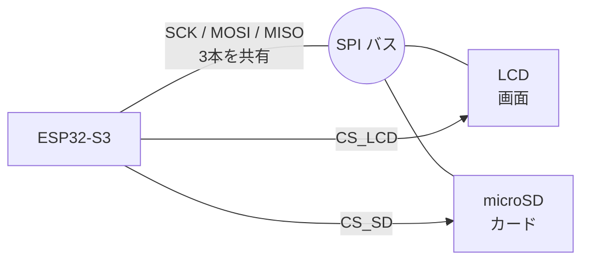
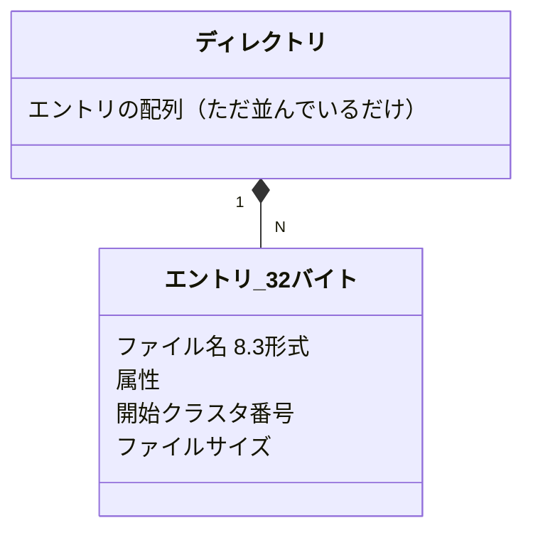
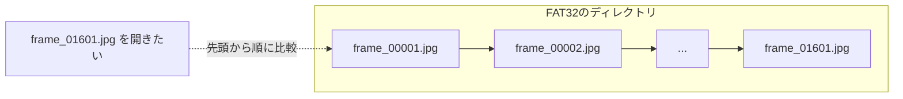
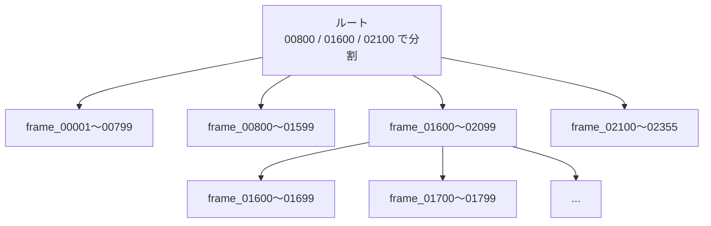
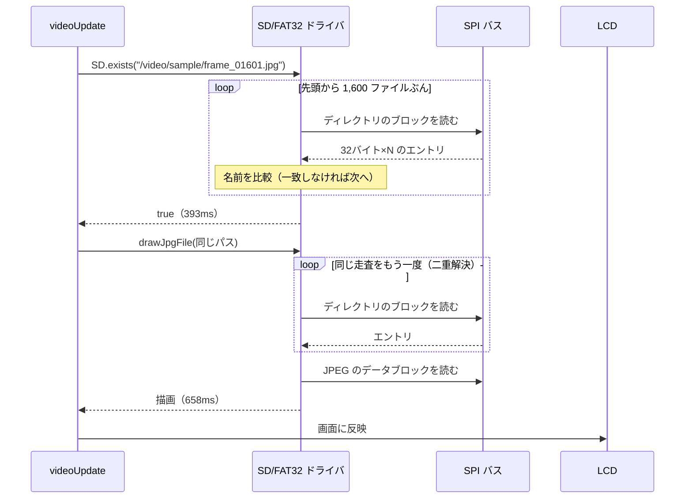
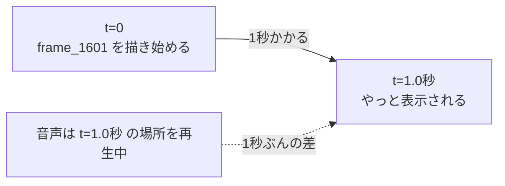
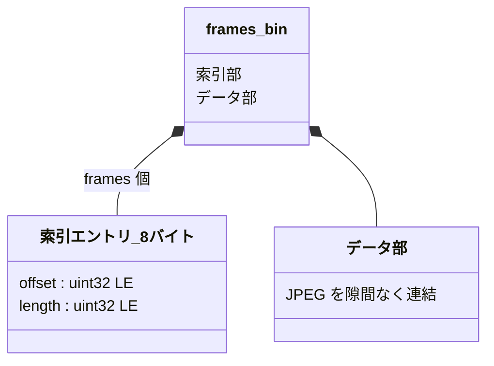
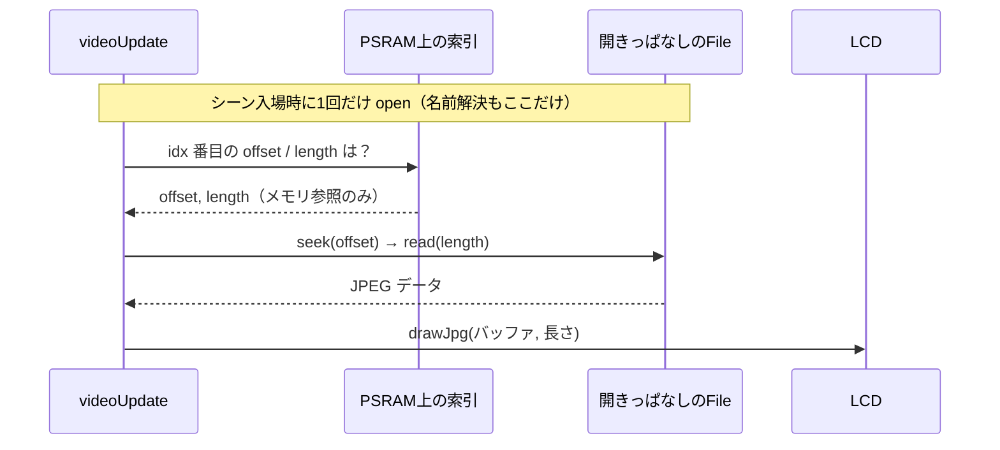
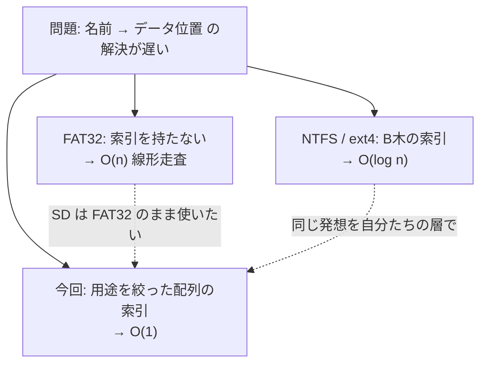

# SPI とファイルシステム（FAT32 / NTFS / ext4 / B木）

分からなかったこと: **「動画の描画が、再生が進むほど遅くなったのはなぜか」**。
#169 で原因を追う中で、SPI とファイルシステムの前提知識が必要になった。

結論を先に言うと、**遅かったのは私たちのコードではなく、SD カードのファイルシステム（FAT32）が
ファイル名を探す処理**だった。そしてその解決策は、NTFS や ext4 が採っている考え方を、
自分たちのアプリ層で真似することだった。

---

## 1. SPI — microSD と LCD が同じ線を使っている

**SPI**（Serial Peripheral Interface）は、マイコンと周辺機器をつなぐ**同期式シリアルバス**。
4 本の線で構成される。

| 線 | 役割 | 共有 |
|---|---|---|
| SCK | クロック（タイミングの基準） | 全機器で共有 |
| MOSI | マイコン → 周辺機器のデータ | 全機器で共有 |
| MISO | 周辺機器 → マイコンのデータ | 全機器で共有 |
| CS | この機器と話す、という選択（Chip Select） | **機器ごとに1本** |

**共有される 3 本＋機器ごとの CS 1 本**という構成。CS を下げた機器だけが応答し、
他はバスから切り離されたように振る舞う。だから 1 組の SCK/MOSI/MISO に複数の機器を
ぶら下げられる。CoreS3 はこれで LCD と microSD を同じバスに載せている。



CS が機器ごとに個別なのがポイントで、**同時に 2 つを選ぶことはできない**。
これが次の (a) に直結する。

### ここが効いてくる 2 点

**(a) 同時に使えない。** CS で選ぶ以上、ある瞬間に話せる相手は 1 つ。
SD から読んでいる間は画面を描けず、逆もまた然り。動画再生は「SD から読む」と「画面に描く」の
繰り返しなので、**このバスが丸ごとボトルネック**になる。

> ⚠ CoreS3 ではさらに **GPIO35 が SD の MISO と LCD の D/C を兼用**している。
> 別タスクから同時に触ると書き込みデータが静かに壊れる（`research/sd-video-playback.md`）。

**(b) 1 回のやり取りにオーバーヘッドがある。** SPI は「コマンドを送る → 応答を待つ」の往復。
SD カードは内部にコントローラを持つので、1 回の読み出しにも準備時間がかかる。
**細かい読み出しを何度も繰り返すと、往復の回数だけコストが積み上がる。**

この (b) が、後の「ファイル名を探すのが遅い」に直結する。

---

## 2. FAT32 — ディレクトリに索引が無い

32GB 以下の SD カード（SDHC）は通常 **FAT32** でフォーマットされている。
FAT は **File Allocation Table** の略。（32GB を超える SDXC は規格上 exFAT だが、
索引を持たない点は同じ傾向。今回使ったカードは 29.1GB / FAT32。）

### ディレクトリの正体は「ただの配列」

FAT32 のディレクトリは、**32 バイトの固定長エントリが並んだだけのファイル**である。
特別なデータ構造ではなく、中身が「ファイル名の一覧」であるだけの普通のファイル。



**索引（インデックス）が存在しない。** つまり `frame_01601.jpg` を開きたければ、
**先頭から 1 つずつエントリを読んで名前を比較する**しかない。これが**線形走査**。

さらに現代のファイル名は 8.3 形式（`FRAME_~1.JPG` のような 8 文字＋拡張子 3 文字）に収まらないので、
**長いファイル名は複数のエントリに分割**して格納される（VFAT の LFN）。
1 ファイルが 2〜3 エントリを消費するため、走査量は実際にはさらに増える。



### なぜそんな設計なのか

FAT は 1970〜90 年代に、フロッピーディスクや小容量メディア向けに作られた。
**実装が単純で、コードが小さく、どの OS でも読める**ことが最大の価値だった。
数十〜数百ファイルしか入らない前提なら、線形走査で何も問題はない。

そして**その単純さゆえに、今でも SD カードの標準**であり続けている。
デジカメでも PC でもマイコンでも読めるのは FAT だからで、これは欠点ではなく仕様上の選択である。

---

## 3. NTFS / ext4 — B木で索引を持つ

同じ問題を、PC 向けのファイルシステムは**索引を持つ**ことで解決している。

| ファイルシステム | ディレクトリの構造 | 名前解決のコスト |
|---|---|---|
| **FAT32** | 平坦な配列 | **O(n)** 線形走査 |
| **NTFS**（Windows） | B+木（`$INDEX_ROOT` / `$INDEX_ALLOCATION`） | O(log n) |
| **ext4**（Linux） | HTree（`dir_index` 機能） | **深さ 2〜3 に固定**＝実質数回の I/O |

ext4 の HTree は少し性質が違う。名前の**ハッシュ値**で引く索引で、木の深さが 2〜3 に
固定されている（葉に着いた後はブロック内を線形走査）。比較で降りていく B木の O(log n) とは
別物だが、**I/O 回数が数回で収まる**という実用上の効果は同じ。

### B木とは

**B木**（B-tree）は、**1 ノードが多数の子を持つ平衡探索木**。
二分木が 1 ノードにつき 2 分岐なのに対し、B木は数十〜数百に分岐する。



> この図は辞書順に分割した B木のイメージ。NTFS の B+木はこの形だが、
> **ext4 の HTree はハッシュ順**なので、実際の並びは名前の順序と対応しない。


**なぜ分岐を増やすのか。** ディスクや SD カードは**ブロック単位**（512 バイト等）でしか読めない。
1 バイトだけ読みたくても 1 ブロック丸ごと読むことになる。ならば **1 ノード＝1 ブロックに
詰め込めるだけ詰め込む**方が、読み出し回数（＝遅い I/O の回数）を減らせる。

B木は「**計算量ではなく I/O 回数を減らす**」ために設計された木、と理解するとよい。
CPU 上のアルゴリズムなら二分木で十分だが、ブロックデバイス相手ではブロック読み出しこそが
コストなので、木を浅く太くする。

数字で言うと、2,355 ファイルを探す場合。**I/O 回数どうしで比べる**のが要点なので、
エントリ数ではなくブロック読み出し回数に直す。

512 バイトのブロックに 32 バイトのエントリは 16 個入る。
また §2 のとおり `frame_01601.jpg` は 15 文字あって 8.3 形式に収まらないので、
**LFN 2 個＋短縮名 1 個 ＝ 1 ファイルあたり 3 エントリ**を消費する。

| | エントリ数 | ブロック読み出し |
|---|---|---|
| **線形走査**（FAT32） | 最悪 2,355 × 3 ≒ **7,000** | 約 **440 ブロック** |
| **B木**（分岐数 100 程度） | 深さ 2 で足りる | **2〜3 ブロック** |

100 倍以上の差になる。しかも SPI 越しの読み出しは 1 回ごとに往復のオーバーヘッドを伴うので、
この差がそのまま体感時間に効く。

---

## 4. 実際に何が起きていたか（#169 の実測）

動画は 1 秒 10 枚のフレームを SD から読んで描く。元動画は 236 秒で、10fps に変換した結果
235.5 秒ぶん ＝ **2,355 ファイル**を
1 つのディレクトリに置いていた。



測定値はこうなった。

| フレーム番号 | `SD.exists`<br/>（名前解決のみ） | `drawJpgFile`<br/>（名前解決＋読み込み＋デコード） | 合計 |
|---|---|---|---|
| idx=0 | 4ms | 54ms | **58ms** |
| idx=1600 | 393ms | 658ms | **1,051ms** |

10fps なら 1 枚あたりの予算は **100ms**。終盤は **10 倍超過**していた。

⚠ **2 列目にも名前解決が含まれている**点に注意。当時のコードは `SD.exists()` で存在を確認してから
`drawJpgFile()` を呼んでおり、**同じファイル名の解決を 2 回**していた（`drawJpgFile` は内部で
自分でファイルを開くため）。だから 658ms の大半も名前解決である。デコード自体は
フレーム番号に依存しないはずなので、番号とともに 54ms → 658ms と 12 倍に増えたことが
その証拠になっている。

この二重解決は #169 で除去した（`drawJpgFile` はファイル不在なら false を返すので、
`exists` は元から不要だった）。

### なぜ「遅れ」に見えたのか

ここが直感に反する部分。画面に出ているのは「**描画を始めた時点の絵**」である。
描画に 1 秒かかるなら、**1 秒前の絵を見ている**ことになる。



この遅れがフレーム番号とともに育ち、先頭に戻ると消える。
実機で観察された「**進むほど絵が音から遅れ、一周すると戻る**」はこれだった。

**時間軸の計算（`video_frame_at`）は正しく動いていた。** 音声も正確だった（235 秒で誤差 ±60ms）。
壊れていたのは時刻ではなく、**画面に出る絵の鮮度**だった。

---

## 5. 失敗した対策: サブディレクトリ分割

「走査する件数を減らせばよい」と考え、100 枚ずつサブディレクトリへ分けた。

```
/video/sample/000/frame_00001.jpg
/video/sample/001/frame_00101.jpg
   ...
/video/sample/023/frame_02355.jpg
```

理屈では、走査対象が 2,355 件から 100 件に減るはずだった。**しかし実測は逆だった。**

| フレーム番号 | 修正前（フラット） | 分割後 |
|---|---|---|
| idx=0 | **58ms** | **872ms** |
| idx=200 | 未測定 | **890ms** |
| idx=1600 | **1,051ms** | 未測定 |

**測れたのは分割後の idx=0 と idx=200 の 2 点だけ**である。この範囲では番号による増大は
見られなかったが、**低い番号 2 点しか観測していない**ので「全域で一定」とまでは言えない。

言えるのは次の 2 つ。**低い番号で 15 倍悪化した**（58ms → 872ms）こと、そして
実機の体感が「遅延は改善したが fps が大幅に落ちた」と一致したこと。
1 周あたり 200 の倍数のログが 2 行しか出なかったことも、実効 **1 fps 前後**を裏付けている
（描画が遅いほど多くのフレームが飛ばされ、200 の倍数を踏まなくなる）。

### なぜ外したか

`idx=0 で 4ms` という値を「走査が短いから速い」と解釈したのが誤りだった。
実際には **`frame_00001.jpg` がディレクトリの先頭エントリだった**だけの最良値であり、
そこから「走査量に比例する」と一般化してはいけなかった。

では**なぜ遅くなったのか。ここは特定できていない。** 悪化したことは実測で確実だが、
機構は仮説の域を出ないので、断定しない形で候補を挙げておく。

- **階層を 1 つ増やすコスト** — `/video/sample/001/frame_00101.jpg` を開くには
  `video` → `sample` → `001` とディレクトリを順に開いて辿る必要がある。
  ただし `sample` の中身は 24 個のサブディレクトリだけなので、**この走査だけで
  58ms → 872ms（15 倍）を説明するのは苦しい。**
- **ドライバのキャッシュが効かなくなった** — FAT ドライバはディレクトリのセクタを
  キャッシュすることがある。フラット配置なら同じディレクトリを読み続けるので当たるが、
  ディレクトリを跨ぐと無効化される可能性がある
- **クラスタ連鎖の追跡** — ディレクトリ自体もクラスタの連結リストで、開くたびに辿る必要がある

いずれにせよ**「走査するエントリ数」だけでは説明がつかない**ことが分かった時点で、
この方向（ファイルシステムに名前解決を任せたまま最適化する）自体を諦める判断材料には十分だった。

> 📌 **教訓**: 1 点の測定値から傾向を一般化しない。
> 「速い理由」の説明が複数あり得るなら、それを区別できる測定を先に設計する。

---

## 6. 解決策: 索引を自分たちの層で持つ（#170）

FAT32 に索引が無いのは変えられない。SD を NTFS や ext4 にすれば解決するが、
**PC やカメラから読めなくなる**ので現実的でない。

ならば発想を変える。**ファイルシステムに名前解決を任せるのをやめ、索引を自分たちで持つ。**

全フレームを 1 本のファイルにまとめ、先頭に「N 番目のフレームは何バイト目から何バイト」という
**索引表**を置く。これは NTFS や ext4 が B木でやっていることを、
用途を絞ったぶん**もっと単純な配列**で実現したものと言える。



索引は 2,355 × 8 = 約 19KB。**PSRAM に丸ごと載せてしまえる**サイズなので、
起動時に一度読めば以降は**メモリ上の配列を引くだけ**になる。

⚠ ただし **O(1) になるのは「名前 → 位置」の解決まで**で、その後の `seek` は別問題。
FAT ではファイルの実体もクラスタの連結リストなので、任意の位置へのシークは一般に
連鎖を辿る必要がある（FatFs の fast seek を明示的に有効にしない限り）。
順再生なら前へ進むだけなので安いが、**ループで先頭に戻る時**に効く可能性がある。
実装時に踏みうる地雷なので注意。



**名前解決が完全に消える。** 残るのは読み込みと JPEG のデコードだけになる。

どれだけ速くなるかは**まだ実測していない**。目安として idx=0 の 54ms があるが、
これも名前解決を含む値なので「デコード単体の時間」ではない。
言えるのは「デコード時間はフレーム番号に依存しないはずなので、**54ms が上限の目安**になる」
という程度で、10fps の予算 100ms に収まる見込みはある、というところまで。
**確定は #170 の実測を待つ。**

副次的な効果として、**PC からの転送も速くなると見込まれる**。
2,355 個の小ファイルの転送には 538 秒かかった（85KB/s）。この速度はデータ量よりも
ファイルごとのオーバーヘッドで決まっていると考えられるが、**内訳は測っていない**ので
これも見込みである。

### 考え方の整理



「辞書を持てばいい」という発想自体は素直で、実際ユーザーからも
**「map などを使って辞書でフレームにアクセスするのでは駄目なのか」**という指摘が出ていた。
これは正しかった。当時「線形探索をしているのは FAT32 の内部なので手が出せない」と答えたが、
より正確には「**ファイルシステムに名前解決を任せている構造そのものを変えればよい**」だった。

---

## まとめ

- **SPI** は 1 本のバスを LCD と SD で共有する。往復のオーバーヘッドがあり、細かいアクセスの繰り返しに弱い
- **FAT32** はディレクトリに索引を持たず、名前解決が線形走査になる。単純さと互換性を優先した設計
- **NTFS / ext4** は B木系の索引でこれを解決している。B木は「I/O 回数を減らす」ために浅く太い木にしたもの
- 今回の遅延は、**2,355 ファイルを 1 ディレクトリに置いたこと**で線形走査が効いたもの
- 画面に出るのは「描画を**始めた**時点の絵」なので、描画の遅さがそのまま**遅れ**として知覚される
- **サブディレクトリ分割は逆効果**だった（低い番号で 15 倍悪化）。**理由は未特定**で、
  走査するエントリ数だけでは説明がつかない
- 解決は **索引を自分たちの層で持つこと**（#170）。FAT を変えずに名前解決を消せる

### この文書を書く中で自分が踏んだ誤り

- **1 点の測定値から傾向を一般化した**（`idx=0 で 4ms` → 「走査量に比例する」）。
  実際は先頭エントリだった最良値にすぎず、これがサブディレクトリ分割の失敗に直結した
- **測っていない値を表に書きかけた**（分割後の idx=1600）。実測は idx=0 と idx=200 の 2 点だけ
- **推定を断定で書きかけた**（失敗の機構、デコード単体の時間、転送時間の内訳）

いずれもレビューで指摘されて直したもの。**測った範囲と、そこから推測したことを、
文章の上で区別する**のは意識しないと崩れる。

## 関連

- Issue #169（原因特定と計測）/ #170（パック方式の設計）
- `knowledge/260718/01-usb-firmware-terms.md` — USB・ファーム周りの用語
- `knowledge/260720/01-psram.md` — PSRAM と断片化
- `research/sd-video-playback.md` — SD 併用時の作法（GPIO35 兼用の話）
