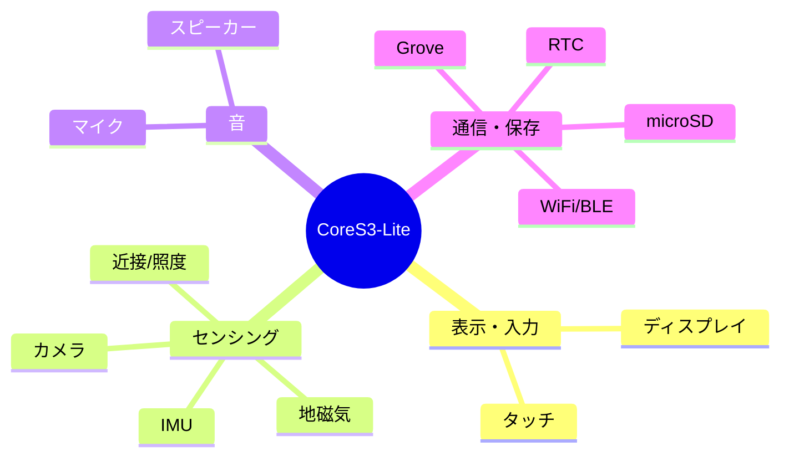
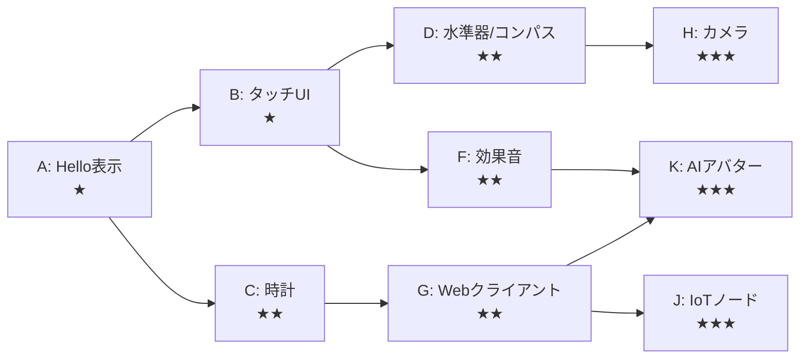

# CoreS3-Lite でできること 調査メモ

> 関連 Issue: #1
> 対象: M5Stack CoreS3-Lite (ESP32-S3)

## 1. 結論サマリ

CoreS3-Lite は「Lite」だが機能はほぼフル装備で、削られたのは**周辺要素（電池容量・取付方式・拡張ポート数・DC入力）**のみ。
ディスプレイ・タッチ・カメラ・マイク・スピーカー・各種センサがすべて使えるため、定番の遊び方はほぼ網羅できる。

## 2. ハードウェア別にできること

| ハード | 主な型番 | できること |
|--------|---------|-----------|
| SoC | ESP32-S3 (240MHz, Flash16MB, PSRAM8MB) | Wi-Fi/BLE通信、画像処理、軽量AI推論 |
| ディスプレイ | 2.0" IPS 320x240 (ILI9342C) | テキスト/図形/画像/UI表示、ダッシュボード |
| タッチ | FT6336U (静電容量) | タップ/スワイプ操作、タッチUI、お絵描き |
| カメラ | GC0308 (0.3MP) | 静止画/映像取得、簡易な顔・色検出 |
| IMU | BMI270 (6軸) | 傾き・振り・歩数・ジェスチャ検出 |
| 地磁気 | BMM150 (3軸) | 方位（コンパス） |
| 近接/照度 | LTR-553ALS | 明るさ計測、近接検知 |
| マイク | ES7210 (デュアル) | 録音、音量計測、簡易音声入力 |
| スピーカー | AW88298 + 1W | 効果音/音声/メロディ再生 |
| microSD | - | 画像/ログ/設定の保存 |
| Wi-Fi | 2.4GHz | Web取得、API連携、サーバ化、MQTT |
| RTC | BM8563 | 時刻保持、タイマー起動、低消費電力 |
| Grove | PORT.A (I2C等) | 外部センサ/アクチュエータ増設 |

## 3. 「メジャーな遊び方」候補リスト

難易度: ★(易) 〜 ★★★(難)

| # | テーマ | 概要 | 使う機能 | 難易度 |
|---|--------|------|---------|--------|
| A | Hello World 表示 | 画面に文字・図形を出す | ディスプレイ | ★ |
| B | タッチお絵描き/ボタンUI | 触れた場所に反応するUI | ディスプレイ+タッチ | ★ |
| C | デジタル時計 | RTCで時刻表示、NTP同期 | RTC+WiFi+表示 | ★★ |
| D | 水準器/コンパス | 傾き・方位を可視化 | IMU+地磁気+表示 | ★★ |
| E | 環境ダッシュボード | 明るさ・音量等をグラフ表示 | 近接/照度+マイク+表示 | ★★ |
| F | 効果音プレイヤー | タッチで音を鳴らす | タッチ+スピーカー | ★★ |
| G | Webクライアント | 天気/為替などAPI取得し表示 | WiFi+表示 | ★★ |
| H | カメラビューア | 撮影しSDに保存/画面表示 | カメラ+SD+表示 | ★★★ |
| I | 音量メーター/簡易録音 | マイク入力を可視化・保存 | マイク+表示+SD | ★★★ |
| J | IoTセンサノード | センサ値をMQTT/HTTPで送信 | Grove+WiFi | ★★★ |
| K | サマーウォーズ風AIアバター | ドット調アバターを表示し、クラウドAI(Claude API)で対話/お知らせ | 表示+マイク+スピーカー+WiFi | ★★★ |
| L | 羊ドット絵キャラ | 既存アバター描画を流用した新キャラ表示 | 表示 | ★ |
| M | 音声サブシステム | 録音WAV再生→クラウドTTS(voice id切替)で声を出す | スピーカー+WiFi | ★★〜★★★ |
| N | 宝石図鑑(瑠璃の宝石パロ) | タップで宝石スプライト+産地+構成元素を表示(自前データ) | 表示+タッチ | ★〜★★ |
| O | PokeAPIビューア | タップでポケモンのドット絵+情報+鳴き声+揺れエフェクト | 表示+タッチ+スピーカー+WiFi | ★★ |
| P | 掛け合わせ | キャラが声で図鑑を解説する統合層 | L+M+N+O | ★★★ |

> テーマ K の詳細検討は [`summary/260621/03-m5stack-avatar.md`](../summary/260621/03-m5stack-avatar.md) を参照。LLM 本体はデバイスに載せず、クラウド推論＋デバイス表示の分担構成が現実解。
>
> テーマ L〜P（羊キャラ・音声・図鑑系）の実現可能性・優先順位・ライセンス評価は [`research/playful-apps-ideas.md`](./playful-apps-ideas.md) を参照。

## 4. 次の一歩の候補

TDD+アジャイルで「小さく動く」を最優先するなら、まずは **A: Hello World 表示**（または最小の Lチカ相当＝シリアル出力）から始め、ビルド〜書き込み〜実機表示の一連を通すのが堅実。
その後 B → C/D と、機能を一つずつ足して遊びを広げる。

## 5. 留意点 / 未確認事項

- M5Stack 用ライブラリは `M5Unified` / `M5GFX` が定番。CoreS3-Lite の対応状況は実装時に確認する。
- カメラ(GC0308)・タッチの細かいAPIはライブラリ依存。テーマ H/B 着手時に詳細調査する。
- TDD は「ハード非依存のロジック」をホストPC上の単体テスト(PlatformIO native + Unity)で先に固め、ハード依存部は実機確認で補う方針が現実的。

## 参考

- [CoreS3-Lite - m5-docs](https://docs.m5stack.com/en/core/CoreS3-Lite)
- [M5Stack CoreS3 Lite - shop](https://shop.m5stack.com/products/m5stack-cores3-lite-esp32s3-iot-dev-kit)
- [CoreS3 Lite low-cost IoT controller - CNX Software](https://www.cnx-software.com/2025/07/22/m5stack-cores3-lite-low-cost-iot-controller-features-magnetic-backplate-and-200mah-battery/)
