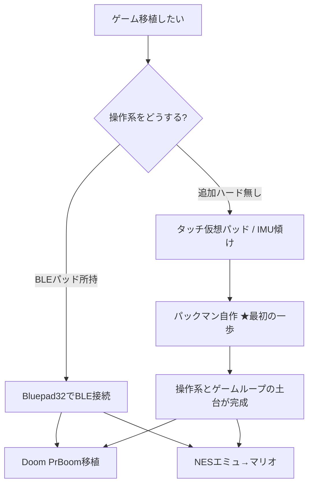

# ゲーム移植 実現性調査（CoreS3-Lite / ESP32-S3）

対象ハード: **M5Stack CoreS3-Lite**
- SoC: ESP32-S3 (Xtensa LX7 dual-core 240MHz)
- Flash 16MB / **PSRAM 8MB**（Doom/エミュに必須の容量あり）
- ディスプレイ: 2.0" IPS 320x240（ILI9341系）＋**静電容量タッチ**
- **物理ボタン無し**（無印 M5Stack Core の A/B/C ボタンが無い）
- 無線: **Wi-Fi 2.4GHz / Bluetooth 5.0 LE（BLE のみ）**

このハードの2大制約が、そのまま移植の分かれ目になるのだ:
1. **物理ボタンが無い** → 操作系を別途用意しないと本格的なアクションゲームは厳しい
2. **BLE のみ（Bluetooth Classic 非対応）** → 使えるコントローラーが限られる

---

## 1. Bluetooth コントローラー接続の可否

### 結論: **BLE 対応のコントローラーなら可能。ただし機種は限られる。**

ESP32-S3 は **Bluetooth Classic (BR/EDR) を積んでいない**（初代 ESP32 と Pico W/2W だけが対応）。
市販ゲームパッドの多くは 2024 年時点でも Classic 接続なので、そのままでは繋がらないのだ。

**使えるライブラリ**: [Bluepad32](https://github.com/ricardoquesada/bluepad32)
- ESP32 / ESP32-S3 / C3 / Pico W 向けのゲームパッド統合ライブラリ
- ESP32-S3 では「**BLE ゲームパッドのみサポート**」と明記されている
- Arduino 対応ボードならそのまま使える＝CoreS3-Lite でも動く見込み

**BLE で繋がる主なコントローラー**:
| コントローラー | 接続 | 備考 |
|--------------|------|------|
| Sony DualShock 4 (PS4) | BLE | Bluepad32 対応 |
| Sony DualSense (PS5) | BLE | Bluepad32 対応 |
| Xbox Wireless (新BLE FW) | BLE | ファーム更新で BLE 動作 |
| 8BitDo（BLE/キーボードモード等） | BLE | モード切替が必要な機種あり |
| Nintendo Switch Pro / Joy-Con | Classic 主体 | **S3 では不可の可能性大** |

> 注意: BLE か Classic かはコントローラーの世代・ファームで変わる。手持ちの型番を教えてくれれば個別に可否を確定させるのだ。

**代替の操作系**（コントローラーが繋がらない場合）:
- **静電タッチ**の仮想パッド（画面下に十字＋ボタンを描画）→ 追加ハード不要。ただしアクションは操作しにくい
- **Grove PORT.A**（I2C/GPIO）に物理ボタンや [M5 Faces/GameBoy 系ユニット]を接続
- **IMU（BMI270）傾け操作** → 落ち物・レース・ボール転がし系と相性◎
- スマホ/PC を BLE 経由でコントローラー化（自作）

---

## 2. メジャーゲーム移植の可否（Doom / パックマン / ロックマン / マリオ）

| ゲーム | 実現性 | 方式 | 難所 |
|-------|:------:|------|------|
| **Doom** | ◎ 実績多数 | PrBoom 移植（[espressif/esp32-doom]） | PSRAM 必須→OK。操作系とWADデータ、音は非対応 |
| **パックマン** | ◎ 最推奨 | **自作実装**（著作権的にクリーン） | 迷路・ゴーストAIを自前で書く。ROM不要 |
| **マリオ (SMB)** | ○ | NESエミュ（[Nofrendo]/[Anemoia-ESP32]）or 自作([SuperESP32World]) | ROMは自分で用意（合法性）。Mapper0で軽い |
| **ロックマン** | △ | NESエミュ | MMCマッパー要対応でエミュ負荷大。ROM合法性 |

### Doom
- 公式 PoC [espressif/esp32-doom] が PSRAM 前提で存在。PrBoom ベース。
- CoreS3-Lite は PSRAM 8MB で容量条件を満たす。
- 難所: **音・BGM・セーブ非対応**、そして**操作系**（元は PS1/PS2 パッド前提）。
- 市販 Doom の WAD データが必要（フリーの `freedoom.wad` なら合法）。

### パックマン（← 最初の一歩に一番おすすめ）
- ROM を使わず**自作**するのが著作権的にも技術的にも一番安全。
- 320x240＋タッチ or IMU で完結。迷路描画・ドット・4体のゴーストAI（追跡/待ち伏せ/気まぐれ）を実装するだけ。
- makership の元記事もパックマン風アーケードを M5Stack で作る趣旨（物理ボタン付き無印Coreを使用）。

### マリオ（スーパーマリオブラザーズ）
- 経路A: **NESエミュ**（[Nofrendo]系 [m5stack/M5Stack-nesemu]、高速版 [Anemoia-ESP32]）で ROM を動かす。SMB は Mapper0 で軽く、実績あり。
- 経路B: **自作クローン** [SuperESP32World]（エミュではなく再実装）。
- **ROM の合法性**: 任天堂の著作物。自分が所有するカセットから吸い出した個人用に限る。リポジトリにコミットしてはいけない（ポケモン素材と同じ扱い）。

### ロックマン
- NESエミュで理論上は動くが、**MMC 系マッパー**対応が必要でエミュの完成度・速度要求が上がる。Doom/マリオより難度高。
- こちらも ROM 合法性の制約は同じ。

---

## 3. 総合おすすめルート

**推奨順序**:
1. **まず操作系の土台**（タッチ仮想パッド or Bluepad32 でのBLEパッド）を1機能として作る
2. **パックマン自作**で「ゲームループ＋操作＋スコア」の型を確立（ROM不要・完全合法）
3. その土台の上に **Doom（PrBoom移植）** → 余力で **NESエミュ（マリオ）**

理由: いきなり Doom/エミュに行くと「操作系」「データ供給」「著作権」の3つが同時に立ちはだかる。
先に自作パックマンで土台を作れば、認知負荷を刻みながら進められるのだ。

---

## 参考リンク
- Bluepad32: https://github.com/ricardoquesada/bluepad32 ／ FAQ(BLE制約): https://bluepad32.readthedocs.io/en/latest/FAQ/
- espressif/esp32-doom: https://github.com/espressif/esp32-doom
- m5stack/M5Stack-nesemu (Nofrendo): https://github.com/m5stack/M5Stack-nesemu
- Anemoia-ESP32 (高速NESエミュ): https://github.com/Shim06/Anemoia-ESP32
- SuperESP32World (マリオ自作): https://github.com/SoftwareGuy/SuperESP32World
- esp-box-emu (多機能エミュ): https://github.com/esp-cpp/esp-box-emu
- makership mini arcade: https://makership.co.jp/m5stack-mini-arcade-1/
