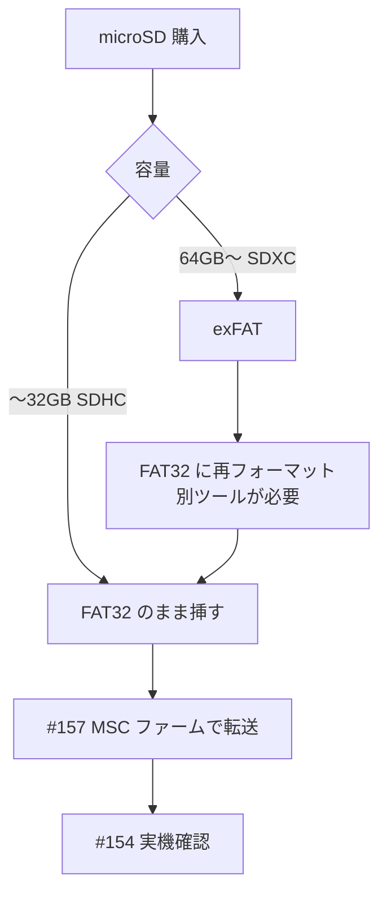

# 動画再生用 microSD の選定と相場（#162）

PLAN.md の動画再生 Step2 以降は microSD 未所持でブロックされている（2026-07-18 時点）。
購入判断のために、**どの規格を買うべきか**と**いくらが相場か**を調べた。調査日 2026-07-19。

## 結論（先に）

**32GB（SDHC）のブランド品を 1,500〜2,200 円で買う。** キオクシア EXCERIA BASIC か SanDisk Ultra。
**カードリーダーも併せて買う**（1,000 円前後）。PC に無いことが確認済みで、MSC 経路が転んだ時の唯一の迂回路になる。

## 容量は 32GB 以下にする理由

通常ファーム・MSC ファームとも、カードのマウントは Arduino `SD` ライブラリ（`SD.begin`）で行っている。
これは FAT16/FAT32 のみで **exFAT を読めない**。ここが容量の上限を決める。

なお MSC ファーム自体（`src/msc_main.cpp`）は `SD.readRAW` / `SD.writeRAW` のセクタ単位実装で
ファイルシステムに非依存（FAT32 の解釈は PC 側）。制約は MSC ではなく `SD.begin()` 側にある。
※ exFAT カードで実際に `SD.begin()` が落ちるかは未実測。落ちない可能性はあるが、賭ける理由が無い。

| 容量 | 規格 | 出荷時 FS | 判定 |
|---|---|---|---|
| 〜32GB | SDHC | **FAT32** | ◎ 挿すだけで動く |
| 64GB〜 | SDXC | exFAT | △ FAT32 へ再フォーマットが要る。GUI のフォーマッタは 32GB 超を FAT32 にできない（Windows 11 24H2 以降なら `format /FS:FAT32` の CLI で可能） |

用途は JPEG 連番＋WAV（`/video/<name>/`）。`tools/video2frames.py` の既定値（`--fps 10`、320×240、
`--quality 5`、音声 16kHz mono 16bit）だと概算で:

- フレーム: 320×240 の JPEG が 1 枚 10〜15KB × 10fps ≒ **100〜150KB/秒**
- 音声: 16000 × 2byte × 1ch = **32KB/秒**

合わせて **約 10MB/分**。10 分の動画で 100MB 程度で、32GB なら数十本入る。
`--fps` や `--quality` を上げてもオーダーは変わらない。
**64GB 以上を買う積極的な理由が無い**うえに、exFAT を踏むと初手のマウント確認で余計な変数が増える。

## 価格相場（2026-07 時点・国内）

| 区分 | 相場 | 実例 |
|---|---|---|
| ノーブランド寄り 32GB | **650〜900 円** | IODATA BMS-32G10A ¥657 / グリーンハウス GH-SDM-RUA32G ¥870 |
| ブランド品 32GB | **1,500〜2,200 円** | キオクシア EXCERIA BASIC ¥1,529 / SanDisk Ultra SDSQUA4-032G ¥2,188 |
| （参考）64GB | 1,500〜2,000 円 | — |

### ブランド品を選ぶ理由

差額は 800 円程度。対して、いま **Step2 全体がこのカード 1 枚でブロックされている**状態で、
`SD.begin()` が失敗した時の切り分けコストの方が高い。

そして **SD まわりは実機で一度も検証が通っていない**（`summary/260718/02-usb-msc.md` の M3 は
カード未所持で保留）。初回のマウントは、コード側の未検証要素をいきなり全部踏む場面になる。
とくに #157 で「**LCD と microSD は同一 SPI バスで、GPIO35 が SD の MISO と LCD の D/C の兼用**」
と判明しており（当初 `sd-video-playback.md` に「別バス」と書いていたのを訂正した）、
バス競合という疑うべき要因がすでに 1 つある。ここに**カード品質という変数を足さない**のが目的。

### 買い時

2025 年秋から AI データセンター向け NAND 需要でメモリ全般が高騰中。SanDisk は 2026-02 に
7%〜最大 78% の値上げを実施。2027 年以降まで需給改善の見込みは薄いとされており、
**待っても下がらない**。実店舗はネット通販より 1,000 円近く高くなる傾向があるので通販で買う。

## カードリーダーの併購

`summary/260718/02-usb-msc.md` の通り、**PC にカードリーダーが無い**ことが USB MSC ファームを
作った動機だった。MSC 経由で転送できれば不要だが、#157 M3（実転送）は未検証のまま。

特に **MSC ファームから通常ファームへ焼き戻す時に自動リセットが効くかが未確認**（PLAN.md に記載）。
ここが転んだ場合、カードリーダーがあれば「PC でカードに直接書いて本体に挿す」という
MSC を完全に迂回する経路が取れる。1,000 円前後の保険としては妥当。

## 関連

- PLAN.md 「カード入手後の再開手順」— 到着後はここから実行する
- #154 動画再生の実機確認 / #157 USB MSC 転送ファーム

## Sources

- [価格.com — メモリー容量:32GB の microSD ランキング](https://kakaku.com/camera/microsd-card/itemlist.aspx?pdf_Spec301=32)
- [価格.com — メモリー容量:64GB の microSD ランキング](https://kakaku.com/camera/microsd-card/itemlist.aspx?pdf_Spec301=64)
- [【2026年最新】SDカードの値段はいくら？容量別の価格相場 — プライシー](https://www.pricey.jp/web/articles/2230)
- [【2026年最新】SDカード価格推移｜急騰の原因と買い時は？ — プライシー](https://www.pricey.jp/web/articles/3034)
