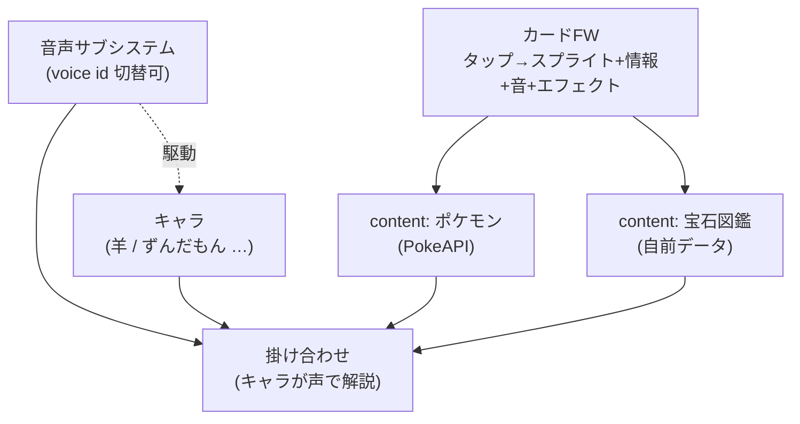
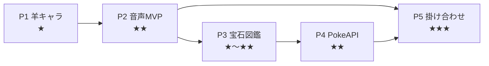

# 遊びアプリ拡張アイデアの評価（羊キャラ / 音声 / 図鑑系）

> 関連 Issue: #27（アンブレラ epic）
> 対象: M5Stack CoreS3-Lite (ESP32-S3)
> 前提: テーマ A〜K 実装済み（ドットアバター描画・表情状態機械・口パク・Wi-Fi・中継サーバ Hono+Claude API）

## 0. このメモの目的

新しい5つの遊びアイデアについて、以下を評価する。

1. 既存 `m5-cores3-lite` リポジトリと分けて開発・管理すべきか
2. 各アイデアの実現可能性・難易度
3. 優先順位とロードマップ
4. public リポジトリ運用ゆえのライセンス上の注意

評価対象アイデア:

1. 羊のドット絵キャラを作成する
2. ずんだもん風（に限らない）の声を出させる
3. PokeAPI を使い、タップでポケモンのドット絵＋情報＋鳴き声、タップで震える・動く・エフェクト
4. 「瑠璃の宝石」パロの宝石図鑑。タップで宝石の絵＋産地＋構成元素などを表示
5. 上記の掛け合わせ

## 1. リポジトリを分けるべきか → 分けない（同一リポジトリ推奨）

### 結論

**同一リポジトリで、新テーマ群（L 以降）として `src/` にモジュールを足す。** 独立プロダクト化の兆しが出たら再検討する。

### 理由

- 5アイデアはすべて CoreS3-Lite 実機上で動く遊びであり、既存の「ディスプレイ＋タッチ＋オーディオ＋Wi-Fi＋中継サーバ」基盤をそのまま共有する。
- 特に結合が強い:
  - アイデア1（羊キャラ）＝既存アバター描画（`avatar.cpp` / 表情・口パク）の流用。
  - アイデア3・4（図鑑系）＝既存の中継 HTTP パターン（`net.cpp` ＋ Hono 中継）の流用。
- いま分割すると `platformio.ini` / `net.cpp` / `secrets.h` 管理 / ドット描画ロジックが二重化し、保守コストが上がる。
- 分割の価値が出るのは「図鑑・キャラ収集アプリ」として独立プロダクト化したくなった時のみで、現時点では時期尚早。

### 判断基準（将来の再評価用）

次のいずれかに当てはまったら分割を検討する。

- 単体で配布・公開したい完成アプリになった（ビルド構成・依存が別系統になる）。
- 実機非依存のコンテンツ（図鑑データ等）が肥大化し、別管理した方が見通しが良い。
- ライセンス区分が異なるアセットを切り離したい（後述のIP注意と関連）。

## 2. 共通アーキテクチャの発見：「タップで開くカード」FW

アイデア3・4は本質的に同じ形をしている。

> **タップ → スプライト表示 ＋ 情報テキスト ＋ 音（鳴き声/声） ＋ アニメ/エフェクト**

そこで「タップで開くカード」フレームワークを1つ用意し、各アイデアをその上の部品として実装する。

この分離により、アイデア間の重複実装を避けつつ段階的に積み上げられる。

## 3. アイデア別 実現可能性

難易度: ★(易) 〜 ★★★(難)

| # | アイデア | 難易度 | 評価 |
|---|---------|--------|------|
| 1 | 羊ドット絵キャラ | ★ | 既存アバター描画を流用して即実現。パラメトリック表情描画も再利用可。まず静的スプライト、次に表情・揺れアニメ。 |
| 2 | 声を出させる（TTS） | ★★〜★★★ | 2方式。①SD/Flash に録音済み WAV を置いて再生＝簡単だが語彙固定。②中継サーバで音声生成（VOICEVOX ENGINE 等）→ WAV/PCM を実機へ配信＝任意文章OK・既存中継パターンに合致。「ずんだもん以外も」は **voice id を引数化**すれば自然に対応。実機側はストリーミング再生とメモリ（PSRAM 8MB が効く）が課題。 |
| 3 | PokeAPI ビューア | ★★ | PokeAPI は無料 REST/JSON。スプライト PNG（低解像度でドット向き）と鳴き声 `cries`（.ogg）あり。鳴き声は実機での OGG デコードが重いので **中継サーバで WAV/PCM へ変換**。「震える」＝スプライトを微小オフセットで jiggle、エフェクトは描画で表現（振動モータは無い）。 |
| 4 | 瑠璃の宝石パロ図鑑 | ★〜★★ | 鉱物データは「事実」なので自前の小さな JSON で安全に作れる。ドット宝石スプライト＋産地（locality）＋化学式/構成元素を表示。カードFWを確立する最初の題材に最適。mindat API はライセンス注意のため自前データ推奨。 |
| 5 | 掛け合わせ | ★★★ | 羊/ずんだもんが宝石やポケモンを声で解説する等の統合層。音声サブシステム＋キャラ＋カードFWが揃ってから着手。 |

## 4. ライセンス上の注意（public リポジトリ運用ゆえ重要）

本リポジトリは public 管理方針のため、IP・利用規約の取り扱いに特に注意する。

- **VOICEVOX / ずんだもん**: 利用規約・クレジット表記が必須。キャラクターごとに規約が異なる。生成音声をリポジトリにコミットする場合は規約条件を満たすこと。「ずんだもん風」の独自生成音声は VOICEVOX のずんだもんとは別物である点にも留意。
- **ポケモン**: 任天堂/ポケモンの IP。**個人利用・非配布・非商用に限定**する。公式スプライトや鳴き声アセットはリポジトリにコミットせず、実行時に PokeAPI から取得する方式に留めるのが安全。
- **瑠璃の宝石**: 漫画のパロディ。鉱物データ自体は事実なので低リスク。タイトルや固有表現の直接流用は避け、データは事実ベースで自前作成する。
- **共通方針**: 著作物アセットはコミットしない／データは事実ベース／必要なクレジットを `README` 等に記載する。

## 5. 推奨優先順位とロードマップ

TDD＋アジャイル「小さく動く」を優先し、見える成果 → 再利用資産 → 統合の順で積む。

| 優先 | テーマ | ねらい |
|------|--------|--------|
| P1 | 1. 羊キャラ | 既存アバター流用で即・見える成果。勢いをつける。 |
| P2 | 2. 音声サブシステム MVP | まず WAV 再生で「音が出る」を通す。後でクラウド TTS（voice id 切替）へ昇格。 |
| P3 | 4. 宝石図鑑 | 安全な自前データでカードFWを確立する。 |
| P4 | 3. PokeAPI | カードFWに外部 API ＋鳴き声変換を追加する。 |
| P5 | 5. 掛け合わせ | キャラ＋音声＋カードFWを統合する。 |

## 6. 次の一歩

P1（羊キャラ）から着手する。実装着手時に個別の実装 Issue を起票し、本メモのアンブレラ Issue に紐づける。
