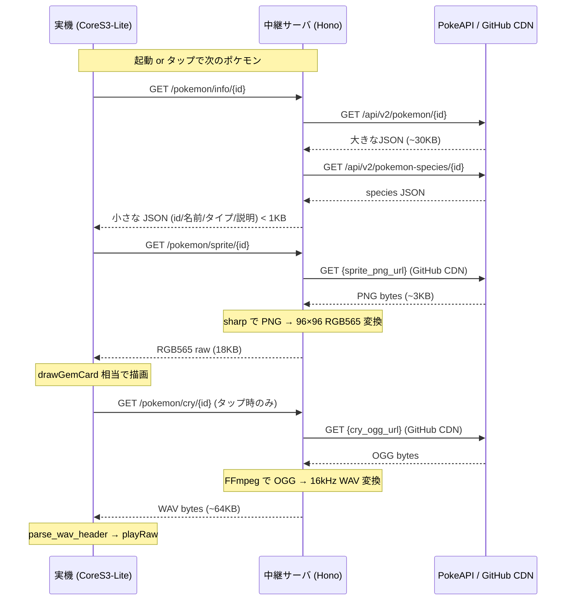

# PokeAPI 連携方式 調査メモ（Issue #69）

> 関連 Issue: #69（調査）/ #27（アンブレラ epic P4）
> 対象: M5Stack CoreS3-Lite (ESP32-S3) + Hono 中継サーバ
> 前提: P3 宝石図鑑で確立した「タップで開くカード」FW（gem.cpp / gem3d.cpp / drawGemCard）

---

## 1. PokeAPI エンドポイントと必要フィールド

### 使うエンドポイント（2本）

| エンドポイント | URL | 用途 |
|---|---|---|
| pokemon | `GET /api/v2/pokemon/{id}` | id・英語名・タイプ・スプライトURL・鳴き声URL |
| pokemon-species | `GET /api/v2/pokemon-species/{id}` | 日本語名・日本語説明文・カテゴリ |

#### `/api/v2/pokemon/25` の主要フィールド（実際の JSON より抜粋）

```json
{
  "id": 25,
  "name": "pikachu",
  "types": [{ "type": { "name": "electric" } }],
  "sprites": {
    "front_default": "https://raw.githubusercontent.com/PokeAPI/sprites/master/sprites/pokemon/25.png",
    "versions": {
      "generation-v": {
        "black-white": {
          "animated": { "front_default": "https://...25.gif" }
        }
      }
    }
  },
  "cries": {
    "latest": "https://raw.githubusercontent.com/PokeAPI/cries/main/cries/pokemon/latest/25.ogg",
    "legacy": "https://raw.githubusercontent.com/PokeAPI/cries/main/cries/pokemon/legacy/25.ogg"
  },
  "species": { "url": "https://pokeapi.co/api/v2/pokemon-species/25/" }
}
```

pokemon エンドポイントの JSON は全move learnset を含むため **約20〜30KB** になる。実機に直接落とすのは非効率。中継でフィルタ必須。

#### `/api/v2/pokemon-species/25` の主要フィールド

```json
{
  "names": [
    { "name": "ピカチュウ", "language": { "name": "ja" } },
    { "name": "Pikachu",   "language": { "name": "en" } }
  ],
  "genera": [
    { "genus": "ねずみポケモン", "language": { "name": "ja" } }
  ],
  "flavor_text_entries": [
    {
      "flavor_text": "でんきぶくろをもつ。ピンチのときにほうでんする。",
      "language": { "name": "ja" },
      "version": { "name": "legends-arceus" }
    }
  ],
  "pokedex_numbers": [
    { "entry_number": 25, "pokedex": { "name": "national" } }
  ]
}
```

- 日本語名: `names[]` を `language.name === "ja"` でフィルタ
- 日本語説明文: `flavor_text_entries[]` を `language.name === "ja"` でフィルタ→最新バージョンを1件選ぶ
- カテゴリ: `genera[]` を `language.name === "ja"` でフィルタ
- 国民図鑑番号: `pokedex_numbers[]` を `pokedex.name === "national"` でフィルタ

### レート制限・キャッシュ方針

- 2018年の静的ホスティング移行以来、**レート制限なし**（公式ドキュメント明記）
- ただし Fair Use ポリシーで「**取得したリソースは必ずローカルキャッシュせよ**」と要求
- 違反（大量リクエスト）はIPバンの対象
- → 中継サーバに Map/JSON キャッシュを持ち、同一 id への再リクエストを PokeAPI に流さない

---

## 2. スプライト（PNG）

### 形式と寸法

- 形式: **PNG**（透過あり）
- `front_default` は世代によって寸法が異なる:
  - Gen I〜IV: 40×40〜64×64 px（白パディングで96×96に統一されている場合もあり）
  - **Gen V (Black/White): 96×96 px**（最も見栄えが良く、CoreS3-Lite 320×240 に最適）
  - Gen VI 以降: 公式artwork (official-artwork) は600×600、front_default は96×96程度
- `sprites.front_default` URL が `null` の変種もあるので null チェック必要
- URL: `https://raw.githubusercontent.com/PokeAPI/sprites/master/sprites/pokemon/{id}.png`

### CoreS3-Lite での表示方式

#### 方式 A: 実機で PNG デコード
- M5GFX の `drawPng(const uint8_t* data, uint32_t len, x, y, maxWidth, maxHeight)` で直接デコード可能
- PNGdec ライブラリが内蔵（LovyanGFX 経由で利用可）
- PNG 1枚の圧縮サイズは約 2〜6KB（96×96透過PNG）
- デコードに約50KB のワークメモリが必要（PSRAM に確保可能）
- **短所**: 実機に PNG デコード負荷がかかる、キャッシュは中継でやりにくい

#### 方式 B: 中継で RGB565/raw に変換して配信（**推奨**）
- 中継: OGG取得→Node.js sharp ライブラリで PNG→96×96 RGB565 raw に変換→バイナリ返却
- 実機: `ps_malloc(96*96*2)` → HTTP GET → バッファ受信 → `M5Canvas::pushImage(x, y, w, h, buf)` で表示
- 96×96×2byte = **18,432 bytes（約18KB）** → PSRAM に余裕で収まる
- **長所**:
  - 実機の PNG デコード処理が不要（pushImage はピクセルコピーのみ）
  - 中継でキャッシュ可（同一 id の再変換ゼロ）
  - 既存 TTS/STT と同じ「中継がバイナリ変換→実機が受信」パターン

**→ 方式 B（中継 RGB565 変換）を推奨。**

既存カード上段の配置との整合:
- 宝石3D スプライト: 116×116（kGemHalf=58、中心 kGemCy=62）
- ポケモン PNG: 96×96 を同位置（中心 y≈62、x=160）に pushImage で描く
- 名前 y=136（kGemNameY 相当）の上端124 より上に収まる（PNG下端 = 62+48=110 < 124 ✓）

---

## 3. 鳴き声（cry）

### 音源の形式と取得元

| 種別 | URL パターン | 対象 |
|---|---|---|
| latest | `https://raw.githubusercontent.com/PokeAPI/cries/main/cries/pokemon/latest/{id}.ogg` | 全世代（Gen1〜9、ID 1〜10325） |
| legacy | `https://raw.githubusercontent.com/PokeAPI/cries/main/cries/pokemon/legacy/{id}.ogg` | Gen1〜5（ID 1〜649）のみ |

- 形式: **OGG Vorbis**（ゲーム音声から取得・Showdown/Veekun 由来）
- 尺: おおむね **1〜3秒**程度（未確認）

### ESP32 での OGG デコード可否

- OGG Vorbis デコードは CPU/メモリ負荷が高く、Arduino/ESP32 向けの軽量ライブラリは少ない
- 現行コードでの音声再生は `M5.Speaker.playRaw(pcm, samples, sample_rate, stereo)` 経路のみ
- `parse_wav_header`→`playRaw` の既存 WAV パイプラインをそのまま流用するには **WAV 変換が必要**
- → 中継サーバで FFmpeg を使って **OGG→16kHz モノラル WAV** に変換するのが既存 TTS と同一流儀

### 変換仕様（中継側）

```
ffmpeg -i {id}.ogg -ar 16000 -ac 1 -c:a pcm_s16le {id}.wav
```

- 出力: 16kHz / モノラル / 16bit PCM（既存 TTS と同じフォーマット）
- サイズ試算: 16000 samples/sec × 2byte × 2sec = **64KB** → 既存 kMaxWav=512KB バッファに余裕で収まる
- 実機側は `speakTts` と同じ `parse_wav_header` → `playRaw` 経路を流用

---

## 4. 推奨アーキテクチャ（中継経由）

### データフロー



### 中継経由を推奨する根拠

| 観点 | 実機直 HTTP | 中継経由（推奨） |
|---|---|---|
| JSON サイズ | ~30KB の pokemon JSON を Arduino パース | 中継フィルタで <1KB に削減 |
| PNG デコード | 実機 PNGdec（~50KB ワークメモリ） | 中継 sharp、実機ゼロ |
| OGG デコード | 実機不可（重い Vorbis ライブラリ必要） | 中継 FFmpeg、実機は WAV 受け取るだけ |
| キャッシュ | 実機 PSRAM は容量限界 | 中継 Map<id, data> でオンメモリキャッシュ |
| 既存パターン | 新規 | /tts・/stt と同じ「中継が変換→WAV/バイナリ」 |
| オフライン時 | 全機能停止 | 中継キャッシュ済みなら再利用可能 |

### 中継サーバ新エンドポイント設計（案）

```
GET  /pokemon/info/{id}   → JSON (id, name_ja, name_en, category_ja, types, desc_ja)
GET  /pokemon/sprite/{id} → RGB565 binary (96×96×2 bytes)
GET  /pokemon/cry/{id}    → WAV binary (16kHz mono 16bit)
```

- `/pokemon/info/{id}`: pokemon + pokemon-species の2リクエストを並行 (`Promise.all`) → フィルタしてコンパクト JSON
- `/pokemon/sprite/{id}`: PNG fetch → sharp でリサイズ・RGB565 変換 → raw バイナリ
- `/pokemon/cry/{id}`: OGG fetch → FFmpeg (child_process) で WAV 変換 → WAV バイナリ
- いずれも `Map<number, Buffer>` でインメモリキャッシュ（プロセス再起動でクリア、永続化は後続）

---

## 5. ライセンス整理

### コミットしてよいもの / ダメなもの

| アセット | リポジトリへのコミット | 実行時取得 | 備考 |
|---|---|---|---|
| ポケモン スプライト PNG | **NG** | OK（実行時のみ） | 著作権は The Pokémon Company。CC0 は配布の権利放棄だが TPC の商標権は残る |
| ポケモン 鳴き声 OGG | **NG** | OK（実行時のみ） | 同上。Showdown/Veekun 由来だが源泉は Nintendo/Game Freak |
| PokeAPI JSON データ | NG（巨大すぎるのもあるが） | OK | コード BSD 3-Clause、データは Nintendo 商標 |
| 変換後 WAV / RGB565 | **NG** | OK（中継キャッシュのみ・永続化しない） | 変換物も元著作物由来 |

### PokeAPI 自体のライセンス

| 対象 | ライセンス |
|---|---|
| PokeAPI ソースコード | BSD 3-Clause |
| スプライトリポジトリ | "CC0 1.0 + Copyright The Pokémon Company" （矛盾あり） |
| 鳴き声リポジトリ | ライセンスファイル存在するが詳細未確認（出典: Showdown/Veekun） |
| PokeAPI データ（JSON） | Nintendo/TPC の商標・著作物を含む |

### 運用上の方針（public リポジトリ）

- **個人利用・非配布・非商用に限定する**（playful-apps-ideas.md の既存方針継続）
- アセット（PNG/OGG/RGB565/WAV）はリポジトリに一切コミットしない
- 中継サーバのインメモリキャッシュはプロセス再起動でクリア→永続ストレージに保存しない
- README / コードに「Pokémon and Pokémon character names are trademarks of Nintendo / Creatures Inc. / GAME FREAK inc.」を明記する
- PokeAPI に対して「Locally cache resources」ポリシーを守る（中継でキャッシュ実装）

> **注意**: PokeAPI の LICENCE.txt が「CC0」と言っていても、Nintendo/TPC の商標権は CC0 で放棄されない。個人の非商用遊びにとどめ、対外公開・配布はしない。

---

## 6. カードFW への必要拡張

### P3 宝石カードとの比較

| 要素 | P3 gem カード | P4 ポケモンカード | 変更要否 |
|---|---|---|---|
| ヘッダ左上 | "宝石図鑑"（固定文字） | "ポケモン図鑑" | 定数変更のみ |
| ヘッダ右上 | "idx+1/total" | "国民図鑑番号" | 書式変更のみ |
| 上段スプライト | gem3d（3D回転、CPU描画） | PNG→RGB565 pushImage | **新規**: HTTP取得+pushImage |
| 中段 名前 | gem.name（和名） | name_ja（日本語名） | 文字列差し替えのみ |
| 下段 3行テキスト | 産地/組成/元素 | タイプ/カテゴリ/説明文 | 文字列差し替えのみ |
| 震えエフェクト | sheep_shake_offset 流用可能 | jiggle = X方向微小オフセット | **新規**: タップでスプライト震わせる |
| 鳴き声ボタン | なし | タップで鳴き声再生 | **新規**: タップ handler に cry 再生追加 |
| 音声再生 | speakTts WAV playRaw | 同じ経路を流用 | speakCry 関数として切り出し |

### 必要な拡張まとめ

1. **Poke データ構造体**: `gem.h` の `Gem` 相当として `Pokemon` 構造体を定義（id, name_ja, name_en, types, desc_ja, category_ja）
2. **スプライトバッファ**: `ps_malloc(96*96*2)` → HTTP GET → バッファ → `pushImage`（gem3d スプライトとは別 PSRAM 確保）
3. **鳴き声バッファ**: 既存 `g_ttsBuf` と同パターンで `g_cryBuf`（サイズは ~64KB、既存 kMaxWav=512KB 以内）
4. **タップ時の分岐**: 短タップ=次のポケモン（既存 gemOnTap と同じ）、**長タップ=鳴き声再生**（または別UI要素）
5. **震えエフェクト**: タップ後の一定時間、スプライトの pushImage X 座標に `sheep_shake_offset` 相当のオフセット
6. **シーン追加**: `scenes[]` 配列に `pokeEnter / pokeUpdate / pokeOnTap` を追加（OCP準拠）

---

## 7. 推奨マイルストーン分割

| # | マイルストーン | 実機不要か | 概要 |
|---|---|---|---|
| M1 | 中継 `/pokemon/info/{id}` 実装 | **実機不要** | pokemon + species を並行取得・フィルタ・日本語名抽出。vitest で単体テスト |
| M2 | 中継 `/pokemon/sprite/{id}` 実装 | **実機不要** | PNG fetch → sharp で 96×96 リサイズ → RGB565 変換。バイナリ返却。キャッシュ付き |
| M3 | 中継 `/pokemon/cry/{id}` 実装 | **実機不要** | OGG fetch → FFmpeg で 16kHz mono WAV 変換。WAV 返却。キャッシュ付き |
| M4 | 実機: ポケモンカード表示 | **実機必要** | 中継 info/sprite を取得→`drawPokeCard` 実装（gem カードと同形）→タップ送り |
| M5 | 実機: 鳴き声再生 | **実機必要** | 中継 cry → WAV → `parse_wav_header` → `playRaw`（speakTts と同じ経路） |
| M6 | 実機: 震えエフェクト | **実機必要** | タップで `sheep_shake_offset` 相当の X jiggle をスプライト push に適用 |

M1〜M3 は中継サーバ単体で開発・テストでき、実機を使わずに進められる。M4 以降は実機確認が必要だが、M1〜M3 の成果物（エンドポイント）に依存する。

---

## 8. メモリ試算（PSRAM 8MB）

| 用途 | サイズ | 既存/新規 |
|---|---|---|
| フルスクリーンキャンバス×2（art/gem） | 150KB × 2 = 300KB | 既存 |
| gem3d 回転スプライト（116×116 内蔵RAM） | 約27KB | 既存（内蔵RAM） |
| TTS WAV バッファ（kMaxWav） | 512KB | 既存 PSRAM |
| STT 録音バッファ | 約100KB | 既存 PSRAM |
| ポケモン RGB565 スプライト | 96×96×2 = 18KB | **新規** PSRAM |
| ポケモン cry WAV バッファ | ~64KB | **新規** PSRAM（kMaxWav 範囲内でも可） |
| **合計** | **~1,021KB（約1MB）** | PSRAM 8MB の **13%** |

余裕は十分。ポケモンシーンに入ったときだけスプライトバッファを確保し、シーン退出時に解放するパターン（gem キャンバスと同じ作法）で問題なし。

---

## 出典

- PokeAPI 公式ドキュメント: https://pokeapi.co/docs/v2
- PokeAPI スプライトリポジトリ: https://github.com/PokeAPI/sprites
- PokeAPI 鳴き声リポジトリ: https://github.com/PokeAPI/cries
- PokeAPI ライセンス: https://github.com/PokeAPI/pokeapi/blob/master/LICENSE.md
- スプライトライセンス: https://github.com/PokeAPI/sprites/blob/master/LICENCE.txt
- M5GFX drawPng API: https://docs.m5stack.com/en/arduino/m5gfx/m5gfx_image
- LovyanGFX PSRAM スプライト: https://github.com/lovyan03/LovyanGFX/issues/283
- FFmpeg fluent-ffmpeg OGG変換: https://github.com/fluent-ffmpeg/node-fluent-ffmpeg/issues/1132
