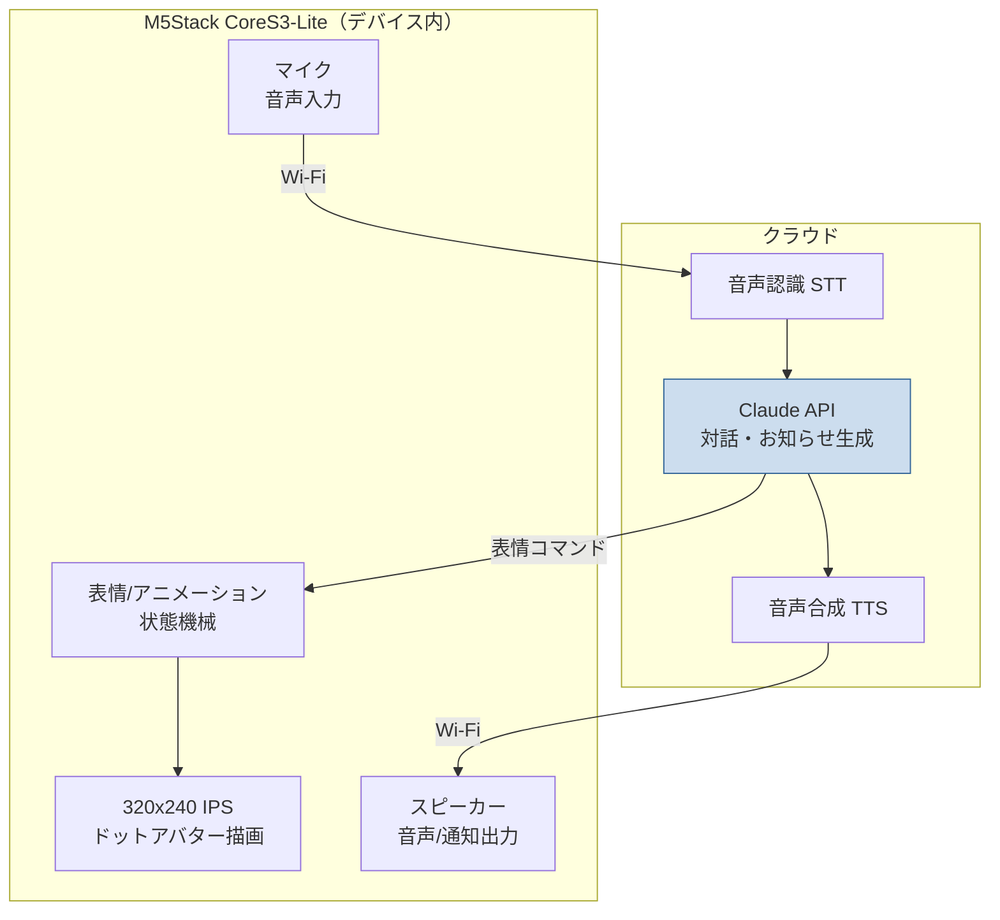

# #3 M5Stack-CoreS3-Lite サマーウォーズ風AIアバター

## アイデア概要（idea.md より）

- M5Stack-CoreS3-Lite に **サマーウォーズ風のアバター** を作成して画面に表示
- アバターはサマーウォーズの雰囲気を踏襲した **ドット調キャラ**
- 対話したりお知らせしてくれる **AI を搭載** する

## 結論：○ 実現性は高い。AI は「クラウド推論＋デバイス表示」が現実解

ドットアバターの表示・アニメーションはデバイス単体で十分可能。対話AIはデバイス内に LLM を載せるのは非現実的なので、**クラウド（Claude API 等）に問い合わせ、結果をデバイスで表示・発話**する構成が現実的。

## M5Stack CoreS3-Lite 実スペック（調査結果）

| 項目 | スペック |
|------|----------|
| SoC | ESP32-S3（Xtensa 32-bit LX7 デュアルコア 240MHz） |
| メモリ | Flash 16MB / **PSRAM 8MB** |
| ディスプレイ | 2.0インチ 静電容量タッチ IPS、**320×240** |
| 音声出力 | I2S アンプ AW88298 + 1W スピーカー |
| 音声入力 | ES7210 コーデック、**デュアルマイク**（全二重） |
| センサ | 6軸IMU(BMI270) + 3軸地磁気(BMM150)、近接/環境光、0.3MPカメラ |
| その他 | microSDスロット、電源管理IC(AXP2101)、RTC(BM8563) |

→ **320×240・8MB PSRAM・スピーカー＆マイク内蔵**という構成は、ドットアバター表示と音声入出力に必要十分。

## アーキテクチャ案

| 要素 | 実現方法 |
|------|----------|
| ドットアバター描画 | M5GFX / LovyanGFX でスプライト描画。表情差分をドット絵で用意し状態機械で切替 |
| アニメーション | まばたき・口パク・うなずき（IMU連動も可）を軽量ループで |
| 音声入力 | 内蔵デュアルマイク → Wi-Fi 経由でクラウド STT |
| 対話AI | Claude API に問い合わせ。応答テキスト＋「表情コマンド」を構造化出力で受け取る |
| 音声/通知出力 | クラウド TTS or 内蔵音声、スピーカーで再生 |

### 「対話AI」実装のポイント

- LLM 本体はデバイスに載せない（ESP32-S3 では非現実的）。**クラウド推論が前提**。
- Claude の **構造化出力（structured outputs）** を使い、`{ "reply": "...", "expression": "happy", "action": "notify" }` のような形で応答を受ければ、アバターの表情・動作とテキストを同時に制御できる。
- 「お知らせ」機能は #4 のイベント収集や任意の通知ソースと連携し、デバイスが定期的に喋る・表示する。

## サマーウォーズ風の表現について

- 「ドット調・四角basis のアイコン的キャラ」をピクセルアートで作成し、320×240に最適化。
- 表情・ポーズのバリエーションをスプライトシート化してSDカードまたはFlashに格納。
- ※ 公開リポジトリ運用のため、**特定作品のキャラクター画像・著作物をそのまま使わない**こと。「雰囲気を踏襲したオリジナルのドット絵」に留める（著作権配慮）。

## リスクと対策

| リスク | 対策 |
|--------|------|
| デバイス内 LLM は不可 | クラウド推論前提で設計 |
| 通信遅延・オフライン時 | ローカルで定型応答・キャッシュ、オフライン表示を用意 |
| 常時クラウド問い合わせのコスト | 発話トリガーを限定（ウェイクワード/ボタン）、Haiku 活用 |
| 著作権 | 既存作品の素材を使わずオリジナルドット絵で表現 |

## 推奨

- **表示・音声入出力はデバイス、対話AIはクラウド**の分担で実装。
- まずは「ドットアバター表示＋まばたき/口パク」のローカル完結版を作り、その後クラウド対話を足す段階的アプローチ。
- 他アイデアと独立して進められるため、ハードウェアが手元にあれば並行着手可能。
