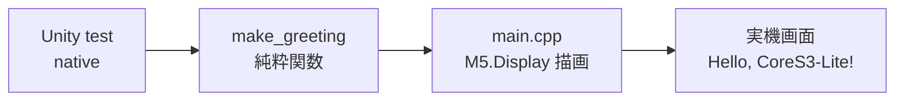

# #3 CoreS3-Lite Hello World 表示

> 関連 Issue: #3
> 対象: M5Stack CoreS3-Lite (ESP32-S3)

## 概要

最初の「小さく動くもの」として、CoreS3-Lite の画面に `Hello, CoreS3-Lite!` を表示。
あわせて PlatformIO のビルド〜書き込み〜実機確認の一連と、TDD の最小ループ（red→green）を通した。

## 成果物

| ファイル | 役割 |
|----------|------|
| `platformio.ini` | 2環境構成（実機 `m5stack-cores3` / ホストテスト `native`） |
| `src/greeting.h` / `greeting.cpp` | 表示文字列を組み立てる純粋関数 `make_greeting`（ハード非依存） |
| `src/main.cpp` | 実機エントリ。`M5Unified` で画面描画（ハード依存部） |
| `test/test_greeting/` | `make_greeting` の Unity 単体テスト（native 実行） |

## 設計の要点

- **責務分離**: 「文字列を作る」純粋ロジックと「画面に出す」ハード依存を分離。
  ロジックはホストPCで高速にテストでき、`main.cpp` は描画だけに専念する。
- **2環境**: 同じコードを実機書き込み用とPCテスト用で切り替え。`native` 環境は
  `build_src_filter = +<greeting.cpp>` で実機依存の `main.cpp` を除外する。

## TDD ループ（実施記録）

1. `make_greeting` のテストを先に記述 → 空スタブで **red**（2 Failures）
2. 実装を追加 → **green**（2 Tests / 0 Failures）

## ビルド・書き込み結果

- `pio run -e m5stack-cores3` … SUCCESS（Flash 6.9% / RAM 6.7%）
- `pio run -e m5stack-cores3 -t upload`（COM3）… SUCCESS、実機画面に表示確認済み

## 留意点 / 環境メモ

- ホストPC（Windows）に gcc が無かったため、native テストは **WSL の g++ + PlatformIO 取得済み Unity** で実行した。
  `pio test -e native` をそのまま使う場合は Windows 側に MinGW(gcc) の導入が必要。
- Unity を g++ 直叩きで動かす際は、テストに空の `setUp()` / `tearDown()` 定義が要る。
- 書き込みポートは `platformio.ini` の `upload_port = COM3`。環境に応じて変更する。

## 次の一歩

- テーマ B（タッチUI）や C（時計）へ機能を一つずつ拡張（research のテーマ依存グラフ参照）。
