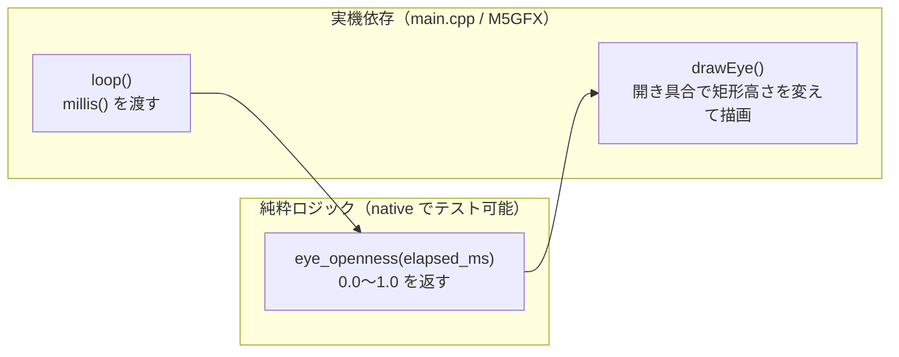

# #9 ドットアバターのローカル表示（まばたき最小版）

テーマK「サマーウォーズ風AIアバター」の第一歩。`03-m5stack-avatar.md` の段階的ロードマップに従い、
まずは **クラウドに依存しないローカル完結のアバター表示** を作る。本 Issue のスコープは **まばたきのみ**。

## やったこと

- 320×240 画面に矩形/円ベースの顔（肌色の円 + 黒目2つ + 口）を表示
- 時間経過に応じて目が **開→閉→開** する「まばたき」アニメーション
- まばたきのタイミング計算を **純粋関数 `eye_openness()`** に切り出し、native 単体テストで検証（TDD）

## アーキテクチャ（ハード/ロジック分離）

`#3` Hello World と同じ「純粋ロジックを実機から分離する」方針を踏襲。

| ファイル | 役割 | テスト |
|---------|------|--------|
| `src/avatar.h` / `src/avatar.cpp` | 経過ms→目の開き具合(0.0〜1.0)を返す純粋関数。`millis()` 非依存 | native 単体テスト |
| `src/main.cpp` | M5GFX で顔を描画。`millis()` を `eye_openness` に渡し、戻り値で目の高さを変える | 実機 |

## まばたきモデル

- 周期 `kBlinkIntervalMs = 3000ms` ごとに、先頭 `kBlinkDurationMs = 150ms` だけ瞬く
- 瞬き窓の中は三角波：前半 75ms で `1.0→0.0`、後半 75ms で `0.0→1.0`
- 残り（約2850ms）はずっと `1.0`（ぱっちり開いたまま）

実測（シミュレーション）: `t=0→1.00`, `t=75ms→0.00`(完全に閉じ), `t=150ms→1.00`, `t=1500ms→1.00`

## テスト・ビルド結果

- native 単体テスト: **6件すべて PASS**（avatar 4件 + greeting 2件）
- 実機ビルド（m5stack-cores3）: **SUCCESS**（Flash 6.8% / RAM 6.7%、firmware.bin 生成）

### 副次的な修正

- `[env:native]` に `test_build_src = true` を追加。
  `pio test` はデフォルトで `src/` をビルドしないため、これが無いと純粋ロジックが
  リンクされず `undefined reference` になっていた（既存の greeting テストも併せて修正）。

## スコープ外（後続 Issue で対応）

- 口パクアニメーション
- オリジナルのドット絵スプライト化
- マイク入力・クラウド(Claude API)対話
