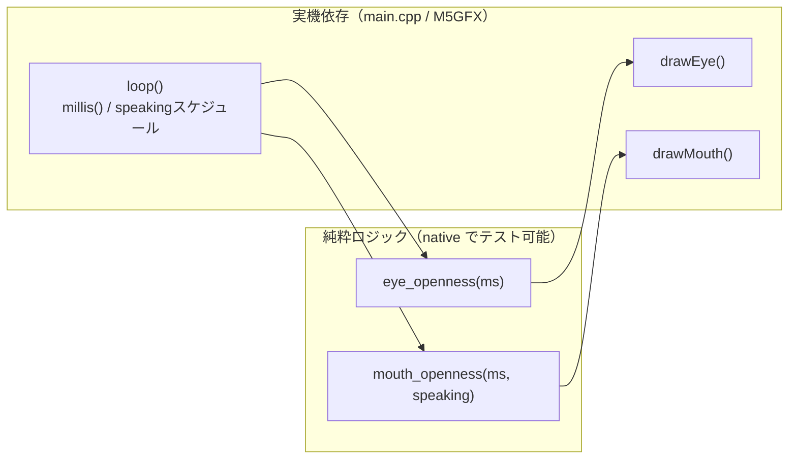

# #11 アバターの口パクアニメーション（speaking連動）

テーマK AIアバターの段階的実装。#9（まばたき）に続き、ローカル完結のまま **口パク** を追加した。
対話（クラウド連携）はまだスコープ外なので、後で差し込めるよう「喋っているか」を引数で受ける形にした。

## やったこと

- 純粋関数 `mouth_openness(elapsed_ms, speaking)` を追加（#9 と同じハード/ロジック分離）
- `main.cpp` で口を描画し、まばたきと同時に動かす
- デモ用に「4秒周期で先頭2秒だけ喋る」スケジュールを与えて、口パクを目視確認できるようにした

## アーキテクチャ

### `speaking` を引数化した理由（OCP）

口パクの「実トリガー」は将来の **マイク入力・Claude API 対話** で決まる。
今は `main.cpp` のデモスケジュールが `speaking` を与えているが、後続 Issue では
「応答テキストを再生している間だけ `speaking = true`」を渡すだけでよい。
純粋関数 `mouth_openness` 自体は変更不要（拡張に開いて修正に閉じる）。

## 口パクモデル

- `speaking == false` → 常に `0.0`（口を閉じる）
- `speaking == true`  → 周期 `kMouthCycleMs = 200ms`（≒5Hz、まばたきより速い）の三角波で `0→1→0`

実測（シミュレーション）: 非speaking=0.00 / speaking時 `t=0→0.00, t=100→1.00, t=200→0.00`

## テスト・ビルド結果

- native 単体テスト: **9件すべて PASS**（avatar 7 + greeting 2）
- 実機ビルド（m5stack-cores3）: **SUCCESS**（Flash 6.9% / RAM 6.7%）

## スコープ外（後続 Issue で対応）

- オリジナルのドット絵スプライト化
- マイク入力・Claude API 対話（`speaking` の実トリガー）
