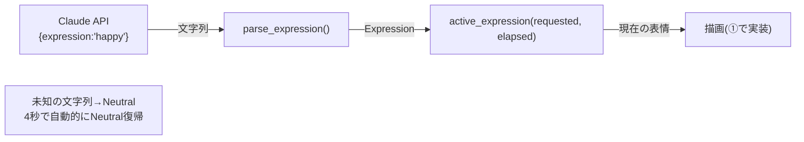

# #13 アバターの表情状態の状態機械（表情セット確定）

テーマK AIアバターを「対話を先、見た目を後（②→①）」の順で進める第一歩。
将来の Claude API 対話が構造化出力で返す表情（`{ "expression": "happy" }`）を扱うため、
**アバターが取りうる表情セットを enum で確定** し、純粋ロジックを用意した。

これが後続の「ドット絵スプライト化(①)」と「API対話(②-2以降)」両方の設計図になる。

## やったこと（純粋ロジックのみ・ローカル完結）

`avatar.h` / `avatar.cpp` に以下を追加し、native 単体テストで検証：

1. `enum class Expression { Neutral, Happy, Thinking, Sad, Surprised }` … 表情の語彙（単一の真実）
2. `parse_expression(const std::string&)` … API の表情文字列→enum。未知の値は `Neutral` にフォールバック
3. `active_expression(requested, elapsed_ms)` … 要求から `kExpressionHoldMs`(4秒)経過で `Neutral` に自動復帰する状態機械

## 設計方針

- #9/#11 と同じく「時間を引数で受ける純粋関数」に統一。**状態（今どの表情を要求中か・いつ要求したか）は呼び出し側が持つ**。
- 表情の語彙(enum)を単一の真実とし、API・描画はこの enum に依存する。
  → 描画(①)も対話(②)も、この表情セットに対して実装すればよい（手戻り防止）。

## なぜ状態をオブジェクトに持たせず純粋関数か

まばたき・口パクと同じく「時間を引数で渡す」設計に揃えるため。状態を呼び出し側
（`main.cpp` や将来の対話レイヤー）に置くことで、ロジックは時間非依存・副作用なしに保て、
native で網羅的にテストできる。

## テスト・ビルド結果

- native 単体テスト: **14件すべて PASS**（avatar 12 + greeting 2）
- 実機ビルド（m5stack-cores3）: **SUCCESS**（Flash 6.9% / RAM 6.7%）

## スコープ外（後続 Issue）

- 表情ごとのドット絵スプライト描画（①）
- Wi-Fi 接続・Claude API 呼び出し（②-2）
- 応答中の speaking 連動（②-3）
