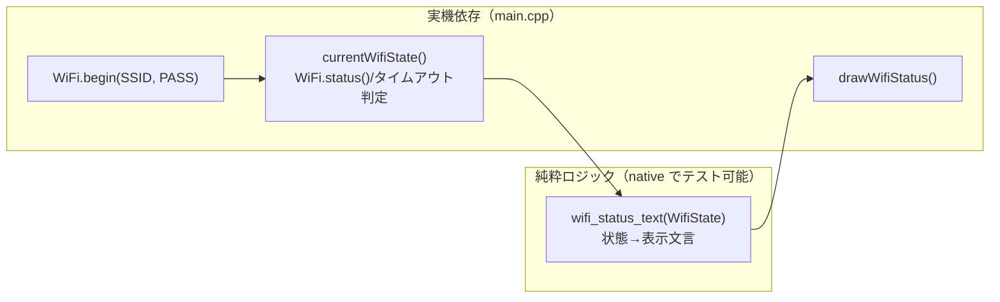

# #15 Wi-Fi 接続と接続状態の画面表示（認証情報は管理外）

テーマK AIアバターのクラウド対話(②)の土台。全体方針は **案B（中継サーバ経由）** だが、
本 Issue のスコープは **Wi-Fi 接続だけ** に絞った。中継サーバ・Claude API 呼び出しは後続 Issue。

## やったこと

- デバイスを Wi-Fi に接続し、接続状態（接続中/接続済/失敗）を画面上部に表示
- 既存のアバター（まばたき＋口パク）は動かしたまま
- Wi-Fi 認証情報を **リポジトリに含めない** 仕組みを整備

## セキュリティ：認証情報をコミットしない（公開リポジトリ運用）

- `src/secrets.h`（SSID/パスワード）を **`.gitignore` で git 管理外**にした
- テンプレート `src/secrets.h.example` をコミットし、README に設定手順を記載
- 認証情報はファームウェアにのみ存在し、リポジトリには一切含まれない

> 定番パターン：秘密情報はリポジトリに置かず、プレースホルダのテンプレートだけ共有する。
> 誤って push しても鍵が漏れない。

## アーキテクチャ（純粋ロジックの分離は #9/#11/#13 と同じ）

| ファイル | 役割 | テスト |
|---------|------|--------|
| `src/net.h` / `src/net.cpp` | `enum class WifiState{Connecting,Connected,Failed}` と `wifi_status_text` | native 単体テスト |
| `src/main.cpp` | `WiFi.begin` と状態ポーリング、文言を画面表示。アバター描画は維持 | 実機 |

### 実機側の判定ロジック

- `WiFi.status() == WL_CONNECTED` → Connected
- 接続開始から `kWifiTimeoutMs`(15秒) 超過 → Failed（無限に「接続中」にしない）
- それ以外 → Connecting
- 状態が**変化した時だけ**文言を描き直す（ちらつき・無駄描画の抑制）

## テスト・ビルド結果

- native 単体テスト: **17件すべて PASS**（net 3 + avatar 12 + greeting 2）
- 実機ビルド（m5stack-cores3）: ローカルのダミー `secrets.h` で確認

## スコープ外（後続 Issue）

- 中継サーバ（Hono + AWS Lambda 等）の構築（②-2b）
- Claude API 呼び出し・応答表示（②-2c）
- 応答中の speaking 連動（②-3）
