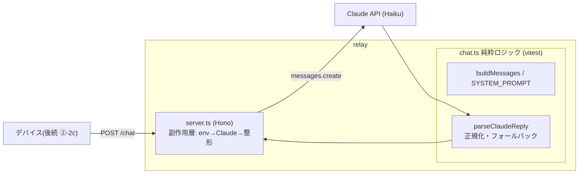

# #17 中継サーバ ②-2b — Hono で /chat を作り Claude を呼ぶ（ローカル先行）

テーマK AIアバターのクラウド対話（案B: 中継サーバ経由）の核心。
デバイスに APIキーを載せないため、**中継サーバが `ANTHROPIC_API_KEY` を保持**して Claude を呼ぶ。
本 Issue は **ローカルで先に動かす** スコープ。クラウドデプロイは後続。

## やったこと

- `relay/` に Hono + TypeScript の最小サーバを作成
- `POST /chat` : `{ message }` → `{ reply, expression, action }`
- `GET /health` : 死活確認
- Claude を呼び、構造化出力(JSON)をパース・検証して返す
- `expression` をアバターの既存語彙(neutral/happy/thinking/sad/surprised)へ正規化

## セキュリティ（#15 の延長）

- `ANTHROPIC_API_KEY` は `relay/.env`（**gitignore**）にのみ置く
- `relay/.env.example` をコミットしてテンプレ共有
- `relay/node_modules/` も gitignore
- 公開リポジトリに鍵を一切含めない

## アーキテクチャ（純粋ロジックの分離は #9/#11/#13/#15 と同じ思想）

| ファイル | 役割 | テスト |
|---------|------|--------|
| `relay/src/chat.ts` | プロンプト組み立て・応答パース＆検証（語彙正規化、不正→neutral/none フォールバック） | vitest 単体テスト |
| `relay/src/server.ts` | Hono。env 読込→Claude 呼び出し→整形のみ | curl スモーク |

### 堅牢性の工夫

- Claude が JSON 前後に文を付けても `{`〜`}` を切り出して拾う
- パース不能なら全文を `reply` 扱いにしてデバイスを止めない
- 語彙外 `expression`/`action` は安全側(neutral/none)に倒す
- 上流 Claude 失敗時は 502、APIキー欠落は 500、不正ボディは 400

## テスト・動作確認結果

- 単体テスト: **12件すべて PASS**（vitest）
- 型チェック: クリーン（tsc --noEmit）
- `npm audit`: **0 件**（dev依存の esbuild 系を vitest 更新で解消）
- スモーク: `/health`=200、不正ボディ=400、`/chat`=Claude まで到達（実キーで返答）

## モデル選定

- `claude-haiku-4-5-20251001` — 即応チャット向けに低レイテンシ・低コストを優先

## スコープ外（後続 Issue）

- ②-2c デバイス側 HTTP クライアント＆応答表示（実機が中継サーバを叩く）
- クラウドデプロイ（AWS Lambda / Cloudflare Workers 等）
- ②-3 応答中の speaking 連動（口パク同期）
