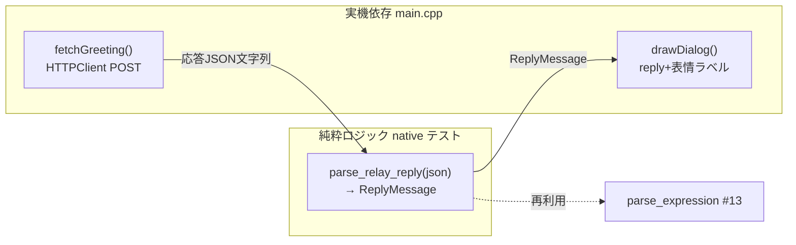

# #19 デバイス側 HTTP クライアント ②-2c — 中継サーバに問い合わせ応答を表示

案B(中継サーバ経由)の続き。②-2b(#17) の中継サーバを **実機が叩いて応答を画面表示**する部分。
本 Issue のトリガは最小（Wi-Fi 接続後に一度だけ）。マイク連動の発話トリガは ②-3。

## やったこと

- 実機(ESP32)から `POST <RELAY_URL>/chat` で `{ message }` を送り `{ reply, expression, action }` を受信
- `reply` を画面下部に表示（和文フォント `lgfxJapanGothic_16`）、`expression` を表情ステート(#13)へ流す
- トリガ：Wi-Fi 接続後に一度だけ問い合わせる固定トリガ
- 表情ラベルを下部に暫定表示し、`active_expression`(#13) で一定時間後に neutral へ自動復帰

## セキュリティ（#15 の延長）

- 中継サーバ URL は `secrets.h` の `RELAY_URL`（**gitignore**）で渡す
- `secrets.h.example` にテンプレ追記。公開リポジトリに具体的アドレスを含めない

## アーキテクチャ（純粋ロジック分離は一貫）

| ファイル | 役割 | テスト |
|---------|------|--------|
| `src/net.h`/`net.cpp` | `ReplyMessage` と `parse_relay_reply`（ArduinoJson でパース・語彙正規化・フォールバック） | native 単体テスト |
| `src/main.cpp` | `HTTPClient` で POST、和文フォントで応答描画。表情自動復帰を反映 | 実機 |

### 設計の要点

- パースはサーバ側 `chat.ts` の `parseClaudeReply` と**同じ思想**：不正でも落とさず安全側に正規化
- ArduinoJson は**ヘッダオンリーで native でも動く**ので、実機と同一コードを単体テストできる
- HTTP の実呼び出しだけ `main.cpp` に隔離（純粋ロジックは net.cpp）

## テスト・ビルド結果

- native 単体テスト: **23件すべて PASS**（net 9 + avatar 12 + greeting 2）
  - うち `parse_relay_reply` 6件（正常・notify・語彙外expression/action・不正JSON・reply欠落）
- 実機ビルド(m5stack-cores3): **SUCCESS**（Flash 18.2% / RAM 14.9%）

## 新規依存

- `bblanchon/ArduinoJson@^7`（実機・native 両環境）— 応答JSONの堅牢なパース

## スコープ外（後続 Issue）

- マイク入力連動の発話トリガ ②-3（口パク同期）
- クラウドデプロイ（中継サーバを LAN 外からも使えるように）
- 表情のスプライト本格描画 ①（現状は表情ラベル表示の暫定）
