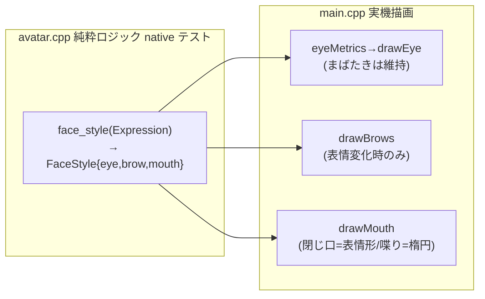

# #21 表情ドット絵 ① — パラメトリックに眉/目/口角を表情ごとに描く

テーマK アバターの見た目の核。表情を文字ラベルで暫定表示していたのを、
眉・目・口を表情ごとに変える**パラメトリック・ドット絵**に置き換えた。
（案B ビットマップは、まばたき/口パクのアニメと両立しづらく単体テスト不可のため不採用）

## やったこと

- `face_style(Expression)` 純粋関数を追加：表情 → `{EyeStyle, BrowShape, MouthShape}`
- main.cpp が face_style に従い、眉・目・口を描画。まばたき・口パクは維持
- 表情の自動復帰(#13)に連動して見た目も neutral へ戻る

## 表情ごとの見た目

| Expression | 目(EyeStyle) | 眉(BrowShape) | 口(MouthShape) |
|-----------|-------------|--------------|---------------|
| neutral   | Normal | Flat 水平 | Line 横線 |
| happy     | Squint 細め | Raised 上げ | Smile 笑顔(‿) |
| thinking  | Normal | Quizzical 片眉上げ | Line 横線 |
| sad       | Normal | Worried ハの字 | Frown 口角下(⌒) |
| surprised | Wide 見開き | Raised 上げ | Round 丸(o) |

## アーキテクチャ（純粋ロジック分離は一貫）

- avatar.cpp は「どの形にするか」を決める（純粋・テスト可能）
- main.cpp は「何ピクセルで描くか」だけ担当（眉の線・目の高さ・口の形）

### 描画の工夫

- 眉はアニメしないので**表情変化時だけ**描く。眉の帯(y≈51..71)と目のクリア領域(y≥74)を分離し、毎フレームの目再描画で眉が消えないようにした
- 目のクリアは最大寸法で固定し、Wide↔Squint と大きさが変わっても前フレームを消し残さない
- 口は「喋り中＝楕円アニメ／閉じ口＝表情ごとの形(‿ ⌒ o ―)」を切り替え

## テスト・ビルド結果

- native 単体テスト: **28件すべて PASS**（avatar 17 + greeting 2 + net 9）
  - うち `face_style` 5件（neutral/happy/thinking/sad/surprised の写像）
- 実機ビルド(m5stack-cores3): **SUCCESS**（Flash 18.2% / RAM 14.9%）

## スコープ外（後続 Issue）

- マイク発話トリガ ②-3（口パク同期）
- 表情遷移のイージング等、より凝ったアニメ
- 表情ラベル(暫定の文字表示)は当面残置（デバッグ用）
