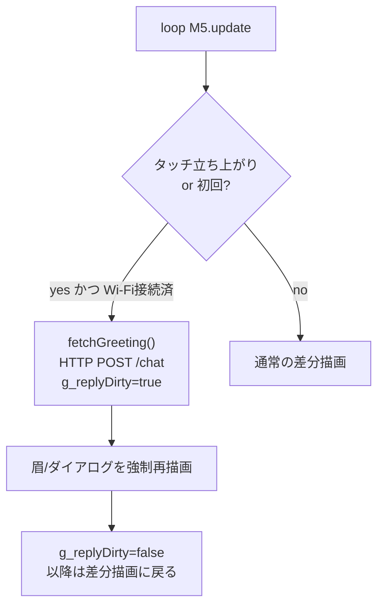

# #24 画面タッチで挨拶を再問い合わせ

これまで中継サーバ(/chat)への挨拶問い合わせは **起動後に一度きり**だったため、
表情は起動直後の約4秒だけ出てあとは neutral に戻ったまま再トリガーできなかった。
画面タッチをきっかけに **何度でも挨拶＋表情を更新**できるようにした。

（CoreS3 は物理 A/B/C ボタンを持たないため、トリガーは静電容量タッチを採用。
電源ボタン/タッチ下端ボタン(BtnA)案もあったが、どこを触っても反応する全面タッチを選択）

## やったこと（変更は `src/main.cpp` のみ）

- `fetchGreeting()` の発火条件を「初回のみ(`!g_hasReply`)」→「初回 **または** タッチ立ち上がりエッジ」に拡張
- `M5.Touch.getCount()` の前フレーム0→今1 のエッジ検出で **1タッチ=1リクエスト**（押しっぱなし・連打での多重発火を防止）
- 再問い合わせ直後は `g_replyDirty` フラグで **1フレームだけダイアログ/表情を強制再描画**
  （通常は「表情変化時だけ描画」最適化のため、同じ表情が返ると返答文が更新されないバグになる。その1点だけ上書き）
- 純粋ロジック層 `avatar.cpp` / `net.cpp` は **不変**（クリーンアーキテクチャの境界維持）

## 動作フロー

## 動作確認・テスト結果

- native 単体テスト: **28件すべて PASS**（avatar 17 + greeting 2 + net 9）※ロジック層不変のため担保はそのまま
- 実機ビルド(m5stack-cores3): **SUCCESS**（Flash 18.2% / RAM 14.9%）
- 実機(CoreS3 + relay 起動)で **タッチのたびに挨拶＋表情が更新される**ことを確認

## 関連 Issue / PR

- Issue: #24
- PR: #25（squash merge 済み）

## 付随して解決した実機トラブル（`sad` しか出ない問題）

実機で「タップしても sad しか出ない」事象が発生。`sad` は `fetchGreeting()` の
**通信失敗時専用の表情**（画面下に `relay error: <code>`）で、原因は次の重なり：

1. **relay 未起動** … `relay/node_modules` が WSL(Linux) 産で Windows では tsx/esbuild が動かず → Windows で `npm install` し直して解決
2. **`RELAY_URL` が古い IP** … `192.168.1.10` → PC の実 Wi-Fi LAN IP `192.168.40.172` に修正し再アップロード

※ `RELAY_URL` は DHCP 値のため将来変動しうる。恒久対策は PC 固定IP or mDNS。
※ 詳細手順はリポジトリ外の開発メモに記録（relay の Windows 起動手順）。

## スコープ外（後続）

- 発話（口パク）の実トリガ ②-3：現状はデモ用スケジュール
- タッチ位置による分岐（例：左半分=別アクション）などの高度なUI
- relay 接続失敗時のリトライ/再接続UX
