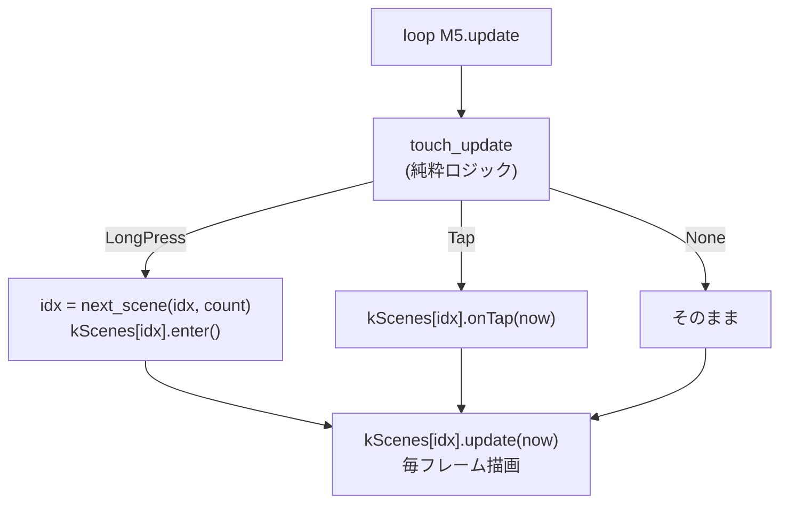
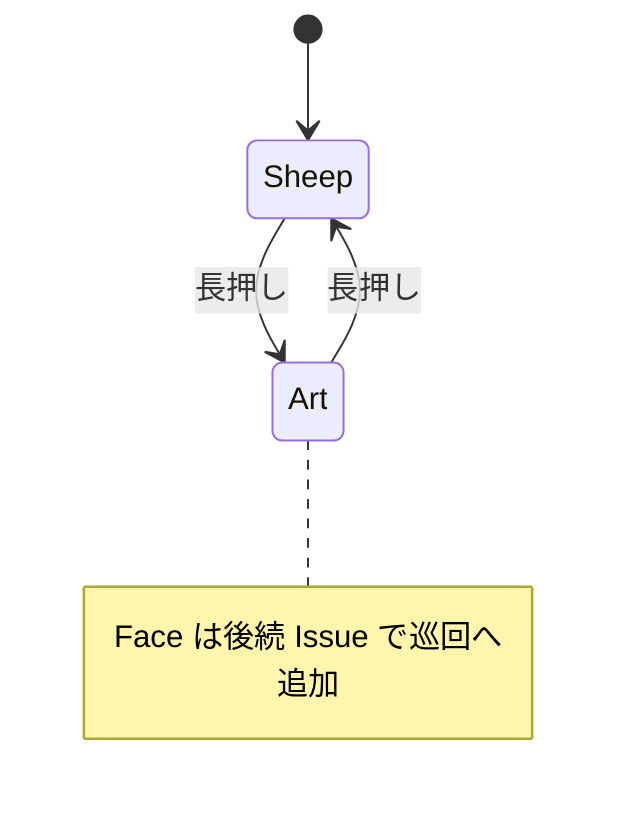

# #33/#34 実行時シーン切替＋アート実機描画

これまで純粋ロジック（`scene` / `gesture` / `art`）は native 検証・main マージ済みだったが、
**実機 `main.cpp` には未配線**だった。今回それらを `main.cpp` に組み込み、
**長押しでシーンを巡回し、アートを実機ディスプレイに描く**ようにした。

（シーンの巡回範囲は **Sheep＋Art の2つ**。Face（中継サーバ対話）は Wi-Fi 依存で
update ループ内に非同期接続/HTTP を抱えるため、本巡回には未組み込み＝後続 Issue で扱う。
Face の描画関数群はファイル内に温存し、リンカが未到達コードとして除去している。）

## やったこと（変更は `src/main.cpp` のみ）

- ビルド時固定の `enum class Scene { Face, Sheep }` / `constexpr kScene` を**撤去**
- **シーン状態機械**を追加：各シーンを `SceneDef{ enter, update(now), onTap(now) }` の関数ポインタに揃え、
  配列 `kScenes[]` で保持。新テーマは「配列に1個足すだけ」で増やせる（開放閉鎖の原則）
- ジェスチャ検出 `touch_update()` を `loop` に配線：
  - **長押し(LongPress)** → `next_scene()` で次シーンへ巡回し `enter()` で初期描画
  - **短タップ(Tap)** → 現シーンの `onTap()` に委譲（羊=メェ鳴き＋揺れ／アート=再生成）
- **アート描画(#34 M2)** `drawArt()` を追加：`art_generate()` の図形プリミティブを
  `fillCircle` / `fillRect` / `fillTriangle` で描き分け（静止画なので dirty 時だけ1回描画）
- 純粋ロジック層（`scene.cpp` / `gesture.cpp` / `art.cpp` / `sheep.cpp`）は**不変**（境界維持）

## 動作フロー

## 動作確認・テスト結果

- native 単体テスト: **57件すべて PASS**（main.cpp は native ビルド対象外・ロジック不変）
- 実機ビルド(m5stack-cores3): **SUCCESS**（Flash 7.3% / RAM 6.8%）
  - ※ Face コードが未到達となりリンカが Wi-Fi/HTTP/JSON を除去したため、前回(18.2%)より縮小
- **実機目視チェック(#37)はユーザ作業**：`pio run -e m5stack-cores3 -t upload` で書き込み後、
  - 羊：表示／まばたき／タップで揺れ＋メェ鳴き
  - 長押し(約0.8秒)でアートに切替
  - アート：カラフルな図形が画面内に描かれる／タップで別パターンに再生成
  - 再度の長押しで羊へ戻る（巡回）

## 関連 Issue / PR

- Issue: #33（シーン状態機械）, #34（アート M2 実機描画）, #37（実機目視チェック）
- PR: feat/33-scene-runtime

## スコープ外（後続）

- **Face シーンの巡回組み込み**：Wi-Fi 常時初期化と対話状態の保持を伴うため別 Issue
- **#34 M3**：アートの時間変化（自動再生成／アニメ）
- 長押し時間や切替時の視覚フィードバック（インジケータ等）
