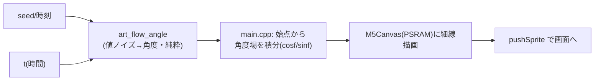

# #42 アートをフローフィールド曲線のアニメに（#34 M3 / Tyler Hobbs 系）

静止図形(#34 M2)だったアートを、実在の generative art 作家 Tyler Hobbs の "Fidenza" 系
**フローフィールド曲線**に作り替えた。ノイズの流れ場に沿って無数の細い曲線が川のように流れ、
時間とともにゆっくり変形する**アニメ**になった。

## やったこと（責務分離は M2 と同じ）

### 純粋ロジック `src/art.cpp` / `src/art.h`（native テスト）
- `art_value_noise(x,y,z)` … 3D 値ノイズ（格子点の擬似乱数を5次スムーズステップで補間）。
  決定論的・範囲有界 [-1,1]・連続。`z`（時間）を進めると場が連続変形＝アニメの素。
- `art_flow_angle(x,y,t,seed)` … ノイズ→進行角度。`seed` で場をずらし作品ごとに別の流れ。
- `art_flow_background/color(seed,...)` … 手選びの調和パレット4種（背景＋5線色）を seed で選択。
  ランダム多色にせず少数色でまとめるのが「おしゃれ」の肝。

### 実機描画 `src/main.cpp`
- アート用フルスクリーン `M5Canvas` を **PSRAM** に確保（約150KB・内部RAMを圧迫しない）。
- 毎フレーム：背景塗り → 約120本の曲線を角度場に沿って約34ステップ積分し細線(約2px)で描画 →
  `pushSprite` で一括転送（ちらつき防止）。`t` を `+0.005/frame` 進めて流れをゆっくり変形。
- タップ＝新 seed で配色・流れを一新（4パレットを巡回）。長押し巡回(#33)はそのまま両立。

## 動作フロー

## テスト結果

- native 単体テスト: **flow 10件を含め全 PASS**（noise の決定論/範囲/連続性、角度の seed 依存、配色巡回）
  - ※ xtensa と x86 で浮動小数の最終ビットは一致しないため、特定値ではなく「性質」で検証
- 実機ビルド(m5stack-cores3): **SUCCESS**
- 実機(CoreS3): フローフィールド曲線が**なめらかにアニメ**・タップで配色一新・長押しで羊⇄アート巡回を確認

## 関連 Issue / PR

- Issue: #42（#34 M3）
- PR: feat/42-flow-field

## 調整ポイント（数値で変えられる）

- 密度/速度: `kFlowLines`(本数) / `kFlowSteps`(長さ) / `kFlowDt`(変形速度) / `kFlowStep`(進み)
- 配色: `art.cpp` の `kFlowPalettes`（4パレット。追加・差し替え可）
- 線の太さ: 現状2本重ねの約2px。1本で更に繊細、3本で力強く

## スコープ外（後続）

- 静止図形版 `art_generate`(#34 M2) は別モードとして温存（現在 main からは未使用）
- アートの状態（パレット名等）の画面表示や、流れ場の種類切替などの高度化
