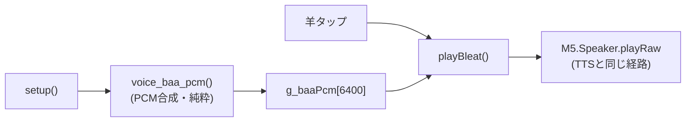

# #44 P2 音声 MVP M1 — 自前生成 PCM を playRaw で再生

音声サブシステム(epic #27 / P2)の M1。tone() の単音合成(M0)ではなく、**本物の波形データ(PCM)を
`M5.Speaker.playRaw` で再生する経路**を実機で確立した。題材として「メェ」を合成でリッチ化した。

これで **クラウド TTS(M3) と同じ playRaw 経路が実機で動く**ことを実証＝後続の最大リスクを先に潰した。

## やったこと（責務分離）

### 純粋ロジック `src/voice.cpp` / `src/voice.h`（native テスト）
- `voice_baa_pcm(out, capacity)` … 16bit モノラル PCM を生成し書き込んだサンプル数を返す。決定論的。
- 合成内容：520→330Hz のピッチ下降＋6Hz ビブラート＋倍音(基音/2/3倍)＋振幅エンベロープ
  （attack 0.06・release 0.30 で端を 0 に落とし「プツッ」を防ぐ）。
- 16kHz / 0.4 秒 = 6400 サンプル = 12.8KB。

### 実機 `src/main.cpp`
- `setup()` で `voice_baa_pcm()` を一度だけ実行し PCM をバッファに生成。
- `playBleat()` を `tone()` → `M5.Speaker.playRaw(g_baaPcm, g_baaLen, 16000, false)` に差し替え。

## 動作フロー

## テスト結果

- native 単体テスト：**voice 6件 PASS**（長さ/capacity/端0/非無音/決定論）
  - ※ xtensa と x86 の浮動小数差を避け、特定値でなく「性質」で検証
- 実機ビルド SUCCESS・実機でタップ時に合成「メェ」が playRaw で鳴る（端のクリックなし）を確認

## 関連 Issue / PR

- Issue: #44（親 epic #27 / P2）/ 調査: research/p2-voice-research.md
- PR: feat/44-voice-pcm

## 次段（P2 ロードマップ）

- M2: 中継サーバに `/tts` を足し、固定文を VOICEVOX→WAV/PCM 化してデバイスで playRaw
- M3: `voice_id` 切替・任意文章・対話(#23 口パク)連携
- 調整余地：音量(setVolume)・ピッチ/長さ(voice.cpp 定数)・倍音バランス
