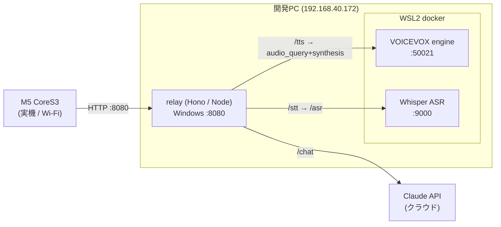

# 実機E2E ランタイム構成 — relay と docker サービス（VOICEVOX / Whisper）

実機で「聞いて→考えて→喋る」音声対話ループ（#60）を動かすために、**ローカルPCで常駐させる必要があるサービス群**をまとめる。デバイス単体では動かず、relay と 2 つの docker サービスが上がっている前提。

実機検証で `2026-06-25` に一巡を確認した時点の構成。

## 全体像



- デバイスは **relay の 1 口（:8080）だけ**を知る。API キーやエンジンの所在はデバイスに載せない（案B：中継サーバ方式）。
- WSL2 は `localhost` を Windows へ転送するため、Windows 上の relay から `localhost:50021` / `localhost:9000` でコンテナに届く。

## コンポーネント一覧

| サービス | 役割 | 実行場所 | ポート | 確認時バージョン |
|---------|------|---------|--------|----------|
| **relay** | デバイスの唯一の窓口。`/chat`(Claude) `/tts`(VOICEVOX中継) `/stt`(Whisper中継) `/health` | Windows / Node(`npm start`) | **8080** | — |
| **VOICEVOX engine** | テキスト→ずんだもん音声(WAV)。relay `/tts` が呼ぶ | **WSL docker** | **50021** | `0.25.2` |
| **Whisper ASR webservice** | 録音WAV→文字起こし。relay `/stt` が呼ぶ | **WSL docker** | **9000** | latest(稼働確認) |
| Claude API | `/chat` の応答生成 | クラウド | — | sdk `@anthropic-ai/sdk` |

## docker で立ち上げているもの（2つ）

WSL のターミナルで起動する（`sudo` 運用）。どちらも **初回はイメージDLで時間がかかる**（VOICEVOX は約2GB）。

### ① VOICEVOX engine（`/tts` 用）
```bash
sudo docker run -d --rm -p 50021:50021 --name voicevox voicevox/voicevox_engine:cpu-latest
```
- `cpu-latest` = GPU不要のCPU版。話者ID 既定 `3`（ずんだもんノーマル）。
- 確認: `curl -s http://localhost:50021/version` → `"0.25.2"`
- ⚠️ 配布時は「VOICEVOX:ずんだもん」等のクレジット明記が必要。音声アセットはコミットしない（実行時生成）。

### ② Whisper ASR webservice（`/stt` 用）
```bash
sudo docker run -d --rm -p 9000:9000 onerahmet/openai-whisper-asr-webservice:latest
```
- relay は `STT_URL`(既定 `http://localhost:9000`) の `/asr?language=ja&task=transcribe` を叩く。
- 確認: `curl -s -o /dev/null -w "%{http_code}" http://localhost:9000/` → `307`(→/docs) で稼働。

> どちらも別ホスト/ポートにするなら relay の環境変数 `VOICEVOX_URL` / `STT_URL` で上書きできる（`relay/src/server.ts`）。

## relay（Windows / Node）

```bash
cd relay
npm start        # tsx src/server.ts。.env は process.loadEnvFile() で読む
```
- `.env`（gitignore）: `ANTHROPIC_API_KEY=...` と `PORT=8080`。
- 確認: `curl -s http://localhost:8080/health` → `{"ok":true}` / `curl -s -X POST http://localhost:8080/chat -H 'content-type: application/json' -d '{"message":"おはよう"}'`

## 起動手順（順番）

1. WSL で VOICEVOX と Whisper の docker を起動（上記①②）。
2. Windows で relay を起動（`npm start`）。
3. 実機の `src/secrets.h` の `RELAY_URL` が **PCのLAN IP:8080**（例 `http://192.168.40.172:8080/chat`）を指していることを確認し、必要なら再書き込み。
4. 実機をタップ → 喋りかけ → 画面に返答＋ずんだもん声で再生。

各サービスが落ちていても実機はフォールバックする（TTS失敗→ローカル「メェ」、STT/chat失敗→無言）。声が出ない時はまず VOICEVOX :50021 の生存を疑う。

## ハマりどころ（実機E2Eで遭遇）

- **ポート3000は Hyper-V/WSL の予約範囲**に入り `listen EACCES 0.0.0.0:3000` で relay が落ちる。確認 `netsh interface ipv4 show excludedportrange protocol=tcp`。→ **8080 に変更**（`.env` と `secrets.h` の両方）。
- **Wi-Fi が Public プロファイル**だと受信がブロックされ、実機→relay が繋がらず実機が固まる。管理者PowerShellで1回:
  `New-NetFirewallRule -DisplayName "m5 relay 8080" -Direction Inbound -Action Allow -Protocol TCP -LocalPort 8080 -Profile Any`
- `pio device monitor` でシリアルが出ないのは、起動後に接続したため。モニタ起動後に電源ボタンでリセットすると `[boot]` から見える。

## 関連 Issue / PR

- 音声対話ループ本体: #60（PR #61）/ STT: #55, #58 / TTS: #48 / WAV: #53
- 実機検証中に発見した表示バグ: #62（PR #63 マージ済み・羊クリップ枠が返答文に被る）

## 残課題（次段）

- `sheepOnTap` が同期ブロック（録音2.5s＋HTTP）で、relay 不在時に UI が長く固まる。`speakTts` にタイムアウトが無い。→ 非同期化／タイムアウト付与を Issue 化候補。
- docker 2サービスの起動を 1コマンド化（compose 等）すると運用が楽。
