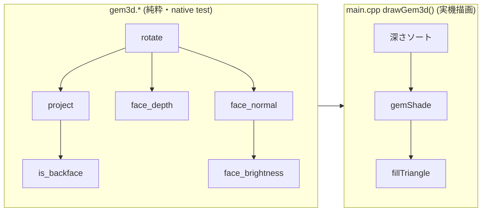

# 宝石を3D回転表示 — GPU無し CoreS3-Lite のソフトウェア3Dレンダ（#70）

宝石図鑑カードの上段に、正八面体のローポリ宝石を **CPU だけで 3D 回転＋フラットシェーディング**して表示する。ESP32-S3 には GPU が無いので、頂点を CPU で回して投影し、面を1枚ずつ塗る。`2026-07-01` に実機（CoreS3-Lite / COM3）で回転・陰影・タップ送り・文字表示を目視確認した時点のまとめ。

## レイヤー構成

純粋3D数学（native テスト可能）と実機描画（LovyanGFX 依存）を分離してある。`gem.cpp` と同じ流儀で、計算層だけ PC 上で単体テストできる。

| ファイル | 役割 | テスト |
|---|---|---|
| `src/gem3d.h/.cpp` | 回転・透視投影・裏面カリング・深さ・法線・明るさの純粋計算と正八面体データ | native 27/27 |
| `src/main.cpp` `drawGem3d()` | 上記を呼んで面を塗る（光源・配色・y反転・スプライト管理） | 実機目視 |

## 描画パイプライン（1フレーム）

`drawGem3d(spr, mesh, ax, ay, az, color)` が毎フレーム行うこと:

1. **rotate**: 全頂点をオイラー角 (ax,ay,az) で回す（適用順 z→y→x）
2. **project**: 透視投影 `scale = d/(d+z)`（焦点距離 `kGemCamD=5`）。`denom<=0` の頂点は投影不能フラグ
3. **裏面カリング**: 投影後三角形の符号付き面積で表裏判定。裏・潰れた面は捨てる
4. **深さソート**: 面の代表深さ（3頂点zの平均）で奥→手前に挿入ソート（ペインターズアルゴリズム、zバッファ不要）
5. **フラットシェーディング**: 面法線×光方向の内積 [0,1] → 環境光45% + 拡散115% = シェード率[45,160]% で宝石色を `gemShade`
6. **fillTriangle**: y を反転（math上向き→画面下向き）して画素座標に写し、面を塗る

## キー設計判断

- **スプライト分離**: 回転する宝石は**内蔵RAM**スプライト(116x116≒27KB)で毎フレーム描き替え（fillTriangle が速い）。静的なカード本体はフルスクリーン(≒150KB)なので **PSRAM** スプライトに置き、宝石送り時だけ描き替える。
- **不透明矩形 push で残像を消す**: 宝石スプライトは毎フレーム背景色(黒)で全クリア→宝石を描く→矩形ごと push。透明色 push にすると前フレームの宝石が消えず残像が出るので**あえて不透明**。
- **操作**: 常時回転＋**タップで次の宝石**（色が変わる）。長押しのシーン送りは従来通り。

## M1 レビュー申し送りの解消（M2 で対応）

- **申し送り1**（投影不能頂点）: カメラ手前 `denom<=0` の頂点を含む面は `ok[]` フラグで面ごとドロップ。中心に潰れる事故を防ぐ。
- **申し送り2**（カリング符号と y 反転の整合）: 裏面カリング・深さソートは**数学座標（y上向き）**で行い、**y 反転は最終ピクセル写像 `cy - proj.y*kGemR` の1箇所だけ**。二重反転を避け、M1テストの巻き順規約と一致させる。これがズレると「正面の面が消える」破綻が出るので実機で要確認だった → 破綻なしを確認。

## ハマりどころ（実機で発見）

- **黒矩形が宝石名の頭を消す**: 宝石名は `middle_center`・24pxフォントで y=136 → 文字は **y=124〜148**。スプライトは中心 y=72・半辺58 で **y=14〜130** の不透明な黒矩形。重なる y=124〜130 で毎フレーム文字上端が消えていた。
  → **中心Yを 72→62 に上げ**、矩形下端を `62+58=120` にして名前上端124の手前へ。半辺58は宝石の最大投影変位(≒52.5px)より大きいので宝石は見切れない。

## 寸法メモ（main.cpp の定数）

| 定数 | 値 | 意味 |
|---|---|---|
| `kGemCx` | 160 | 宝石中心X（画面中央） |
| `kGemCy` | 62 | 宝石中心Y（黒矩形下端120 < 名前上端124） |
| `kGemHalf` | 58 | 回転スプライト半辺（116x116） |
| `kGemR` | 42.0 | 投影正規化座標→画素スケール（見かけ半径） |
| `kGemCamD` | 5.0 | 透視投影の焦点距離 |
| `kGemLight` | {0.45,0.55,-1.0} | 光源方向（右上・手前から差す、math座標） |
| `kMaxV`/`kMaxFaces` | 16/32 | 固定長バッファ容量（八面体は6頂点/8面、超過は安全に return） |

## 関連 Issue / PR

- 本体: #70（M1=PR #71 純粋数学 / M2=PR #72 実機描画。#70 CLOSED）
- 前段（宝石カードのシーン・データ）: #64(PR #65) / #66(PR #67)

## 残課題・拡張余地（次段候補）

- いまは**正八面体固定**。宝石ごとに多面体を変える（ダイヤのブリリアントカット風など）と図鑑らしさが増す。`drawGem3d` はメッシュ非依存なので mesh を差し替えるだけで拡張可能（バッファ上限 kMaxV/kMaxFaces 内）。
- 角度を毎フレーム加算し続けるので長時間で `sin/cos` 引数が巨大化（実害ほぼ無いが `fmodf(angle,2π)` で畳むと安心）。
- ピクセル写像の `static_cast<int>` 切り捨ては正負非対称。`lroundf` にすると 1px の偏りが減る（美観のみ）。
