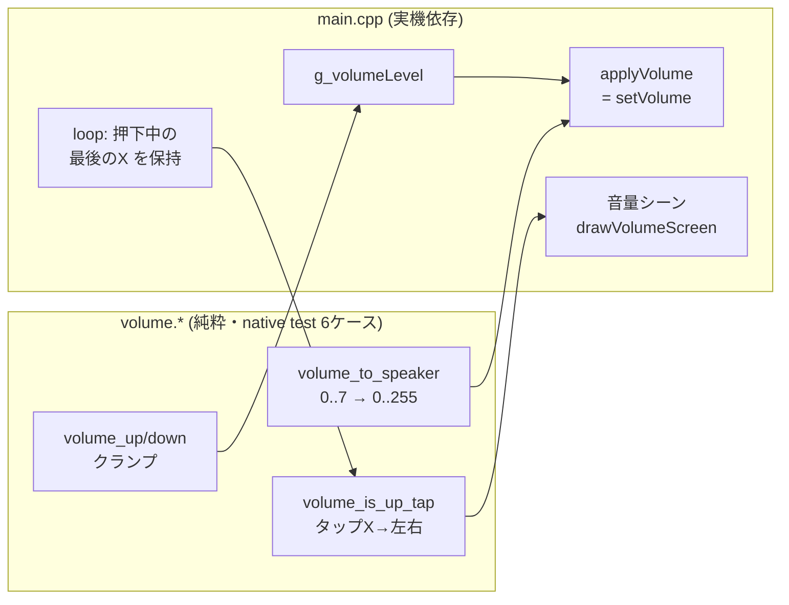

# 音量調整 — 専用シーンで左右タップ増減＋音量バー表示（#87）

スピーカー音量を実行時に変えられるようにした。長押しのシーン巡回に **音量シーン** を1つ足し、画面 **右タップ=上げ / 左タップ=下げ** で 8 段階（レベル 0〜7）を増減し、**音量バー**で現在値を見せる。`2026-07-03` に実機（CoreS3-Lite / COM3）へ書き込み、左右判定・試聴音・発話反映を目視確認した時点のまとめ。

## 背景

音量は `M5.Speaker.setVolume(180)` として `main.cpp` の複数箇所（`playBleat` / `playWavBuffer`）にベタ書きされ、ユーザーが変更できなかった。CoreS3-Lite は物理ボタンが乏しく（実体は側面の電源ボタン1個のみ・長押しは電源OFF）、タッチ操作が主。そこで **タッチ完結の音量シーン** を選んだ。

## レイヤー構成

音量ロジック（native テスト可能）と実機依存（`M5.Speaker` / `M5.Touch` / 描画）を分離。`gem`/`scene` と同じ流儀で、計算層だけ PC 上で単体テストできる。



| ファイル | 役割 | テスト |
|---|---|---|
| `src/volume.h/.cpp` | レベル増減のクランプ・`setVolume` 値変換・左右タップ判定の純粋関数 | native 6/6 |
| `src/main.cpp` | 音量状態の一元管理・音量シーン描画・タッチX座標の受け渡し | 実機目視 |

## 純粋ロジック（`volume.*`）

| 関数 | 仕様 |
|---|---|
| `volume_up(level)` / `volume_down(level)` | ±1 して `[0, kVolumeMax]` にクランプ |
| `volume_to_speaker(level)` | `level*255/kVolumeMax` の線形変換。範囲外は内部クランプ。**level5 = 182 ≒ 従来の 180** |
| `volume_is_up_tap(x, screenW)` | `x >= screenW/2` で上げ（右半分）。境界は右扱いで左右を漏れなく二分 |

- `kVolumeMax = 7`（0〜7 の 8 段階）、`kVolumeDefault = 5`（初期値。従来 180 に最も近い 182 相当）。
- 0 除算は `kVolumeMax > 0` の定数保証で回避。整数切り捨てだが設計意図どおり（丸めは不要）。

## 実機依存（`main.cpp`）の3つの変更

### 1. 音量の一元管理（DRY 化）

ベタ書き `setVolume(180)` 2箇所を、単一の状態 `g_volumeLevel` と `applyVolume()`（= `setVolume(volume_to_speaker(g_volumeLevel))`）に集約。`playBleat` / `playWavBuffer`（＝メェ / TTS / 鳴き声の全再生経路）が同じ状態を参照する。

### 2. `onTap` にタッチX座標を渡す拡張

`SceneDef.onTap(uint32_t now)` → `onTap(uint32_t now, int touchX)` に変更。既存4アダプタ（sheep / art / gem / poke）は touchX を無視する形で追随、音量シーンだけが使う。

**ハマりどころ**: `Tap` は **離した瞬間** に確定する（`touch_update` の仕様）。その時点では指が離れて `M5.Touch.getDetail().x` は無効。そこで `loop` で **押下中の最後のX座標** を `static` に保持し、`Tap` 確定時にそれを渡す。

```cpp
static int lastTouchX = kScreenW / 2;
if (touching) lastTouchX = M5.Touch.getDetail().x;   // 押下中は毎フレーム更新
...
} else if (ev == TouchEvent::Tap) {
    kScenes[g_sceneIdx].onTap(now, lastTouchX);       // 離した時に最後の座標で判定
}
```

### 3. 音量シーンの追加（開放閉鎖）

`volumeEnter/Update/OnTap` + `drawVolumeScreen` を追加し `kScenes[]` に1要素足すだけ。`kSceneCount` は `sizeof` 自動計算なので登録漏れが起きない。

- **表示は静的**（羊/宝石カードと同じく毎フレームは描かない）。`enter` とタップ変更時だけ全画面を描く。
- **バー**は `kVolumeMax` 個のセグメントセル。現在レベルぶんだけ緑点灯、残りは暗いグレー。下に `N / 7` の数値と左右の操作ヒント。
- **`onTap`**: `volume_is_up_tap` で左右判定 → `volume_up/down` → `playBleat()`（新音量で試聴のメェ／`applyVolume` は `playBleat` 内で実施）→ バー再描画。

## 寸法メモ（main.cpp の定数）

| 定数 | 値 | 意味 |
|---|---|---|
| `kVolumeMax` / `kVolumeDefault` | 7 / 5 | 最大レベル / 初期レベル（≒従来180） |
| `kVolBarX,Y,W,H` | 40, 108, 240, 26 | 音量バーの位置・大きさ |
| `kColVolOn` / `kColVolOff` | GREEN / 0x4208 | 点灯 / 消灯セルの色 |

## テスト・検証

- **native 全 138 テスト PASS**（`test_volume` 6ケース: 上下限クランプ / 範囲外入力 / 単調性 / 両端の setVolume 変換 / 左右二分の境界 159・160 / 奇数幅 321）。
- **実機ビルド** `m5stack-cores3` SUCCESS（RAM 19.5% / Flash 23.3%）。
- **実機目視**（#89）: 音量シーン入場・右上げ/左下げ・試聴音の変化・上下限飽和・発話への反映を確認。`setRotation(1)` 下でも `getDetail().x` の左右反転なし。

## レビュー対応（reviewer サブエージェント）

- 🔴 **Issue 番号の是正**: 当初 #70 に誤って紐付けたが #70 は既存（gem3d）。新規 #87 を起票し直してブランチ・コミットを整合。
- 🟡 奇数幅の左右判定テストを追加。

## 関連 Issue / PR

- 本体: #87（PR #88 squash マージ・CLOSED）
- 実機目視: #89（CLOSED）

## 残課題・拡張余地

- **`onTap` の引数拡張は「インターフェース改変」**なので、将来また入力（Y座標・押下時間など）が要ると全アダプタを触る必要がある。`struct TapContext { uint32_t now; int x; }` のような文脈オブジェクト1つを渡す形にすると、以後の拡張で既存シーンを触らずに済む（reviewer 🟡）。
- バーは `kVolumeMax=7` セルで **8 段階（0〜7）** を表す非対称（レベル0=全消灯、7=全点灯で破綻はしない）。段階数とセル数を揃えたいなら要調整。
- 音量は**電源を切ると初期値5に戻る**（永続化なし）。NVS 等に保存すれば次回起動時に復元できる。
