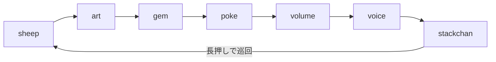

# スタックちゃん（本家 M5Stack-Avatar）の顔シーン追加 — #125 M1

- Issue: #125（M1 完了・M2 は未着手のため OPEN のまま）
- PR: #129（前提として #127 / Issue #126 を先にマージ）
- 派生: #128（ヒープ調査）

## 何をしたか

#121 で `lib_deps` に入れただけだった定番OSS `meganetaaan/M5Stack-Avatar`（スタックちゃん）を、
実際に画面へ出した。既存6シーンは1行も変えず、`kScenes` に7つ目として追加した。



## 前提として先に潰した地雷（#126 / PR #127）

`#include <Avatar.h>` を書いた瞬間に実機ビルドが落ちた。

```
src/main.cpp:1632:8: error: 'm5avatar' does not name a type
```

Windows のファイルシステムは大文字小文字を区別せず、PlatformIO の include パスは `src/` が
ライブラリより先に並ぶ。`<Avatar.h>` の検索が自作 `src/avatar.h` にヒットし、しかも `#pragma once` 済み
なので2回目の include が丸ごと無視され、`m5avatar` 名前空間が定義されないまま進んでいた。

自作側を `face_logic.h` へ改名して解決した。**`face.h` では不十分**で、ライブラリは `Face.h` も
`Expression.h` も持つ。実験で裏を取った — ダミー `src/face.h` に `#error` を仕込んで
`<Mouths.hpp>`（内部で `#include <Face.h>`）を通すと:

```
src/Face.h:2:2: error: #error "src/face.h was included -- collision reproduced"
```

GCC が `<Face.h>` を case-insensitive に `src/face.h` として開いている。M2 では口の見た目を扱うため
`faces/` 系ヘッダを include する筋であり、確実に踏んでいた。

## 設計

このシーンだけ**描画を `loop()` が駆動しない**。ライブラリが2本の FreeRTOS タスクを立て、
勝手に `M5.Display` へ描き続ける。

| タスク | 役割 | 周期 | Display に触るか |
|---|---|---|---|
| `drawLoop` | 顔の描画 | `TaskDelay(10)` | 触る（DMA 転送） |
| `facialLoop` | まばたき・サッケード・呼吸の内部状態 | `TaskDelay(33)` | 触らない |

よって `update()` は意図的に空で、`enter`/`exit` でタスクの生死だけを管理する。
そのため `SceneDef` に `exit()` フックを新設した。既存6行は4要素目を省略でき、
aggregate 初期化で `nullptr` になるので差分が増えない（開放閉鎖の原則）。

### 核心: なぜ `exit()` でタスクの消滅を待つのか

当初 `stop(); delay(50);` と書いたが、これはバグだった（reviewer が 🔴 で指摘）。

`Avatar::stop()` は `_isDrawing` フラグを下ろすだけで、進行中の `Face::draw()` を中断できない。
その `draw()` は画面を高さ8pxの短冊30枚（`y_step=8`, 240/8）に分けて DMA 転送し、毎回
`lgfx::delay(1)` を挟む（`Face.cpp:161`）。`stop()` の直後に `draw()` へ入られると最低30ms、
実際にはスプライト生成と30回の `pushRotateZoom` を含めて数十ms 走り切ってからフラグを見に来る。
**50ms はマージンがゼロ〜負**で、生きている `drawLoop` の DMA 転送と `fillScreen()` が
同一バスへ並行アクセスしうる（M5GFX のバストランザクションはタスク安全ではない）。

そこで `xTaskGetHandle(name)` が `NULL` を返すまで待つ形にした。これが正しい同期点である根拠:

- `xTaskGetHandle` は **`xTasksWaitingTermination`（自己削除待ちリスト）を走査しない**。
  タスクが `vTaskDelete(NULL)` を実行した瞬間に Ready リストから外れ、以後ハンドルは引けない。
- `drawLoop` は `while (isDrawing())` を抜けた**後**に `vTaskDelete` する（`Avatar.cpp:43-49`）。
- ゆえに **`NULL` を観測した時点で最後の `draw()` は完了済み＝以後 Display に触れない**。

reviewer が提案した `eTaskGetState(drawTaskHandle)` は採らなかった。TCB は idle タスクが解放するので、
解放後のハンドルを覗くのは未定義動作になる。名前引きはハンドルを保持しないのでその危険が無い。
`Face::draw()` は非 virtual（デストラクタも非 virtual）なので、サブクラス化してフックする道も塞がれている。
消滅の確認が、実装可能な最も正確な同期点だった。

`facialLoop` も待つ。Display には触れないが、生き残ったまま再 `start()` すると2本目が走って
呼吸・視線の状態を奪い合う。両方の消滅を確認することで、**二重起動も原理的に消える**
（`start()` は `if (_isDrawing) return;` でしか守られていない）。

400ms のタイムアウトは保険で、抜けた時はシリアルに警告を出す（ライブラリのタスク名が変わった徴候）。

## 学び

- **ライブラリの `stop()` が「止まったこと」を保証するとは限らない。** フラグを下ろすだけの実装は多い。
  停止要求と停止完了は別物で、後者を観測する手段があるかを先に確かめる。
- **case-insensitive FS では、ヘッダ名が実質グローバル名前空間。** 依存ライブラリのヘッダ名一覧と
  自分のヘッダ名がぶつからないかは、導入時に確認しておくと後で泣かない。
- **reviewer の指摘は正しくても処方箋が正しいとは限らない。** 今回 🔴 の診断（delay 不足）は正確だったが、
  提案された `eTaskGetState` は dangling を踏む。指摘を受け取ってから自分で裏を取る価値がある。

## 検証

- `pio run -e m5stack-cores3` SUCCESS（Flash 30.5% → 30.8% / RAM 19.6% 据え置き）
- native テスト 167件すべて緑
- **実機目視は未実施**。顔が出るか・シーン切替で画面が乱れないかは実機確認が要る（#111 と合わせて行う）

## 次（#125 M2）

タップ → `speakTts()` で発話し、再生中の音量エンベロープを `setMouthOpenRatio()` に流して口パクを連動させる。
強度計算は現在 `drawSpeakingParticles` 内に埋まっている（`main.cpp` の `g_voiceEnv` / native テスト済みの
`voice_envelope`）ので、パーティクルと共有できる形に小さく切り出す。
