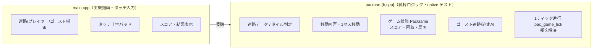

# 自作パックマン 実装概要（Issue #134）

CoreS3-Lite 上で動く自作パックマンを、追加ハード無し（静電タッチ操作）で実装した。
著作権クリーン（ROM 不要・自前実装）で、ゲーム移植の土台となるゲームループ・操作系・
状態管理・敵AIの型をこのプロジェクトに確立するのが狙い。

## きっかけ（調査）

`research/game-porting-research.md` にゲーム移植可否をまとめた。要点:
- CoreS3-Lite の2大制約: **物理ボタン無し（タッチのみ）** / **Bluetooth は BLE のみ**
- Doom ◎ / パックマン ◎（自作が最適）/ マリオ ○（NESエミュ・ROM要）/ ロックマン △
- まず著作権クリーンなパックマン自作で土台を作る方針に決定

## アーキテクチャ

既存の gem3d と同じ「**純粋ロジック層＋描画/入力層**」の分離を踏襲した。

- 純粋層は M5GFX 非依存で、**PC 上（native/Unity）で 26 件のテスト**が守る。
- main.cpp は `PacGame` を1つ持ち、`pac_game_tick` に進行を丸ごと委譲。描画のみ担当。

## 操作モデル

本アプリ共通の「**長押し＝メニュー復帰**」と衝突しないよう、押しっぱなしではなく
アーケード版と同じ「**十字パッドをタップで進行方向をセット→自動で進み続ける**」方式にした。
入力は `pacUpdate` 内でタッチの立ち上がり（前フレーム非接触→接触）を検出して方向を予約する。

## 実装ステップ（6 PR）

| Step | 内容 | PR |
|------|------|----|
| 1 | 迷路モデル＋プレイヤー移動の純粋ロジック＋テスト | #135 |
| 2 | 迷路描画＋タッチ十字パッド（実機で動く） | #136 |
| 3 | ドット回収＋スコア（状態を PacGame に集約） | #137 |
| 4 | ゴースト1体の追跡AIと衝突（やられ） | #138 |
| 5a | ゴースト4体化＋全回収でクリア判定 | #139 |
| 5b | パワーエサでゴースト逃走モード＋捕食 | #140 |

各 Step で reviewer サブエージェントにレビューを委譲し、🔴 指摘を解消してからマージした。

## ゲーム仕様（完成形）

- 15×13 の迷路（全床連結を native テストで保証）
- ドット10点／パワーエサ50点／逃走ゴースト捕食200点
- ゴースト4体。追跡AI＝壁回避・逆走禁止・マンハッタン距離最小、逃走時は距離最大化。
  タイブレークは Up>Left>Down>Right で決定的
- パワーエサで `fright_timer` の間ゴーストが青紫になって逃走、触れると捕食して巣へ戻す
- 全ペレット回収で CLEAR!／ゴーストに捕まると GAME OVER（長押しでメニューへ、再入場でリスタート）

## 主要ファイル

- `src/pacman.h` / `src/pacman.cpp` — 純粋ロジック（迷路・状態・AI・衝突）
- `src/main.cpp` — パックマンシーン（描画・タッチ・結果表示）。`kScenes` に "パックマン" を登録
- `test/test_pacman/test_pacman.cpp` — native テスト 26 件

## 認知負債メモ（信頼してよい境界）

- **ゲームのルールとAIは全て純粋層**にあり、テストが仕様を語る。挙動を変えたい時はここを読む。
- **main.cpp のパックマン部分は「描く／触る」だけ**。ルールは持たない。
- 迷路を広げる時は `pacman.cpp` の `kMaze` と、`pacman.h` の `kPacMaxW/H`（eaten 配列上限）を確認する。
  描画は `pacDrawMaze` が描画可能域にクランプする安全網を持つ。

## 次にやれること（未着手）

- BLE コントローラー対応（Bluepad32。PS4/PS5 等の BLE パッドが必要）
- Doom（PrBoom 移植）や NESエミュ（マリオ）への発展 — research/ 参照
- ゴーストの個体差（4体を別AIに）、ラウンド進行・自機残数
