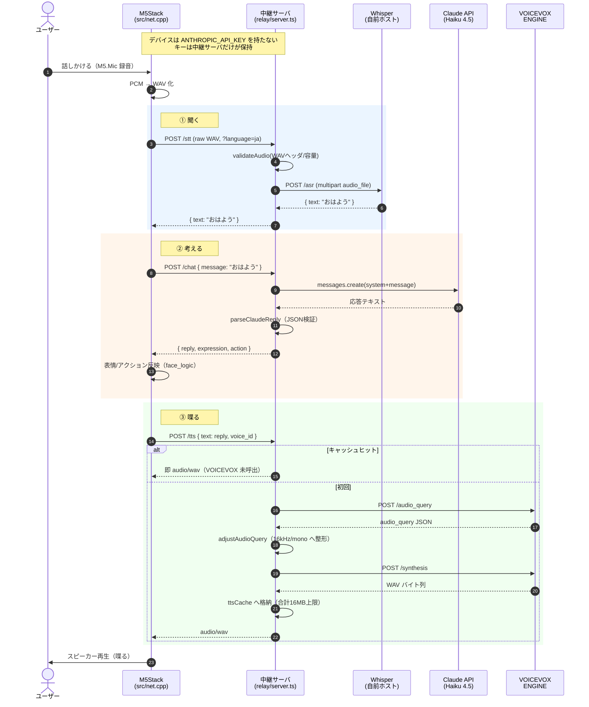
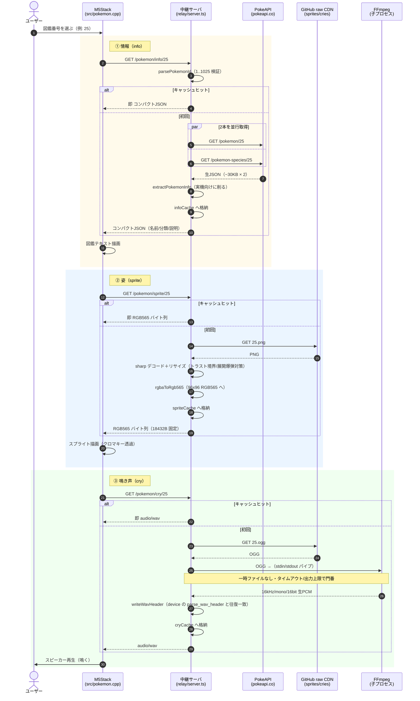

# 中継サーバ(relay) の役割をシーケンス図で整理

- Issue: #155
- 位置づけ: `relay/` 中継サーバが担う2つの中継シーンを、認知負債軽減のため図示するドキュメント。コード変更なし。

## relay とは何か

M5Stack デバイスと外部サービス（Claude / VOICEVOX / Whisper / PokeAPI / GitHub CDN）の間に立つ中継サーバ（`relay/src/server.ts`, Hono 製）。
中継の動機はシーンによって2種類ある。

| シーン | エンドポイント | 中継の主な動機 |
|--------|--------------|---------------|
| 音声対話ループ | `/stt` `/chat` `/tts` | **秘密鍵の隠蔽**（`ANTHROPIC_API_KEY` をデバイスに載せない） |
| ポケモン図鑑 | `/pokemon/info` `/sprite` `/cry` | **重い変換のオフロード**＋外部 API 保護（fair-use / キャッシュ） |

---

## ① 音声対話ループ（`/stt` → `/chat` → `/tts`）

READMEの「M3b: 聞いて→考えて→喋る」の一巡。デバイスは秘密鍵を持たず、relay の3エンドポイントだけを知る。

### 押さえる点
- **中継の存在理由**: デバイスに秘密鍵を置かず、`ANTHROPIC_API_KEY` を持つのは中継サーバだけ。
- **中継サーバ＝翻訳＆整形役**: デバイスは relay の3エンドポイントしか知らない。上流が何でもデバイスから見た形は一定（純粋ロジック `stt.ts`/`chat.ts`/`tts.ts` が整形を担う）。
- **`/tts` のキャッシュ分岐**: 定型文は2回目以降 VOICEVOX を叩かず即返し、体感遅延を消す。

---

## ② ポケモン図鑑（`/pokemon/info` → `/sprite` → `/cry`）

非力なデバイスの代わりに、中継サーバが「上流の生データ」を「即使える形」へ変換する。

### 押さえる点
- **中継サーバ＝重い変換の肩代わり役**。デバイスは変換ロジックを一切持たない。

| エンドポイント | 上流の生データ | 変換後（デバイス向け） | 変換の担い手 |
|---|---|---|---|
| `/info` | PokeAPI JSON ~30KB×2 | コンパクト JSON | `extractPokemonInfo` |
| `/sprite` | PNG | RGB565 バイト列 18432B 固定 | `sharp` + `rgbaToRgb565` |
| `/cry` | OGG | WAV（16kHz/mono） | `FFmpeg` + `writeWavHeader` |

- **全エンドポイントにキャッシュ**: PokeAPI の fair-use ポリシー順守＋レイテンシ削減。キーが検証済み id（1..1025）に閉じるのでメモリ有界（プロセス再起動でクリア、永続化しない＝ライセンス方針にも合致）。
- **音声対話ループとの違い**: あちらは「秘密鍵の隠蔽」、こちらは「変換負荷のオフロード＋外部 API 保護」が中継の動機。
