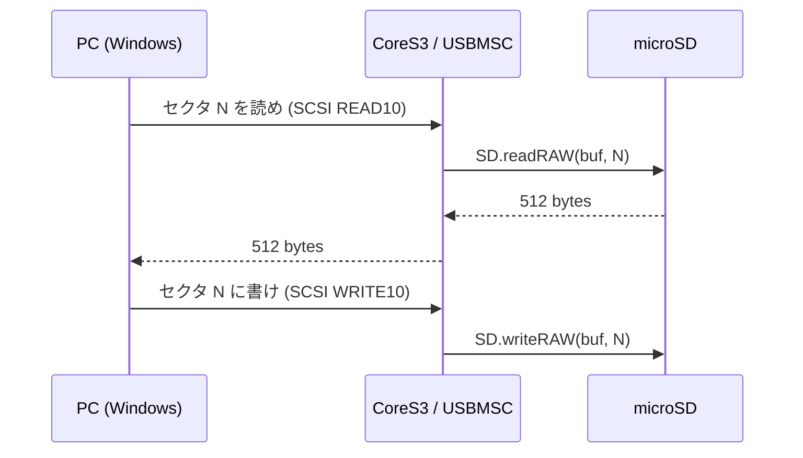

# USB MSC 転送専用ファーム（#157 M1/M2）

2026-07-18。動画アセットを microSD に配置する手段として、CoreS3 を USB Mass Storage として
PC にマウントさせるファームを追加した。M1（USB モード切替の検証）と M2（実装）が完了。
M3（実転送）は microSD カード未所持のため保留。

## なぜ作ったか

動画再生（Step 2 / #154）の実機検証は、microSD に `video/sample/`（JPEG 連番＋WAV＋meta.txt）を
置くことが前提。しかし PC 側にカードリーダーが無く、ファイルを配置できなかった。

そこで本体の microSD を USB 経由で PC に見せることにした。変換パラメータ（`--fps` 等）は
実測しながら何度も差し替える前提なので、都度カードを抜き差しするより USB 転送の方が反復が速い。

## MSC とは

USB Mass Storage Class。USB 機器が「自分は外付けストレージだ」と名乗るための規格。
PC 側は対応ドライバを標準で持っているので、名乗りさえすれば専用ソフト無しでドライブとして見える。

実装で書くのは実質これだけ:

- PC「512 バイト単位の N 番目のブロックをくれ」→ SD の同じ番号を読んで返す
- PC「N 番目のブロックにこれを書け」→ SD の同じ番号に書く

**FAT32 の解釈は PC 側が行う**ため、ファイルシステムを自前で実装する必要はない。



## 設計判断: なぜ env を分けたか

当初は「1 つのファームで、起動時ボタン長押しで MSC モードに入る」案だった。
これを **M1 の単独検証で棄却**した。

`USBMSC` は `CONFIG_TINYUSB_MSC_ENABLED` 配下にあり `ARDUINO_USB_MODE=0`（TinyUSB）が要る。
board 定義 `m5stack-cores3.json` の既定は `1`（ハードウェア USB CDC/JTAG）。実際に `0` にして
実機で試したところ:

| 項目 | 結果 |
|---|---|
| ビルド | 成功（RAM +11.9KB / Flash +26KB） |
| COM ポート | COM3 → COM4 に移動（USB PID 0x8119 → 0x1001） |
| 自動書き込み | **失敗**（`default_reset` / `usb_reset` とも "No serial data received"） |

TinyUSB では USB をアプリが握るため、esptool がブートローダーへ落とせない。
単一ファーム案だと**日常の開発すべてが手動ボタン押し**になる。

そこで通常ファームは `USB_MODE=1` のまま残し、MSC を別 env の専用ファームに分離した。

```
[env:m5stack-cores3]      通常ファーム。USB_MODE=1。自動書き込みを維持
[env:m5stack-cores3-msc]  転送専用。USB_MODE=0 + USBMSC。msc_main.cpp のみビルド
```

`build_src_filter` でビルド対象を切り替える（同一 `src/` に `setup()`/`loop()` が 2 つあると
リンクが多重定義で落ちるため、通常 env 側は `msc_main.cpp` を明示除外）。

副次的な利点として、**別ファームなので PC と本体が同時に SD を掴む競合が構造的に起こらない**。
モード切替案ならソフトで排他する必要があった。

## reviewer 指摘で判明した重大な事実

### LCD と microSD は同じ SPI バスだった

`research/sd-video-playback.md` に「CoreS3 では画面と microSD は物理的に別バス」と書いていたが
**誤り**。M5GFX の CoreS3 初期化は以下を割り当てる。

```cpp
bus_cfg.pin_mosi = GPIO_NUM_37;   // SD の MOSI と同じ
bus_cfg.pin_miso = GPIO_NUM_35;   // SD の MISO と同じ
bus_cfg.pin_sclk = GPIO_NUM_36;   // SD の SCK と同じ
bus_cfg.pin_dc   = GPIO_NUM_35;   // MISOとLCD D/CをGPIO35でシェアしている
```

GPIO35 に至っては SD の MISO と LCD の D/C の兼用。つまり **SD アクセスと画面描画は
同じ物理バスを奪い合う**。

`main.cpp` が問題なく動いているのは、SD アクセスも描画もすべて `loop` タスク内で直列に
実行されているからであって、バスが分かれているからではない。MSC ではコールバックが
USB タスクで走るため、この前提が崩れる。

対応として **MSC 開始後は一切描画しない**設計にした（転送状況の R/W カウンタ表示は削除）。
`USB.begin()` の呼び出し位置も、描画をすべて済ませた後に移した（`USB.begin()` が返った時点で
ホストが READ10 を投げてくるため、その後の `fillScreen` が競合の窓になる）。

### セクタ範囲チェックは自前で持つ必要がある

TinyUSB 側にも範囲判定はあるが `lba + block_count > max` という加算式で、32bit でラップする。
`lba=0xFFFFFFFF, count=8` なら `7` になって**素通り**し、セクタ0（MBR）破壊に化けうる。

減算比較の純粋関数として切り出し、native テストを付けた。

```cpp
inline bool msc_range_ok(uint32_t lba, uint32_t count, uint32_t sector_count) {
    if (count == 0) return false;
    if (lba >= sector_count) return false;
    return count <= sector_count - lba;   // 引き算なのでラップしない
}
```

## 追加/変更したファイル

| ファイル | 内容 |
|---|---|
| `platformio.ini` | env を 3 つに再編（通常 / MSC / native） |
| `src/msc_main.cpp` | 転送専用ファーム本体（新規） |
| `src/msc_range.h` | セクタ範囲判定の純粋関数（新規・ヘッダオンリー） |
| `src/sd_pins.h` | SD ピン定義を集約（新規・両ファームで共有） |
| `test/test_msc_range/` | 境界値・オーバーフローの回帰テスト（6 cases） |
| `research/sd-video-playback.md` | 「別バス」の誤記を訂正 |

検証: native 226/226 パス。通常 env RAM 20.0%/Flash 31.6%（変更前と同一）、MSC env RAM 10.5%/Flash 8.0%。

## 残作業（M3）

microSD カード入手後に実施する。手順は `PLAN.md` の「カード入手後の再開手順」に集約した。

なお実機には現在 M1 の検証ファームが載っており **USB が機能しない**（`USB.begin()` 未呼び出しのため）。
通常ファームへの焼き戻しには**底面 RST ボタンの 3 秒長押し**でのダウンロードモードが必要。

⚠ ボタンの役割（間違えると電源が落ちるだけで先に進めない）:

| ボタン | 位置 | 操作 | 動作 |
|---|---|---|---|
| POWER | 左側面 | シングルクリック | 電源オン |
| POWER | 左側面 | 6 秒長押し | 電源オフ |
| RST | 底面 | シングルクリック | リセット |
| RST | 底面 | 3 秒長押し | ダウンロードモード（緑 LED） |
