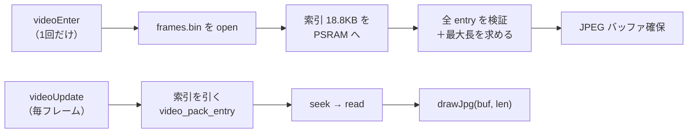

# フレームを1ファイルにパックして索引で seek する（#170）

- Issue: #170
- 位置づけ: 動画再生が実効 1.1fps しか出ず実用にならなかった問題の解決。**再生速度の問題はこれで決着**。

## 何が問題だったか

動画は全長で再生できていたが、**フレーム番号が進むほど 1 枚の描画が遅くなり**、終盤では 1 枚に 1 秒かかっていた。

原因は #169 で特定済みで、**FAT32 のファイル名解決コスト**。FAT32 はディレクトリにインデックスを持たないため、`frame_02200.jpg` を開くには**先頭から 2,200 個ぶんのエントリを順に読む**（線形走査）。しかも SD は SPI 接続なので、1 エントリ読むたびに往復が発生する。

### サブディレクトリ分割は逆効果だった（破棄済み・二度やらないこと）

「1 ディレクトリあたりのファイル数を減らせば走査が短くなる」と考えて 100 枚ずつに分割したが、**実機で測ると全域が約 880ms の均一な遅さになり、むしろ悪化した**。

読み違えたのは `idx=0 で 4ms` という値。これを「走査が短いから速い」と解釈したが、実際は `frame_00001.jpg` がディレクトリの先頭エントリだったという最良値にすぎなかった。**パスの階層を 1 つ増やすコスト自体**（ディレクトリを開くたび FAT のクラスタ連鎖を辿り SPI 往復が発生）が、走査短縮の利得を上回っていた。

## どう解決したか

**ファイルシステムに名前解決をさせている限り解決しない**、という見立てに立った。番号 → データ位置の辞書を、FAT32 ではなく**自分たちが制御できる層**に持つ。

全フレームを 1 本のファイルにまとめ、先頭に索引を置く。

```
frames.bin
  [索引部] frames 個 × 8 バイト … offset(uint32 LE), length(uint32 LE)
  [データ部] JPEG を連結（パディング無し）。offset はデータ部先頭からの相対値
```



要点は **`File` を開いたまま保持する**こと。毎フレーム開き直すと名前解決が復活して本末転倒になる。名前解決はシーン入場時の 1 回だけになり、以降に残るコストは JPEG デコードのみ。

## 実測結果（2026-07-21・全長 2,355 フレーム）

| フレーム番号 | フラット配置（旧） | パック方式 |
|---|---|---|
| idx=0 | 58ms | **46ms** |
| idx=1600 | **1,051ms** | **65ms** |
| idx=2200 | （実質再生不能） | **81ms** |

- `draw total` は全域 46〜81ms。**フレーム番号が進んでも増えない**（走査が消えた証拠）
- 1 周の実時間 235,512ms vs 音声の公称 235,520ms → **ズレ 8ms（0.003%）**。終盤でも開かない
- 実効 fps は最悪値 81ms で約 12fps（10fps の予算に収まる）
- 入退場を 4 回繰り返しても `audio-alloc-before` が完全に同一値（free=8,308,231 / largest=8,257,524）。**リークも断片化もゼロ**

### 副次的な効果

MSC 転送が **85KB/s → 204KB/s**（33.6MB を 164.6 秒）。小ファイル 2,355 個ぶんのファイルごとのオーバーヘッドが消えた。実機作業のたびに挟まる待ち時間が短くなる。

### PSRAM の占有

| | 変更前 | 変更後 |
|---|---|---|
| 音声（audio.wav 全体） | 7.5MB | 7.5MB |
| 映像 | 0（毎回 SD から読む） | **35KB**（索引 18.8KB + JPEG バッファ 16.6KB） |

映像は 39MB を PSRAM に載せず SD から seek で読むので、ほぼ無償。占有は動画シーンに居る間だけで、退場すれば全部返る。減らす必要が出たら `--sample-rate 8000` で音声を 3.7MB に半減できる。

## 実装

### 純粋関数（native テスト済み）

この方式で最も壊れやすいのは**索引の読み違い**（エンディアン・レコード幅・範囲外）なので、そこを純粋関数に閉じ込めて TDD した。SD 上のファイルは外部入力として扱う。

```cpp
// src/video.h
bool video_pack_entry(const uint8_t* index, size_t index_len, int frame_count,
                      int idx, uint32_t data_size,
                      uint32_t* out_offset, uint32_t* out_length);
```

Issue の設計から `frame_count` と `data_size` を足した。`offset + length` がデータ部を超えないかの検証こそが「壊れた索引で範囲外読みをしない」の本体で、これを呼び出し側（実機でしか動かない main.cpp）に置くと native テストで固められないため。

固めた境界:
- リトルエンディアンで読めているか（`memcpy` を使わず明示的にバイト組み立て。使うとホストのバイト順に依存し、PC と ESP32-S3 が偶然一致しているだけの状態になる）
- データ部の末尾ちょうどに終わる entry は有効（off-by-one で弾かない）
- `offset + length` が uint32 を回り込む値でも範囲内と誤判定しない（uint64 で足す）
- 索引長が 8 の倍数でない時、半端なぶんをレコードとして数えない
- 失敗時に出力を書き換えない

manifest から文字列を読む `meta_get_str` と、キーの存在だけを見る `meta_has_key` も追加した（`pack=frames.bin` のような非数値項目のため）。

### 端末側（src/main.cpp）

- `videoOpenPack` … `frames.bin` を開き索引を PSRAM へ。**入場時に全 entry を検証し、同時に最大フレーム長を求める**。読み込みバッファをその最大値ちょうどにできるうえ、壊れた索引を「再生中に 1 枚だけ描けない」ではなく入場時点で弾ける（原因が分かる場所で失敗させる）
- `videoDrawFromPack` / `videoDrawFromFiles` … 方式ごとに分離。`videoDrawFrame` は選択と計測だけ
- `videoReleasePack` … `File` を閉じ索引と読み込みバッファを解放。`videoExit` で呼ぶ（`videoReleaseAudio` と同じ「確保と解放を対にする」作法）

### 変換ツール（tools/video2frames.py）

`--pack`（既定 ON）で `frames.bin` を出力し、`meta.txt` に `pack=frames.bin` を書く。索引はフレーム長が全部分かってからでないと書けないが、先に全 JPEG をメモリへ載せると 39MB 級で無駄が大きいので、**索引部のぶんだけ 0 で埋めて場所を空けておき、データを流し込みながら長さを集め、最後に先頭へ seek して索引を上書き**する。

`meta.txt` はパックより**後**に書く。先に書いて途中で失敗すると、端末が「あるはずの frames.bin が無い」状態を掴むため。

### 互換性

`meta.txt` に `pack=` があればパック方式、無ければ従来の連番ファイル方式。旧アセットをそのまま再生できる。

ただし「`pack=` の宣言がある」と「値が取り出せた」は区別している（reviewer 指摘）。`pack=<32文字以上>` のような値を「宣言が無い＝旧アセット」と読むと、遅い連番方式へ黙って落ちて「なぜか遅いだけ」の状態になるため、そこは明示的にエラーとして止める。

## この件から得た一般的な教訓

- **速度の問題は「どの層が仕事をしているか」を見る**。今回は FAT32 に名前解決を任せていたのが根本で、その層の中で最適化（階層を分ける）しても解決しなかった。層ごと外して自前の索引に置き換えて初めて消えた。
- **測定値の解釈を疑う**。`idx=0 で 4ms` は事実だったが、そこから引いた結論（走査が短いから速い）が誤りだった。最良値を代表値と読まないこと。
