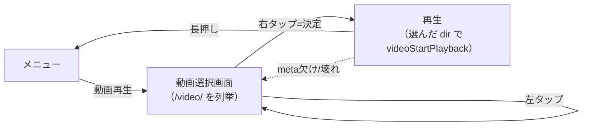

# 動画を選べるようにする（/video/ 直下を列挙して選択画面を出す）（#175）

- Issue: #175
- 位置づけ: 再生対象が `/video/sample` 固定だったのを、SD の `/video/` 直下から実機で選べるようにする。
  素材を差し替えるたびに MSC ファームを焼き直す固定コスト（RST 3秒長押しを含む）が無くなる。

## 何が問題だったか

`src/main.cpp` の `kVideoDir` が `constexpr const char* = "/video/sample"` で固定されていた。
別の動画を再生するには `/video/sample/` を丸ごと差し替えて MSC 転送し直すしかなく、SD に複数本
置いても切り替えられなかった。

## どう解決したか

「声の選択」（`src/voice_select.cpp`）と同じ「リストから選ぶ」パターンに倣い、動画シーンに
**選択(kSelecting) → 再生(kPlaying)** の2状態を持たせた。実機依存を混ぜない純粋ロジックを
先に TDD で固め、端末側は薄く繋ぐ（コードベースの一貫作法）。

### 純粋ロジック `src/video_list.{h,cpp}`（native テスト済み）

- **エントリ名の妥当性判定** `video_name_valid` — SD 上の名前は外部入力。空・`.`・区切り文字
  (`/`・`\`)・`..` を含む・`kVideoNameMax`(31) 超えを弾く。**読む側**（`videoOpenPack` の `pack=`
  名検証）・**書く側**（`tools/video2frames.py` の `safe_subdir_name`）と同じ規則を、**列挙する側**にも置く。
- **パス組み立て** `video_build_dir` — `"/video/<name>"` を作る。収まらなければ false で buf を使わせない
  （`video_frame_path` と同じ「中途半端なパスで SD.open を呼ばせない」作法）。
- **候補リスト** `VideoList` — 固定長 `kVideoListCap`(8) 件。上限超・不正名は `video_list_add` が
  黙って捨て、`count` の頭打ちで気づく。カーソル巡回 `video_list_next`・タップ左右判定 `video_is_decide_tap`。

### 端末側 `src/main.cpp`

- `kVideoDir` を可変バッファ `g_videoDir[64]` へ。**再生中は書き換えない**（`videoOnTap` の決定で確定し
  `videoExit` まで固定）。再生中に書き換わると `videoOpenPack` が開いた File／索引と食い違うため。
- `videoEnumerate` — 入場時に1回だけ `/video/` を `openNextFile` で列挙。`name()` が絶対パス／basename
  どちらを返しても basename に正規化してから検証。捨てた件数を Serial に出す（「入れたのに出ない」の手掛かり）。
- `videoRenderSelect` — `menuRender` と同じ縦リスト。0件は理由を表示（固まらせない）。
- `videoStartPlayback` — 旧 `videoEnter` の「meta 読み→pack→1枚目→音声」部分を切り出し。失敗時は理由文字列を
  返し、`videoFailToSelect` で資源を対称解放＋状態を選択へ戻す。
- 操作: **長押しは loop 側で「メニューへ戻る」固定**なので、決定はタップ右半分に割り当て。
  壊れた動画は退場せず選択画面へ戻して赤字で理由表示（別 dir を選び直せる）。

## 素材変換（変更不要だった）

`tools/video2frames.py <URL> --name <名前>` は既に `--name` で出力先を分けられる。今回
`--name lain` で "Serial Experiments Lain Opening"（102秒・1016フレーム・pack方式）を変換して
`video/lain/` を作成した（アセットは非コミット・`.gitignore` 済み）。

## テスト

- `test/test_video_list/`（native・14件）: 名前検証（区切り・`..`・空・上限長の境界）、パス組み立て
  （成功・不正名・切り詰め・実機バッファ幅での境界）、候補リスト（0件・追加・満杯溢れ）、タップ左右、カーソル巡回。
- ファーム全体ビルド成功（`m5stack-cores3`）。`kVideoNameMax` とバッファ境界は `static_assert` で
  コンパイル時保証（reviewer 指摘）。
- native 全体 265 件パス（回帰なし）。

## レビュー（reviewer サブエージェント）

🔴 must なし。🟡 should の指摘を反映:
- 再生失敗3経路の資源解放の非対称 → `videoFailToSelect` に集約。
- 失敗時の phase 後始末を関数内に閉じる（呼び出し側に散らさない）。
- `kVideoNameMax` とバッファ境界の `static_assert`。
- 列挙で捨てた件数を Serial に出力。
- 上限長名×実機相当バッファの境界テスト追加。

## 受け入れ条件との対応

- [x] エントリ名の検証が native テストで固められている（区切り文字・`..`・長すぎる名前）
- [x] `/video/` が空 / 存在しない場合に固まらず理由が画面に出る
- [x] 選んだ動画の meta が欠け/壊れなら選択画面に戻して理由を出す
- [ ] SD に 2 本以上置いて実機で選んで再生できる（実機での物理転送＋確認が必要・下記手順）
- [ ] 動画を切り替えても PSRAM が確実に返る（`videoExit`→再入場で確認・実機タスク）

## 実機で試す手順（物理転送）

1. MSC ファームで本体を D: ドライブとしてマウント（RST 3秒長押し）。
2. `video/lain/` と既存 `video/sample/` を SD の `/video/` 直下へコピー。
3. 通常ファーム（`pio run -e m5stack-cores3 -t upload`）に戻す。
4. メニュー→「動画再生」で選択画面が出る。左タップで `lain`/`sample` を切り替え、右タップで再生。
