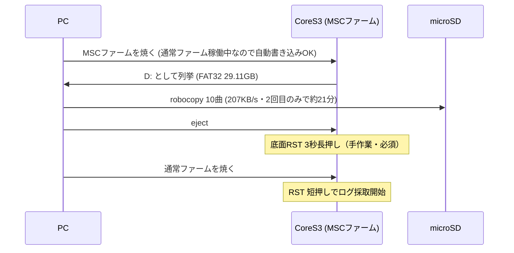

# 動画素材 10 本を追加転送し、13 本で選択画面を実機確認（#191 / #189 消化）

2026-07-25 実施。PC 側で変換済みの 10 曲を microSD へ転送し（既存 3 本と合わせて 13 本）、
#189（動画選択の 16 件化 + 8 行スクロール窓）が実機で機能することを確認した。
ファーム側の変更は無し（既存実装の検証のみ）。

## 結論

- **13 本すべて列挙され、取りこぼしは 0**。`kVideoListCap` 8→16 の拡張が実機で効いている。
  ⚠ ただし確認できたのは 13 本まで。**上限 16 の境界と、溢れを捨てる経路
  （`src/video_list.cpp` の `dropped` カウント）は未検証**（#179 の「捨てた件数の表示」に直結する）。
- 選択画面でカーソルを一周させ、**9 本目以降も画面内に見え、▲▼インジケータも出た**（目視確認）。
- 新規素材 `aaa` を再生し、パック読み込み・PSRAM への音声常駐・フレーム描画すべて正常。
- 副産物として **#176 が待っていた `bench` ログが採れ、draw の内訳を概算で分解できた**（下記の限界に注意）。

## 確認結果（実機ログ）

```
[video] enumerate: listed=13 dropped=0
[video] pack ok: /video/aaa/frames.bin frames=2118 index=16944B data=19739587B maxjpg=11936B
[video] bench: lcd clk=40000000Hz push=34130us/frame (320x240 16bit avg of 30 img=1)
[video] audio-alloc-before want=6778820 psram_free=8161211 psram_largest=8126452
[video] audio-alloc-ok     want=6778820 psram_free=1382375 psram_largest=1376244
[video] audio ok: 3389371 samples @16000Hz ch=1
[video] draw idx=0   total=69750us sd=12765us draw=56974us jpg=10791B pack=1
[video] draw idx=200 total=69024us sd=10906us draw=58105us jpg=11633B pack=1
[video] draw idx=400 total=60723us sd=7491us  draw=53218us jpg=8212B  pack=1
```

### PSRAM に載ったことを今回は確認できた

#183 では `audio-alloc-*` を採り逃して「載ったか不明」で終わっていたが、今回は
`audio-alloc-ok` が採れた。6,778,820B の要求に対し確保前 8,161,211B 空き → 確保後 1,382,375B。
**16kHz mono・212 秒ぶんの全長音声が PSRAM に載っている。**

⚠ ただし #168（他シーンを経由した後でも載るか）の追試には**なっていない**。今回は起動直後に
動画シーンへ入った経路しか踏んでいないため、#168 は未消化のまま残る。

## #176 の宿題: draw の内訳を分解した（ただし厳密な引き算ではない）

PLAN は「サイズ非依存分 ≈43ms が LCD 転送なのかデコードなのか分離できていない。次にやるのは
計装の実装ではなくログの採り直し」としていた。今回そのログが採れた。

| 指標 | 値 |
|---|---|
| LCD **バス設定クロック**（報告値・実効ではない） | **40MHz**（`videoBenchLcd()` が `getBus()->getClock()` を報告） |
| `push`（フルスクリーン転送・30 回平均・実測） | **34.13ms/frame** |

⚠ 上段は設定値であって実効スループットの測定ではない。実効は 153,600B / 34.13ms ＝ **36MHz 相当**で、
その差が下記の未分解 3.4ms にあたる。

### 🔴 先に限界を書く（この分解は近似）

`draw − push` を「デコード時間」と呼ぶが、**2 つは同じ転送経路ではない**。

- `push` は `videoBenchLcd()`（`src/main.cpp:2412` 付近）が測った **PSRAM 常駐 Sprite の
  `pushSprite`** の値。PSRAM からの読み出しコストを含む。
- `draw` 側の転送は `M5.Display.drawJpg`（`src/main.cpp:2352` 付近）の内部で、
  **MCU ブロック単位・ソースは内蔵 RAM**。
- 320×240×16bit = 153,600B を 40MHz で流す**理論下限は 30.72ms**。実測 `push` 34.13ms との
  差 **3.4ms は未分解**（PSRAM 読み出し分なのか他のオーバーヘッドなのか切り分けていない）。

したがって下表の「デコード」列は**実測値ではなく、上記前提での導出値**である。

| idx | JPEG | draw | push | デコード = draw − push（導出値） |
|---|---|---|---|---|
| 400 | 8,212B | 53.22ms | 34.13ms | **19.09ms** |
| 0 | 10,791B | 56.97ms | 34.13ms | **22.84ms** |
| 200 | 11,633B | 58.11ms | 34.13ms | **23.98ms** |

両端 2 点（8,212B と 11,633B）から傾きは **1.43ms/KB**、固定分は **≈7.36ms**。
残る 1 点（10,791B）の固定分も 7.43ms で、3 点とも 7.36〜7.43ms に収まる（線形性の裏付け）。

```
draw ≈ 34.1ms（LCD転送・固定） + 7.4ms（デコード固定） + 1.43ms/KB × JPEGサイズ
     ≈ 41.5ms + 1.43ms/KB
```

PLAN の推定式（43ms + 1.3ms/KB）とよく一致した。**「43ms の正体は転送 34ms + デコード固定分 7ms」**
という描像が得られた。

### 30fps 却下の判断は、この分解に依存しない

30fps の予算は 33.3ms。却下の根拠は**引き算も push も使わない直接実測**にある。

- `aaa` の `draw`（デコード＋転送）は実測 **53.22〜58.11ms＝予算の 1.60〜1.75 倍**
- #176 の `the1` でも `draw` は **54〜61ms＝1.6〜1.84 倍**と、**別素材で再現している**
- どちらも SD 読み（`sd`）を**ゼロにしても届かない**

つまり 30fps 却下は今回の分解の前に確定していた。**今回の分解が足したのは「内訳」だけ**で、
削るなら転送 34.1ms が支配的、という方針の裏付けになる。

fps を上げたい要求が出たら **描画面積を減らす**（解像度を落とす / 部分更新）のが筋。
面積を減らすと**転送とデコードの両方が同時に減る**ので、内訳の不確かさに影響されない。

⚠ **「40MHz バスの原理として不可能」とまでは言えない**。3.4ms が未分解であり、
`drawJpg` 内部の転送効率も測っていないため。そこまで断定したければ `drawJpg` 経路そのものの
転送時間を分離する計装が要る。**ただしこれは内訳の話で、却下判断には影響しない。**

### `aaa` の余裕

`aaa` の最大 JPEG は 11,936B なので推定 draw ≈ 58.5ms・sd 込み約 70ms。
**10fps（100ms）では余裕、12fps（83.3ms）も入る見込み**（ただし推定）。

## 転送の実測

| 回 | コピー量 | 所要 | 速度（robocopy の Bytes/sec） |
|---|---|---|---|
| 1 回目（RST で中断） | 59.29MiB | 6:03 | 171KB/s |
| 2 回目（再開） | 243.85MiB | 20:34 | **207KB/s** |

⚠ robocopy のサマリが出す `m` は **MiB**（1024²）だが、`Speed : ... Bytes/sec` は実バイト数なので、
上の KB/s は**十進 KB/s としてそのまま正しい**。過去実績（#170: 204KB/s、#183: 188KB/s）とも同基準で、
**同水準**と言える。

13 本で SD 使用量は約 379MiB（29.11GB FAT32 のうち）。中断を含めた実所要は約 27 分。



## ハマった点（次回避ける）

### 1. 転送中に RST を押すと転送が死ぬ

MSC 転送中は画面が「USB MSC ready」で固まったままになる（`loop()` は LCD/SD の SPI バス競合を
避けるため意図的に何も描かない設計・`src/msc_main.cpp` 参照）。これを「終わった」と読んで RST を
押すと USB が切れ、robocopy が `ERROR 3 / ERROR 21` を吐いて落ちる。

- **転送の進捗は画面では分からない。PC 側の robocopy の出力で判断する。**
- 今回の中断からの復旧は容易だった: `chkdsk D:`（読み取り専用）で FAT に問題は見つからず、
  robocopy を回し直せばコピー済みぶんはスキップされて残りだけ流れた（315 ファイルをスキップ）。
  ⚠ これは**今回の 1 例の観測**。robocopy のスキップ判定はサイズ＋タイムスタンプなので、
  書きかけで切れたファイルは不一致となり再コピーされる（＝壊れたまま残りはしない）。

### 2. pyserial ロガーは「開き直しループ」が無いと RST で落ちる

PLAN の「🔴 実機ログを採るときの順序」にある「pyserial で読むだけの最小ロガーが確実」に従ったが、
**単純な read ループでは足りない**。CoreS3 のネイティブ USB CDC はリセットでポートごと消えて
再列挙されるため、RST の瞬間に
`SerialException: ClearCommError failed (PermissionError(13, 'デバイスがコマンドを認識できません'))`
で落ちる。「ロガーを先に起動 → 後で RST」という手順と正面衝突する。

外側に開き直しループを持たせれば解決する:

```python
while True:
    try:
        ser = serial.Serial(port, baud, timeout=1)
    except Exception:
        time.sleep(0.5); continue
    try:
        while True:
            data = ser.read(4096)
            if data: f.write(data)
    except Exception:
        pass          # RST で切れた → 開き直しへ
    finally:
        try: ser.close()
        except Exception: pass
    time.sleep(0.5)
```

`pio device monitor` のリダイレクトが 0 バイトになる件（PLAN の同じ節に既出）も今回再現した。
`logs/device-monitor-*.log` が 0 バイトで残っているのはこれが原因。

## 残った未確認

- **#168**: 他シーンを経由した後でも全長音声が PSRAM に載るか（今回は起動直後の経路のみ）
- 再生確認は `aaa` 1 本のみ。**他 12 本は列挙のみ確認で、再生は未確認**。
  なお最長の `itsame` は 4,095 フレーム（10fps で約 409 秒）・8kHz mono なので音声は
  **約 6.55MB と推定**され、`aaa` の 6.78MB より 3% ほど小さいだけ。確保前空き 8.16MB に対して
  余裕は 1.6MB 程度しかない（**推定・未確認**。フレーム数と sample_rate の出典は `video/itsame/meta.txt`
  で、`video/` は .gitignore のため repo 外）。
  ⚠ 「再生できた＝載った」ではない。音声ロードはベストエフォートで、`ps_malloc` が失敗しても
  映像は再生され続ける。判定は `audio-alloc-ok` のログで行うこと。
- `videoBenchLcd()` の `push` と `drawJpg` 内部転送の経路差（上記 3.4ms）の分解
