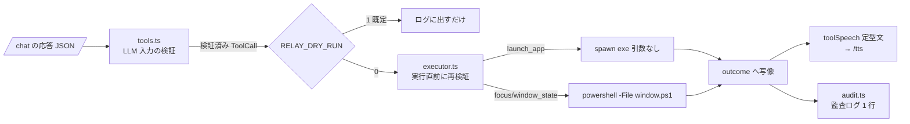

# 声で PC を操作する実行アダプタ（#219 / epic #215 M3）

## 何を作ったか

M2（#218）で作った「検証済みツール呼び出し」を、実際に Windows 上で実行する層。
**relay 側だけの変更**で、実機のファームは触っていない。



| ファイル | 性質 | 役割 |
|---|---|---|
| `relay/src/winexec.ts` | 純粋 | 実行パスの検証・プロセス名の導出・PowerShell 引数配列の組み立て |
| `relay/src/executor.ts` | 副作用 | **唯一 OS に触る層**。`spawn` で起動、失敗は全て `outcome` へ写像 |
| `relay/scripts/window.ps1` | スクリプト | user32 の `ShowWindow` / `SetForegroundWindow` |
| `relay/src/audit.ts` | 純粋 | 監査ログ 1 行（JSON）の整形 |

## 守っている不変条件

1. **シェルを介さない。** `exec` 系は使わず `spawn(exe, [], { shell: false })`。
   PowerShell も `-Command` ではなく `-File` + パラメータ束縛で呼ぶ（値がコードに化けない）。
2. **アプリへ渡す引数は常に空配列。** ここに口を作った瞬間に許可リストが無意味になる
   （`terminal` に `-c ...` を渡せたら任意コマンド実行と同じ）。
3. **許可リストは二重。** `tools.ts`（LLM 入力）と `executor.ts`（実行直前）。片方の改変で穴が開かない。
4. **例外を外へ出さない。** 起動失敗・タイムアウト・窓が無い、を全て日本語の返答へ写像する。
5. **既定は dry-run。** 声で PC が動くのは戻せない副作用なので `RELAY_DRY_RUN=0` の opt-in のみ。

## 設定ファイル由来の入力も疑う

M2 は「LLM の幻覚」を、M3 は「`apps.json` の書き間違い・書き換え」を疑う層。
実行パスは**起動時**に検証し、通らなければサーバを起動しない（フェイルクローズ）。

拒否する形: 相対パス / `..` / `%WINDIR%` `$env:` などの展開記法 / UNC / `.bat` `.cmd` `.ps1` `.lnk` /
先頭が `-` の実行ファイル名（PowerShell のパラメータに化ける余地）。

> `.bat` / `.cmd` を許さないのは、Node が Windows でバッチファイルを**シェル経由でしか
> 起動できない**ため（CVE-2024-27980 の緩和）。許した瞬間に不変条件 1 が崩れる。

## 監査ログ

```
audit {"time":"2026-07-26T09:00:00.000Z","utterance":"ブラウザ最小化して","tool":"window_state","outcome":"ok","app":"browser","state":"minimize"}
```

1 行 1 レコードの JSON。発話も `detail` も外部由来なので改行を潰してから載せる
（残すと偽のログ行を注入できる＝ログインジェクション）。

## 検証

- `npm test` … 16 ファイル / 237 件 通過（winexec 24・executor 12・audit 5・結線 8 を追加）
- `npm run typecheck` 通過
- **Windows 実機で一巡確認**（メモ帳を起動 → 最小化 → 復帰 → 前面化 → 未登録アプリは `denied`）
  - `window.ps1` 単体でも確認: 対象プロセス無し → `exit 3`（`not_running`）、
    列挙外の `-Action` → PowerShell の束縛時点で失敗
- CoreS3 実機からの一巡は #220（M4）で行う

## ハマったところ

`window.ps1` を BOM 無し UTF-8 で保存すると、Windows PowerShell 5.1 が ANSI(cp932) として
読むため日本語コメントが化けて**構文エラー**になった。UTF-8 BOM 付きで保存して解決。
詳細は `knowledge/260726/01-powershell-bom.md`。

## 関連

- Issue: #219（epic #215）
- 派生: #226（平文トークンの再評価。PC 操作が入りリプレイの影響が上がったため）
