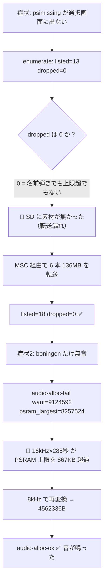

# 動画素材 6 本を SD へ転送し、boningen の無音を直した（#232 / #233 / #234）

2026-07-27。「動画選択で psimissing が選べない」から始まり、転送漏れの解消と長尺素材の無音修正まで。
**コード変更は無い**（端末側の実装は #231 の時点で既に正しかった）。素材とデプロイだけの作業。

手順書の正典は **PLAN.md の「アセットの転送手順」**。今回得た知見はそちらに反映済みなので、
次に作業する時は PLAN.md を見る。この文書は「何が起きて、なぜそう判断したか」の記録。

## 何が起きていたか



要点は 2 つ。**「一覧に出ない」は端末のバグではなく転送漏れ**、**「音が鳴らない」は素材が端末の容量上限を超えていた**。
どちらもコードを触らずに解決した。

## 転送した 6 本と、件数が 19 でなく 18 になった理由

| 素材 | 尺 | sample_rate | audio.wav | SD 上の最終サイズ | 音の確認 |
|---|---|---|---|---|---|
| psimissing | 89.9s | 16000 | 2,877,866 B | 10,948,235 | ✅ 鳴った |
| nobuts | 90.0s | 16000 | 2,880,838 B | 12,709,641 | ✅ 鳴った |
| badapple | 219.1s | 16000 | 7,011,018 B | 14,896,064 | ✅ 鳴った |
| bluelight | 235.5s | 8000 | 3,768,398 B | 29,853,753 | ✅ 鳴った（**差し替え**） |
| goodbye | 346.8s | 8000 | 5,549,648 B | 40,143,588 | ✅ 鳴った |
| boningen | 285.1s | **8000**（16000 から再変換） | 4,562,336 B | 22,954,865 | ✅ 鳴った（#234 で修正後） |
| — | | | | **計 131,506,146** | |

⚠ **この最終サイズ列を足しても、下の実測表の「136,068,026 B を 11.2 分」には一致しない**（差 4,561,880 B）。
**初回パスで転送した boningen は 16kHz 版（27,516,745 B）** で、上の表は 8kHz 再変換後の最終形だから。
初回パスの実バイトは 136,068,026 B（`logs/sd-transfer-260727.log` の robocopy 6 回分）、
その後 boningen だけ 22,954,865 B で再転送している。**転送した総バイト = 136,068,026 + 22,954,865。**

「音の確認」は**ユーザーが「boningen だけ音が鳴らない」と報告した**ことによる（＝他 5 本は鳴っていた）。
boningen も再変換後に耳で確認済み。ログ上は 5 本が `audio-alloc-ok`（boningen は **16kHz 時に 4 回
`audio-alloc-fail`、8kHz 再変換後に ok**）で、うち badapple / goodbye / boningen は
`audio stream: complete`（尺の最後まで供給完了）まで確認できている。

🔴 **件数は 13 + 6 = 19 ではなく 18**。**bluelight は既に SD にあった**（7/20 の破損版）ので、
新規追加 5 本 + 差し替え 1 本 = **+5** で 18 になる。Issue #233 の本文に書いた「listed=19」は数え間違い。

## 覚えておくべき: 音声の尺には上限がある

音声は再生開始時に **`ps_malloc(audio.wav 全体サイズ)` で全量を PSRAM に確保する**設計
（`src/main.cpp:2283`）。ログに `audio ok(stream)` と出るので一見ストリーミングだが、
**確保は全量・読み込みだけが逐次**という半端な作り。実測 `psram_largest` = **8,257,524 B** が天井。

**目安として 4 分を超える曲は `--sample-rate 8000` で変換する。** 詳しい上限表（理論値と実運用の推奨）は
PLAN.md の「アセットの転送手順」手順 1 に書いた。境界ぎりぎりは実証されていないので狙わない。

失敗はログの `audio-alloc-fail` にしか出ず、**画面には何も表示されない**（絵だけ正常に流れる）ので
気づきにくい。逆に言えば「絵は出るのに音だけ無い」を見たら真っ先にこれを疑えばよい。

なお **8kHz は帯域が半分になり音質が落ちる**トレードオフがある。目安に収まっているなら 16kHz を維持する。
bluelight（235 秒）は #166 で **16kHz のまま鳴っていた**ので、今回 8kHz にしたのは必須ではなかった。

根本対策（固定リングバッファ化して尺の制限を消す）は **#235** に積んだ。優先度は低い
（8kHz 回避策が確立しているため）。

## 実測値（次回の見積りに使う）

| 項目 | 実測 |
|---|---|
| 転送速度 | **約 203,000 Bytes/sec**（136,068,026 B を 11 分 11 秒）。robocopy の `Speed: Bytes/sec` は **176,356〜217,474**（6 本の幅） |
| MSC ファーム書き込み | 14.2 秒（キャッシュ済み）/ 67.7 秒（要ビルド時） |
| 通常ファーム焼き戻し | 26.8 秒 |
| ディレクトリ削除（パック方式・3 ファイル） | **0.5 秒** |
| ディレクトリ削除（連番 JPEG・300 枚） | **12.5 秒** |
| 再変換（4分45秒・AV1 1080p60 → 320x240 10fps + 音声抽出 + パック） | 約 50 秒 |

boningen の 8kHz 再転送だけは **226,158 Bytes/sec**（22,954,865 B を 102 秒）だった。これは
コマンド出力のみでログファイルには残していないので、`logs/` から再検算できるのは上の 176,356〜217,474 の方。

### 証拠ログ（後から再検算できるように）

| ログ | 何が読めるか |
|---|---|
| `logs/sd-transfer-260727.log` | 初回パスの robocopy 6 回分（バイト数・所要時間・`Speed: Bytes/sec`） |
| `logs/device-monitor-260727-203856.log` | `listed=13`→ 転送後 `listed=18`、boningen の `audio-alloc-fail` 3 回、他 5 本の `audio-alloc-ok` |
| `logs/device-monitor-260727-213323.log` | 8kHz 再変換後の boningen が `audio-alloc-ok` → `audio stream: complete` |
| `logs/convert-boningen-8k-260727.log` | yt-dlp + ffmpeg の再変換（元動画は AV1 1080p60 / opus 48kHz stereo） |

### 🔴 `--sample-rate` を付け忘れた時の実コスト

boningen を 16kHz で転送してしまったため、**MSC 焼き → 削除 → 転送 → RST 3 秒長押し → 通常ファーム焼き戻し
の往復を丸ごと 1 回やり直した**（実測表の MSC 書き込みが 2 値あるのはこの 2 回分）。
所要は約 4 分＋**手作業の RST 長押し**。変換は 50 秒で済むので、**転送前に
`Get-Content video\<素材名>\meta.txt` で `sample_rate` と `frames` を見る**方が圧倒的に安い。

既存 PLAN.md の 207KB/s とほぼ一致（今回 202KB/s）。削除時間も 40ms/件前後で連番時代と整合している
（95 秒 / 2,355 ファイル ≒ 40ms、12.5 秒 / 300 枚 ≒ 42ms）。**パック方式が速いのは 1 件あたりが速い
のではなく、ファイル数が 300 → 3 に減ったから**。

## ハマりどころ

### 🔴 USB PID ではファームを判別できない

通常ファーム稼働中（曲選択カルーセル表示中）でも `VID_303A&PID_1001` が present で見えた。
platformio.ini のコメント「TinyUSB にすると 0x8119 → 0x1001 に変わる」を**ファーム判別に使ってはいけない**。
ini と PLAN.md の両方に注意書きを入れた。

さらに `Get-PnpDevice` は既定で**非 present の幽霊デバイスも列挙する**。今回 COM5 が `Status=Unknown`
（前回 MSC 起動時の残骸）で出てきて、一瞬「2 ポート見えた」と誤読した。**`-PresentOnly` を必ず付ける。**

稼働中のファームを知りたい時は **画面表示**か **`Get-Volume | Where-Object DriveType -eq 'Removable'`**
でドライブの有無を見る。

### 🔴 `pio` には `-d <プロジェクトパス>` を付ける

セッション中に作業ディレクトリが `~/git` に戻り `NotPlatformIOProjectError` を踏んだ。

### robocopy の exit code 1 は成功

`rc=1` は「コピーを実施した」の意味。**8 以上が本当の失敗**。バックグラウンド実行すると
最後の `$LASTEXITCODE` が残って「failed」と報告されるが、`FAILED 0` を確認すれば問題ない。

### `robocopy /E` は既存ファイルを消さない → 差し替えは先に削除

**素材を差し替える時は先に `Remove-Item -Recurse` する。** `/E` はサイズ・タイムスタンプが違う
ファイルは上書きするので `meta.txt` や `frames.bin` は更新されるが、**ローカルに存在しないファイル
（古い連番 JPEG）は残り続ける**。

⚠ 削除コマンドは `<素材名>` の埋め忘れで `D:\video` を丸ごと消す。**先に
`Get-ChildItem D:\video\<素材名>` で対象を確認する**（消したら 30 分超の再転送になる）。

### 転送後は meta.txt を目視する

今回 SD の bluelight が「**連番 JPEG 300 枚 + frames.bin が同居し、meta.txt に `pack=` 行が無い**」
破損状態だった（パック方式へ移行する前の残骸。今回の転送で生じたものではなく、転送前から SD にあった）。
`Get-Content D:\video\<素材名>\meta.txt` で `pack=frames.bin` と `sample_rate=` を確認すれば同じ事故に気づける。

### ロガーは「先に起動 → 後で RST 短押し」＋開き直しループ

順序を逆にすると起動ログを取り逃がす。**それでも取り逃がすことがあるので、空振りしたら
モニタを開き直して RST 短押しをやり直す**。

## 確認すべきログはこの 2 行

```
[video] enumerate: listed=18 dropped=0        ← 件数が期待どおりか（dropped>0 なら名前弾きか上限超）
[video] audio-alloc-ok want=4562336 ...       ← fail なら無音。sample_rate を下げる
```

## SD の現状（18 件）

```
aaa, aporia, badapple, bluelight, boningen, dontsaylazy, gogomaniac, goodbye,
itsame, lain, natsukage, nobuts, noudou, passeul, psimissing, raise, ruri, the1
```

`kVideoListCap` = 32（#231）なのであと 14 本入る。容量は 29.1GB に対し使用 500MB 程度なので、
**制約になるのは件数だけ。容量は当面気にしなくてよい**。

## 反省

**既存の Issue を確認せずに #233 を起票し、#232 と重複させた。**
#232 は同じ症状の切り分け Issue で、その切り分け表（`dropped` の値で 3 択に絞る）が今回そのまま当たった。
作業前に `gh issue list` を見るべきだった。
