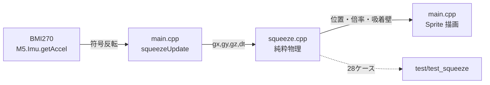

# スクイーズシーン（傾け・シェイクで動くぷにぷに玉）— Issue #240

CoreS3-Lite の IMU（BMI270）をこのプロジェクトで**初めて使った**機能。
傾けると玉が転がり、壁で弾んで潰れ、勢いよく振ると壁にべちゃっと貼り付く。

## できること

| 操作 | 反応 |
|---|---|
| 傾ける | 傾けた向き（上下左右）へ玉が転がる |
| 壁に当たる | 反発しながら当たった面が潰れ、ぷるんと震えて丸へ戻る |
| 中くらいに振る | 振った向きへ速度が加わる。枠が明るくなる |
| 勢いよく振る | その向きの壁へ吸着し、平たく潰れて 1.3 秒貼り付く → 剥がれて落ちる |
| タップ | 中央へ仕切り直し（貼り付いたまま迷子になった時の逃げ道） |
| 長押し | メニューへ戻る（共通機構） |

## 構成



- `src/squeeze.{h,cpp}` … 物理だけ。M5・millis・描画に一切依存しない
- `src/main.cpp` … IMU の読み取りと描画だけ。物理定数を持たない
- `test/test_squeeze/` … native 28 ケース

**なぜ分けたか**: 反発係数・シェイク閾値のような調整点は実機に焼いて確かめると 1 回 2 分かかる。
純粋層に寄せれば PC 上で 13 秒で回せる。既存の pacman / gem3d と同じ思想。

## 実機との境界（ここが一番の注意点）

`squeeze.h` に渡すのは **「玉が引っ張られる向き」** であって加速度センサの生値ではない。
センサは「静止時に**上を向いている軸**が +1G」を示すので、重力の向きは生値の逆になる。
`main.cpp` で符号を吸収している:

```
gx = -ax   /  gy = +ay   /  gz = az（そのまま。二乗して大きさにしか使わない）
```

🔴 **この符号は M5Unified の軸割り当てと `setRotation(1)` に依存するので、実機で目視確認が要る。**
「傾けた向きへ転がる」が逆なら `kSqImuSignX` / `kSqImuSignY` を反転するだけで直る。

## シェイクをどう検出しているか

合力の大きさ `|g|` の **1G からのズレ** を見る。

- 静止・傾けだけ → 大きさは常に 1G → ズレ 0 → 誤発火しない
- 振る → 2〜3G に振れる → ズレ 0.7 以上でキック、1.5 以上で吸着

向きではなく大きさを見るので、どちら向きに振っても等しく反応する。
1 回の振りは数フレームにまたがるので不応期 0.25 秒を置き、同じ振りで何度もキックが入らないようにした。

⚠ `M5.Imu.getAccel()` の戻り値は「IMU があるか」ではなく **新しいサンプルが取れたか**
（`IMU_Class::update()` のセンサマスク）。BMI270 はデータレディが立っていないと 0 を返すので、
正常動作中でも false は普通に起きる。**false を「IMU 無し」と解釈してはいけない**（レビュー指摘）。
存在判定は `M5.Imu.isEnabled()` に任せ、読めなかったフレームは前回値を使い回している。

## メモリ

フルスクリーンキャンバス約 150KB を PSRAM に確保するが、**exit で必ず返す**。
アート・宝石・ポケモンは常駐させているが、動画再生の音声は 7MB 級の「連続」確保で
PSRAM の余裕が際どい（#166）ため、常駐を 1 枚増やさない判断にした。

LovyanGFX は PSRAM 確保に失敗すると**黙って内蔵 RAM(DMA) へ落ちる**。内蔵 RAM から 150KB を
奪うと Wi-Fi / TTS が窒息するので、確保の前後を `[squeeze] canvas-*` でログに出している。

## 副作用

シーンが 11 個になり、既存の `static_assert`（メニューが画面に収まるかのコンパイル時検査）が
溢れを検知して**ビルドを止めた**。設計どおりの警報なので行間を 21→19 に詰めて解消した。
次にシーンをもう 1 つ増やすと再び落ちるので、その時はページングを検討する。

## 🔴 実機で確認すること（#240 M3・未実施）

1. **傾けた向きへ転がるか**（逆なら `kSqImuSignX` / `kSqImuSignY` を反転）
2. **振ったら壁に貼り付くか**。付きにくければ `kSqShakeStick`(1.50) を下げる
3. **傾けただけで誤って貼り付かないか**。誤爆するなら `kSqShakeStick` を上げる
4. `[squeeze] canvas-ok` が出て `psram_largest` が十分残っているか
5. 動画再生シーンへ入り直しても音声が確保できるか（キャンバス解放が効いているか）
6. シェイクの取りこぼし。30fps サンプリングなので、反応が鈍ければ玉サイズのスプライトに
   変えてフレームレートを上げるのが第一手（フルスクリーン 150KB の push が律速）

## レビュー（reviewer サブエージェント）

🔴 1 件・🟡 7 件・🟢 多数の指摘を受け、🔴 と 🟡 は全て解消した。主なもの:

| 指摘 | 対応 |
|---|---|
| 🔴 `getAccel` の false を「IMU 無し」と誤解釈（赤字が永続表示・入力が 1 コマ欠ける） | 存在判定を `isEnabled()` に一本化し、失敗フレームは前回値を使う |
| 🟡 キャンバスを解放する経路が無い | `squeezeExit()` で `deleteSprite()` |
| 🟡 PSRAM 失敗時に黙って内蔵 RAM を食う | 確保の前後をログ |
| 🟡 `onTap` が `now` を捨てて `millis()` を読み、dt が uint32 で巻き戻る | `now` をそのまま使う |
| 🟡 剥がれる瞬間に形が 0.55→1.00 へ 1 コマで飛ぶ | 張り付き形状と同じ潰れ量から減衰振動を始める |
| 🟡 NaN が入ると恒久汚染して復帰しない | 入口で `std::isfinite` チェック |
| 🟡 吸着強度 `dev / kSqShakeStick` が常に 1.0 に飽和する死んだ計算 | 「閾値をどれだけ超えたか」で 0.5〜1.0 にする |
