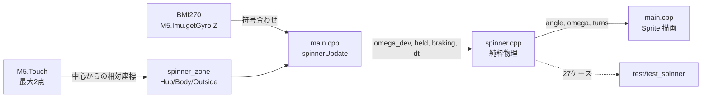

# ハンドスピナーシーン（ジャイロで回し、指で止める）— Issue #243

中央のハブを指で押さえたまま本体をはじくと、画面内のハンドスピナーが連動して回る。
指を離しても慣性で回り続け、スピン部を押さえると止まる。
IMU の**ジャイロ**を使うのはこれが初めて（加速度は #240 のスクイーズで導入済み）。

## できること

| 操作 | 反応 |
|---|---|
| 中央ハブ（半径40px以内）を押さえる | ハブに緑のリングが出る＝「軸を持てている」目印 |
| 押さえたまま本体をはじく | 本体の回転と同じ勢いでスピナーが回り出す |
| 指を離す / 本体が止まる | **慣性で回り続ける**。軸受け摩擦で 20〜30 秒かけて減速 |
| スピン部（ローブ）を押さえる | ブレーキ。約 0.12 秒で停止し、ローブが赤くなる |
| 逆向きにはじく | 減速し、やがて逆回転になる |
| スピナーの外を短タップ | 角度・回転数を仕切り直し |
| 画面の隅を長押し | メニューへ戻る |

回転中は右下に `現在rpm (最高rpm)  累計回転数` を出す。最高rpm は完全停止でリセットされるので、
1 回の回しのベストが読める。

## 構成



- `src/spinner.{h,cpp}` … 回転物理と領域判定だけ。M5・millis・描画に一切依存しない
- `src/main.cpp` … ジャイロの読み取り・画面中心の減算・描画だけ。物理定数を持たない
- `test/test_spinner/` … native 27 ケース

スクイーズ（#240）と同じ二層構成。摩擦やブレーキの効きは実機に焼くと 1 回 2 分かかるが、
純粋層に寄せれば PC 上で 20 秒で回せる。

## 物理モデル（1状態）— ここが設計の肝

状態は「画面上の見かけ角速度 `omega`」1 本だけ。3 つの規則で実物の手触りを作る。

1. **ハブを押さえていて、かつ本体が実際に回っている間だけ**、本体の回転がスピナーへ伝わる
2. それ以外では `omega` はそのまま残り、軸受け摩擦で緩やかに減衰する（＝慣性）
3. スピン部を押さえている間は強い減衰で止まる（＝ブレーキ）

規則 1 の「本体が実際に回っている間だけ」（`kSpDriveMin` = 60 deg/s 以上）が肝。
単純に本体の角速度へ漸近させると、**はじき終わって本体が止まった瞬間にスピナーまで止まり、
慣性がまったく出ない**。手ブレ程度の揺れでは超えず、意図して回せば必ず超える値にしてある。

絶対角速度と本体角速度を別々に持つ厳密な剛体モデルも検討したが、はじいた後の余韻が
カップリング係数任せになって体感を詰めにくいため採らなかった。

## 実機との境界

`spinner.h` に渡す `omega_dev` は「**画面上の時計回りを正**に揃えた本体角速度」であって
ジャイロの生値ではない。軸の割り当てと符号は基板の向きと `setRotation(1)` で変わるため、
`main.cpp` の `kSpImuSign` で吸収する。純粋層でこれを吸収すると嘘になる。

```cpp
constexpr float kSpImuSign = +1.0f;   // 実機で逆ならここだけ反転する
```

## 踏んだ罠

### 1. `onTap` でリセットすると仕様の中核が壊れる（レビューで発見）

`touch_update`（gesture.cpp）は **800ms 未満で離した押下を `Tap` として返す**。
「ハブを押さえてはじき、すぐ指を離す」という本来の操作はまさにこれに当たるので、
`onTap` で無条件に `spinner_reset()` すると、はじいた回転が離した瞬間に消える。
＝「離しても慣性で回り続ける」が 800ms 以上押し続けた時しか成立しない。

対策として「現在の押下中に一度でもスピナー上に指が乗ったか」を押下単位でラッチし
（`g_spBodyLatch`）、**スピナーの外側を触った短タップだけ**リセットするようにした。

### 2. 中央を押さえ続けると長押し＝メニュー復帰が誤爆する

中央を押さえる操作は 800ms を軽く超える。`SceneDef::onLongPress`（#198 で足した口）で
スピナー上の長押しを消費し、外側（画面の隅）の長押しだけメニューへ通す。
ただし **IMU が無い個体では消費しない**。回らない画面から出られなくなるため。

### 3. ジャイロの直近値には賞味期限が要る

`M5.Imu.getGyro()` の戻り値は「IMU があるか」ではなく**新しいサンプルが取れたか**で、
正常動作中でも `false` は普通に起きる（#240 で踏んだのと同じ罠）。読めなかったフレームは
直近値を使い回すが、スクイーズと違いこちらの角速度は**エネルギー源**なので、そのままだと
IMU が黙った時に古い非ゼロ値が注入され続けて永久に回りっぱなしになる。
`kSpGyroStaleMs`（200ms）を過ぎたら 0 に倒している。

### 4. `enum class X : uint8_t` は `<cstdint>` が無いと崩れる

`spinner.h` に `#include <cstdint>` を書き忘れ、
`found ':' in nested-name-specifier` という原因の分かりにくいエラーになった。
基底型が未知だと enum の宣言そのもののパースが失敗する。

### 5. メニューが溢れる寸前

シーンを 1 つ足すたびにメニューの `static_assert` が効き、今回は行間 19→17px に詰めた。
文字高 16px に対し余白 1px で、**次のシーン追加ではもう縮められない**（Issue #244 でページング化）。

## 実機で確認すること（Issue #243 M3）

- ジャイロ Z の符号（本体を回した向きにスピナーが回るか。逆なら `kSpImuSign` を反転）
- **はじき戻しで打ち消されないか**（はじいた後に本体を元の向きへ戻すと、ハブを押さえたままなら
  逆回転入力として効いて回転が打ち消される。指を離すのが先なら問題ない）
- ハブ判定（40px）とローブ描画（14〜102px）が重なる 26〜40px の帯。見た目はローブなのに
  ブレーキが効かないので、違和感があれば `kSpHubTouchR` を詰める
- 摩擦の強さ（20〜30秒で止まる想定）とブレーキの効き

## 関連

- Issue #243 / PR #245
- 先行: #240（スクイーズ・IMU 加速度の初導入）、#198（`onLongPress` の横取り機構）
- 後続: #244（メニューのページング化）
